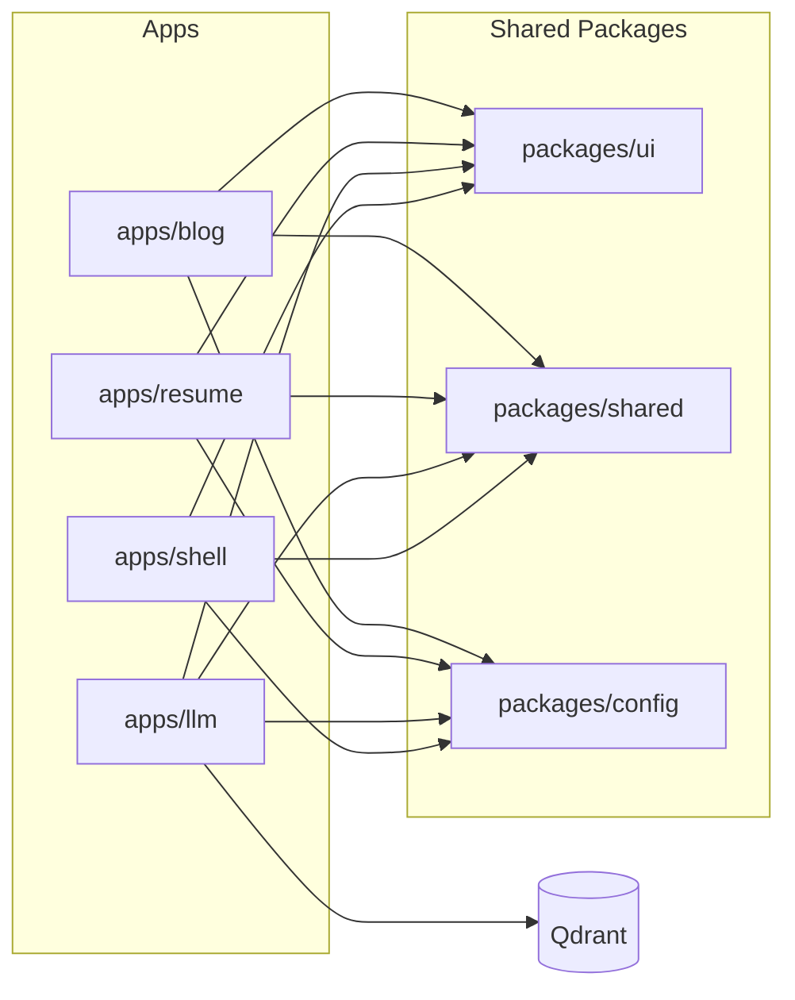
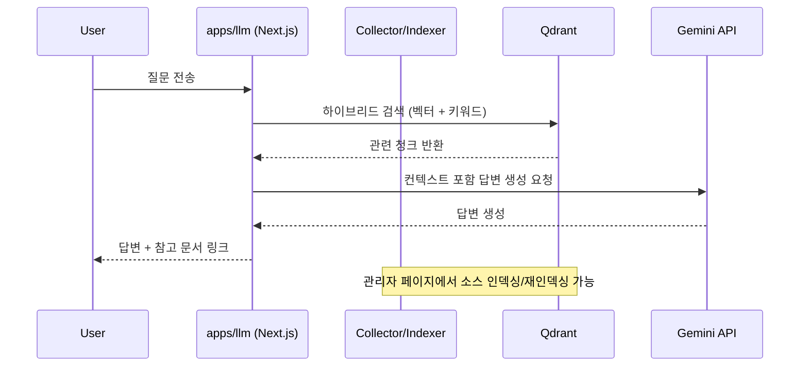

# itjustbong Platform Monorepo

개인 서비스들을 하나의 Turborepo로 통합한 멀티 서비스 레포지토리입니다.
현재 `blog`, `resume`, `llm` 서비스를 운영 중이며, 공통 패키지(`ui`, `shared`, `config`)를 통해 코드와 설정을 재사용합니다.

## 서비스 개요

| 서비스 | 경로 | 설명 | 기본 포트 |
| --- | --- | --- | --- |
| blog | `apps/blog` | MDX 기반 기술 블로그, 관리자/에디터, OG 이미지 생성 | `3000` |
| resume | `apps/resume` | 웹 이력서 및 PDF 생성/다운로드 | `3001` |
| llm | `apps/llm` | RAG 기반 Q&A 서비스 (Gemini + Qdrant) | `3002` |
| shell | `apps/shell` | 향후 확장용 셸 앱(기본 골격) | `3003` |

## 모노레포 구조

```text
.
├─ apps/
│  ├─ blog/
│  ├─ resume/
│  ├─ llm/
│  └─ shell/
├─ packages/
│  ├─ ui/        # 공용 UI 컴포넌트
│  ├─ shared/    # 공용 데이터/유틸
│  └─ config/    # ESLint/TS/Tailwind/PostCSS 공용 설정
├─ docker-compose.yml
├─ pnpm-workspace.yaml
└─ turbo.json
```

## 아키텍처 개요



## LLM 요청 흐름



## 로컬 실행

### 요구사항

- Node.js `20+`
- pnpm `9+`

### 설치

```bash
pnpm install
```

### 개발 서버

```bash
# 전체 앱 동시 실행
pnpm dev

# 개별 실행
pnpm dev:blog
pnpm dev:resume
pnpm dev:llm
pnpm dev:shell
```

### 빌드/검사

```bash
pnpm build
pnpm lint
pnpm format:check
```

## Docker 실행

루트 `docker-compose.yml` 기준으로 다음 구성이 올라갑니다.

- `blog-app` (`3000`)
- `resume-app` (`3001`)
- `llm-app` (`3002`)
- `qdrant` (`6333`, `6334`)

```bash
docker compose up --build
```

## 환경 변수

현재 필수 환경 변수는 `apps/llm/.env`에 집중되어 있습니다.

```bash
cp apps/llm/.env.example apps/llm/.env
```

주요 항목:

- `GEMINI_API_KEY`
- `QDRANT_URL`
- `ADMIN_USERNAME`
- `ADMIN_PASSWORD`

## 주요 스크립트

| 위치 | 스크립트 | 설명 |
| --- | --- | --- |
| root | `pnpm dev` | Turborepo로 전체 앱 개발 서버 실행 |
| root | `pnpm build` | 워크스페이스 전체 빌드 |
| root | `pnpm lint` | 워크스페이스 전체 린트 |
| `apps/blog` | `pnpm build` | OG 이미지 생성 후 블로그 빌드 |
| `apps/llm` | `pnpm test` | LLM 서비스 테스트(Vitest) |

## 라이선스

MIT (`LICENSE`)
