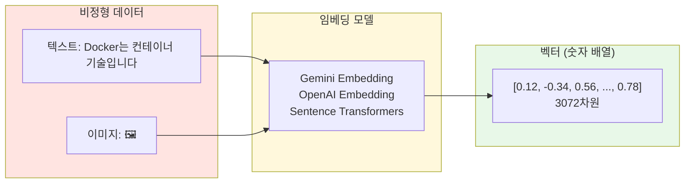
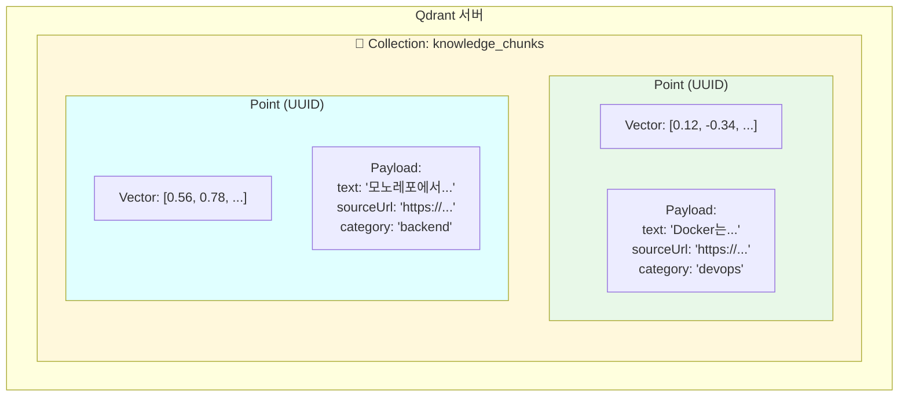
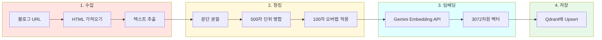
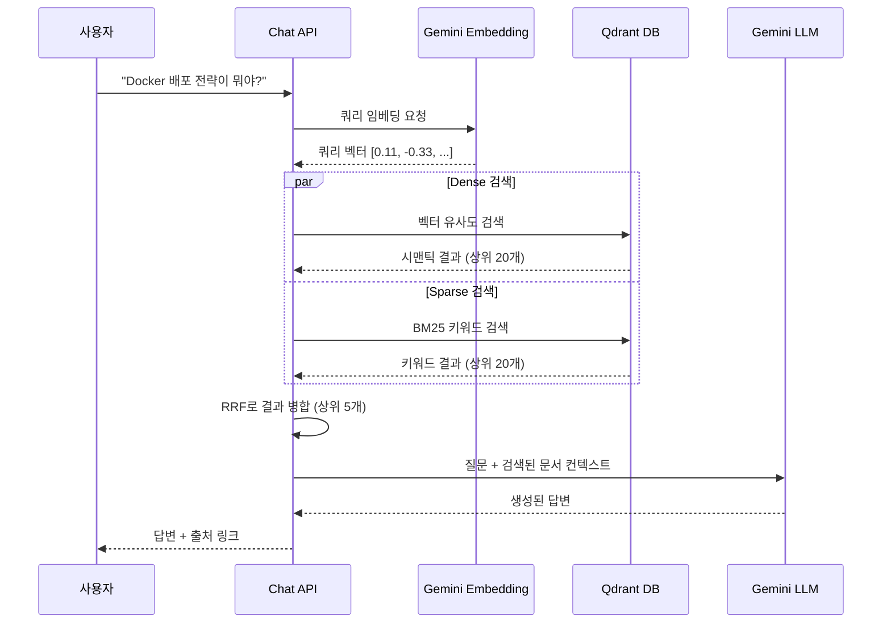
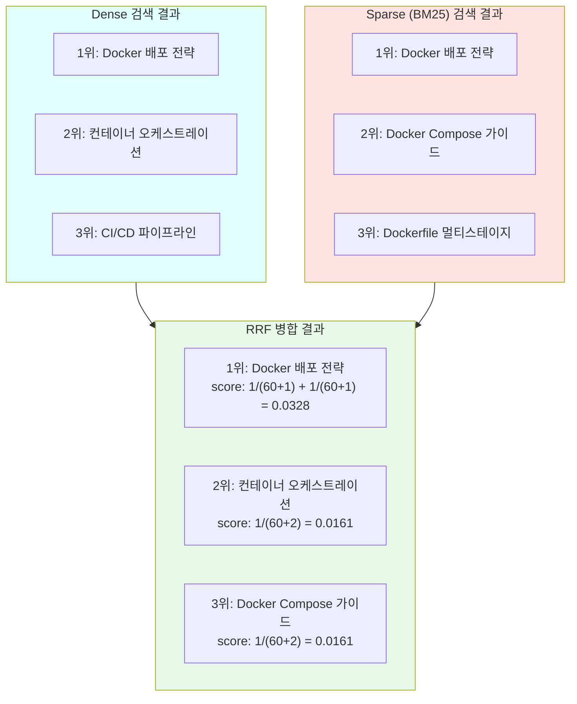
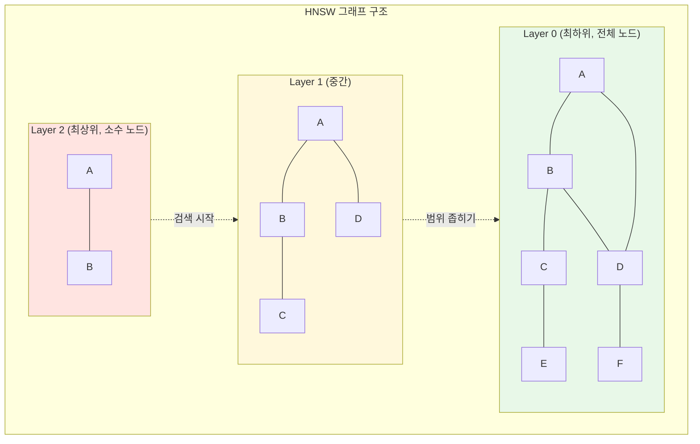
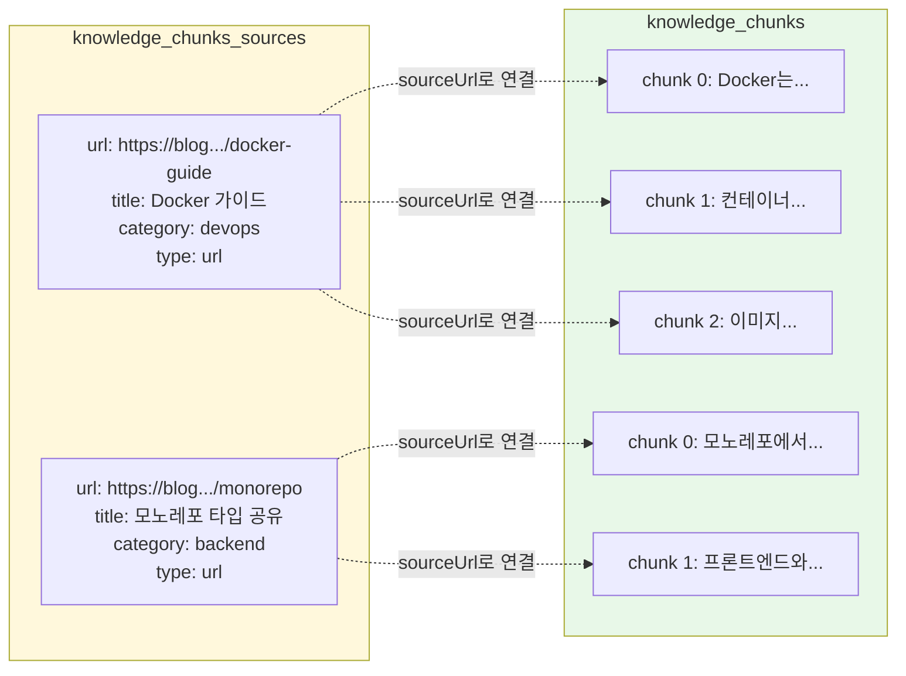

## 벡터 데이터베이스와 Qdrant 실전 가이드

기술 블로그에 RAG(Retrieval-Augmented Generation) 기반 챗봇을 붙이면서 벡터 데이터베이스를 처음 다루게 되었습니다. 이 글에서는 벡터 DB가 무엇인지, 왜 필요한지, 그리고 Qdrant를 실제 프로젝트에서 어떻게 활용했는지를 정리합니다.

---

## 벡터 데이터베이스란

일반적인 데이터베이스는 숫자, 문자열, 날짜 같은 정형 데이터를 저장하고 정확한 일치(exact match) 검색을 수행합니다. 반면 벡터 데이터베이스는 고차원 벡터를 저장하고, 벡터 간의 유사도를 기반으로 검색합니다.

여기서 벡터란 텍스트, 이미지, 오디오 같은 비정형 데이터를 수백~수천 차원의 숫자 배열로 변환한 것입니다. 이 변환 과정을 임베딩(Embedding)이라 부릅니다.



### 왜 벡터 DB가 필요한가

"Docker 컨테이너 기술"이라는 문장과 "도커를 이용한 가상화"라는 문장은 단어가 다르지만 의미는 비슷합니다. 전통적인 DB에서는 이 두 문장의 관계를 알 수 없지만, 벡터 DB에서는 임베딩 벡터 간의 거리가 가까워 유사한 문서로 검색됩니다.

이 특성 덕분에 벡터 DB는 다음과 같은 곳에 활용됩니다.

- RAG 시스템: LLM에 관련 문서를 검색해서 컨텍스트로 제공
- 시맨틱 검색: 키워드가 아닌 의미 기반 검색
- 추천 시스템: 유사한 아이템 추천
- 이미지 검색: 비슷한 이미지 찾기

### 벡터 유사도 측정 방법

벡터 간의 거리를 측정하는 방법은 여러 가지가 있습니다. Qdrant에서 지원하는 주요 거리 메트릭은 다음과 같습니다.

| 메트릭 | 설명 | 범위 | 용도 |
|--------|------|------|------|
| Cosine | 벡터 간 각도 기반 유사도 | -1 ~ 1 | 텍스트 임베딩 (가장 일반적) |
| Euclidean | 벡터 간 직선 거리 | 0 ~ ∞ | 좌표 기반 데이터 |
| Dot Product | 벡터 내적 | -∞ ~ ∞ | 정규화된 벡터 |

텍스트 임베딩에서는 Cosine 유사도를 가장 많이 사용합니다. 두 벡터의 방향이 비슷할수록 값이 1에 가까워지고, 관련 없는 내용일수록 0에 가까워집니다.

---

## Qdrant 소개

Qdrant(쿼드런트)는 Rust로 작성된 오픈소스 벡터 데이터베이스입니다. 높은 성능과 풍부한 필터링 기능이 특징이며, REST API와 gRPC를 모두 지원합니다.

### 다른 벡터 DB와의 비교

| 특성 | Qdrant | Pinecone | Weaviate | Milvus |
|------|--------|----------|----------|--------|
| 오픈소스 | ✅ | ❌ (SaaS) | ✅ | ✅ |
| 언어 | Rust | - | Go | Go/C++ |
| 셀프 호스팅 | ✅ | ❌ | ✅ | ✅ |
| 필터링 | 풍부함 | 기본 | 풍부함 | 풍부함 |
| Sparse 벡터 | ✅ | ✅ | ❌ | ✅ |
| 클라우드 서비스 | ✅ | ✅ | ✅ | ✅ |

Qdrant를 선택한 이유는 Docker로 간단히 셀프 호스팅할 수 있고, Dense + Sparse 하이브리드 검색을 네이티브로 지원하며, TypeScript 클라이언트가 잘 되어 있기 때문입니다.

### Qdrant 핵심 개념

Qdrant의 데이터 구조를 이해하려면 세 가지 개념을 알아야 합니다.



**Collection**은 관계형 DB의 테이블에 해당합니다. 벡터의 차원 수와 거리 메트릭을 지정하여 생성합니다.

**Point**는 테이블의 행(row)에 해당합니다. 고유 ID, 벡터, 페이로드로 구성됩니다.

**Payload**는 벡터에 첨부되는 메타데이터입니다. JSON 형태로 자유롭게 저장할 수 있고, 필터링 조건으로 사용할 수 있습니다. Qdrant 대시보드(`http://localhost:6333/dashboard`)에서 보이는 데이터가 이 Payload입니다. 벡터 값 자체는 고차원 숫자 배열이라 대시보드에서 직접 보여주지 않고, 검색과 유사도 계산에 내부적으로 사용됩니다.

---

## Qdrant 시작하기

### Docker로 실행

가장 간단한 방법은 Docker Compose를 사용하는 것입니다.

```yaml
# docker-compose.yml
services:
  qdrant:
    image: qdrant/qdrant:latest
    ports:
      - "6333:6333"  # REST API
      - "6334:6334"  # gRPC
    volumes:
      - qdrant_data:/qdrant/storage

volumes:
  qdrant_data:
```

```bash
docker compose up -d
```

실행 후 `http://localhost:6333/dashboard`에 접속하면 웹 대시보드를 사용할 수 있습니다. 컬렉션 목록 조회, 포인트 검색, 필터링, 삭제 등을 GUI로 수행할 수 있어서 별도의 DB 뷰어가 필요 없습니다.

### TypeScript 클라이언트 설치

```bash
pnpm add @qdrant/js-client-rest
```

### 컬렉션 생성

```typescript
import { QdrantClient } from "@qdrant/js-client-rest";

const client = new QdrantClient({ url: "http://localhost:6333" });

// 컬렉션 생성
await client.createCollection("knowledge_chunks", {
  vectors: {
    dense_vector: {
      size: 3072,        // 임베딩 모델의 차원 수
      distance: "Cosine", // 유사도 메트릭
    },
  },
  sparse_vectors: {
    bm25_sparse_vector: {
      modifier: "idf",   // BM25 키워드 검색용
    },
  },
});

// 필터 검색 성능을 위한 페이로드 인덱스 생성
await client.createPayloadIndex("knowledge_chunks", {
  field_name: "sourceUrl",
  field_schema: "keyword",
  wait: true,
});
```

`size`는 사용하는 임베딩 모델에 따라 달라집니다. Gemini Embedding은 3072차원, OpenAI text-embedding-3-small은 1536차원입니다.

### 데이터 삽입 (Upsert)

벡터 포인트를 저장하는 것을 upsert라 합니다. 같은 ID가 있으면 업데이트하고, 없으면 새로 삽입합니다.

```typescript
import { randomUUID } from "crypto";

await client.upsert("knowledge_chunks", {
  wait: true,
  points: [
    {
      id: randomUUID(),
      vector: {
        dense_vector: [0.12, -0.34, 0.56, /* ... 3072차원 */],
      },
      payload: {
        text: "Docker는 컨테이너 기반 가상화 기술입니다.",
        sourceUrl: "https://blog.example.com/posts/docker-guide",
        sourceTitle: "Docker 가이드",
        category: "devops",
        chunkIndex: 0,
        contentHash: "abc123...",
        indexedAt: "2026-02-06T00:00:00.000Z",
      },
    },
  ],
});
```

### 벡터 검색

쿼리 벡터와 가장 유사한 포인트를 찾습니다.

```typescript
const results = await client.search("knowledge_chunks", {
  vector: {
    name: "dense_vector",
    vector: [0.11, -0.33, 0.55, /* ... 쿼리 벡터 */],
  },
  limit: 5,
  with_payload: true,
});

// results 예시:
// [
//   { id: "uuid-1", score: 0.92, payload: { text: "Docker는...", ... } },
//   { id: "uuid-2", score: 0.87, payload: { text: "컨테이너...", ... } },
// ]
```

`score`는 유사도 점수입니다. Cosine 거리를 사용하면 0~1 사이의 값이 나오고, 1에 가까울수록 유사합니다.

### 필터링 검색

Payload 필드를 조건으로 걸어 검색 범위를 좁힐 수 있습니다.

```typescript
const results = await client.search("knowledge_chunks", {
  vector: {
    name: "dense_vector",
    vector: queryVector,
  },
  limit: 5,
  with_payload: true,
  filter: {
    must: [
      {
        key: "category",
        match: { value: "devops" },
      },
    ],
  },
});
```

`must`, `should`, `must_not` 조건을 조합할 수 있어서 관계형 DB의 WHERE 절처럼 사용할 수 있습니다.

### 스크롤 (전체 조회)

검색이 아닌 전체 데이터 조회는 scroll API를 사용합니다.

```typescript
const result = await client.scroll("knowledge_chunks", {
  filter: {
    must: [
      { key: "sourceUrl", match: { value: "https://..." } },
    ],
  },
  limit: 100,
  with_payload: true,
});

console.log(result.points);        // 조회된 포인트 배열
console.log(result.next_page_offset); // 다음 페이지 오프셋 (페이지네이션)
```

### 삭제

특정 조건에 맞는 포인트를 삭제할 수 있습니다.

```typescript
// 필터 조건으로 삭제
await client.delete("knowledge_chunks", {
  wait: true,
  filter: {
    must: [
      { key: "sourceUrl", match: { value: "https://..." } },
    ],
  },
});
```

---

## 실전: RAG 시스템에서의 활용

이 블로그의 LLM 챗봇은 Qdrant를 활용한 RAG 시스템으로 구현되어 있습니다. 전체 흐름을 살펴보겠습니다.

### 인덱싱 파이프라인

블로그 글을 벡터 DB에 저장하는 과정입니다.



각 단계를 코드로 살펴보겠습니다.

**1단계: 수집 (Collector)**

URL에서 HTML을 가져와 텍스트를 추출합니다. script, style, nav 같은 불필요한 태그를 제거하고 본문만 남깁니다.

```typescript
// collector.ts (핵심 부분)
async function collectFromUrl(url: string): Promise<CollectedContent> {
  const response = await fetch(url, {
    headers: { "User-Agent": "Mozilla/5.0 (compatible; KnowledgeCollector/1.0)" },
    signal: AbortSignal.timeout(30_000),
  });

  const html = await response.text();
  const title = extractTitle(html) ?? url;
  const text = htmlToText(html);  // HTML → 순수 텍스트
  const contentHash = generateContentHash(text); // SHA-256 해시

  return { url, title, text, contentHash, collectedAt: new Date().toISOString() };
}
```

`contentHash`는 콘텐츠 변경 감지에 사용됩니다. 재인덱싱 시 해시가 같으면 건너뛰어 불필요한 API 호출을 줄입니다.

**2단계: 청킹 (Chunker)**

긴 텍스트를 적절한 크기로 분할합니다. LLM의 컨텍스트 윈도우에 맞추고, 검색 정확도를 높이기 위해 500자 단위로 나눕니다.

```typescript
// chunker.ts (핵심 부분)
function chunkText(
  text: string,
  metadata: ChunkMetadata,
  options?: Partial<ChunkOptions>
): TextChunk[] {
  // 1. 문단 경계(\n\n)로 분할
  const paragraphs = splitByParagraphs(text);

  // 2. 큰 문단은 문장 경계로 추가 분할
  const segments = paragraphs.flatMap((p) =>
    p.length <= chunkSize ? [p] : splitBySentences(p)
  );

  // 3. 세그먼트를 chunkSize 이하로 병합
  const rawChunks = mergeSegmentsIntoChunks(segments, chunkSize);

  // 4. 인접 청크 간 100자 오버랩 적용
  return applyOverlap(rawChunks, chunkSize, chunkOverlap);
}
```

오버랩은 청크 경계에서 문맥이 끊기는 것을 방지합니다. 이전 청크의 마지막 100자를 다음 청크 앞에 붙여서 연결성을 유지합니다.

**3단계: 임베딩 (Embedding)**

텍스트를 벡터로 변환합니다. Gemini Embedding API를 사용하며, 문서용과 쿼리용 임베딩을 구분합니다.

```typescript
// embedding.ts (핵심 부분)
import { GoogleGenAI } from "@google/genai";

// 문서 임베딩 (인덱싱 시)
async function embedTexts(texts: string[]): Promise<number[][]> {
  const ai = new GoogleGenAI({ apiKey: process.env.GEMINI_API_KEY });
  const response = await ai.models.embedContent({
    model: "gemini-embedding-001",
    contents: texts,
    config: { taskType: "RETRIEVAL_DOCUMENT" },
  });
  return response.embeddings.map((e) => e.values);
}

// 쿼리 임베딩 (검색 시)
async function embedQuery(query: string): Promise<number[]> {
  const ai = new GoogleGenAI({ apiKey: process.env.GEMINI_API_KEY });
  const response = await ai.models.embedContent({
    model: "gemini-embedding-001",
    contents: query,
    config: { taskType: "RETRIEVAL_QUERY" },
  });
  return response.embeddings[0].values;
}
```

`RETRIEVAL_DOCUMENT`와 `RETRIEVAL_QUERY`를 구분하는 이유는 임베딩 모델이 문서와 쿼리의 특성에 맞게 벡터를 최적화하기 때문입니다.

**4단계: 저장 (VectorStore)**

생성된 벡터를 Qdrant에 저장합니다.

```typescript
// vector-store.ts (핵심 부분)
class VectorStore {
  private client: QdrantClient;
  private collectionName: string;

  async upsertPoints(points: VectorPoint[]): Promise<void> {
    await this.client.upsert(this.collectionName, {
      wait: true,
      points: points.map((point) => ({
        id: point.id,
        vector: { dense_vector: point.vector.dense },
        payload: {
          ...point.payload,
          indexedAt: new Date().toISOString(),
        },
      })),
    });
  }
}
```

### 검색 파이프라인

사용자 질문에 대해 관련 문서를 찾는 과정입니다.



### 하이브리드 검색

이 프로젝트에서는 Dense 벡터 검색과 Sparse(BM25) 키워드 검색을 조합한 하이브리드 검색을 사용합니다.

**Dense 검색**은 의미 기반입니다. "Docker 배포"와 "컨테이너 릴리즈"처럼 단어가 달라도 의미가 비슷하면 찾아냅니다. 하지만 고유명사나 정확한 키워드 매칭에는 약합니다.

**Sparse 검색(BM25)**은 키워드 기반입니다. 전통적인 검색 엔진과 비슷하게 단어의 출현 빈도와 희소성을 기반으로 점수를 매깁니다. "Turborepo"같은 고유명사 검색에 강합니다.

두 검색 결과를 RRF(Reciprocal Rank Fusion) 알고리즘으로 병합합니다.

```typescript
// hybrid-search.ts (핵심 부분)
async function hybridSearch(
  query: string,
  limit: number = 5
): Promise<SearchResult[]> {
  const store = new VectorStore();
  const queryVector = await embedQuery(query);

  // Dense + Sparse 검색을 병렬로 수행
  const [denseResults, sparseResults] = await Promise.all([
    store.searchDense(queryVector, limit * 4),
    store.searchSparse(query, limit * 4),
  ]);

  // RRF로 병합
  return mergeWithRRF(denseResults, sparseResults, limit);
}
```

RRF 알고리즘은 각 검색 결과의 순위를 기반으로 점수를 계산합니다. 공식은 `score = Σ(1 / (k + rank))`이며, 두 검색 모두에서 상위에 등장하는 결과가 높은 점수를 받습니다.



---

## Qdrant 내부 구조

### HNSW 인덱스

Qdrant는 HNSW(Hierarchical Navigable Small World) 알고리즘을 사용하여 벡터 검색을 수행합니다. 모든 벡터를 하나하나 비교하는 대신, 그래프 구조를 만들어 빠르게 근사 최근접 이웃(ANN)을 찾습니다.



검색은 최상위 레이어에서 시작하여 점점 하위 레이어로 내려가면서 범위를 좁힙니다. 이 방식으로 수백만 개의 벡터에서도 밀리초 단위로 검색이 가능합니다.

### Quantization (양자화)

벡터 데이터가 많아지면 메모리 사용량이 급격히 증가합니다. 3072차원 벡터 100만 개를 float32로 저장하면 약 12GB가 필요합니다. Qdrant는 양자화를 통해 메모리 사용량을 줄일 수 있습니다.

```typescript
// Scalar Quantization 적용 예시
await client.createCollection("large_collection", {
  vectors: {
    size: 3072,
    distance: "Cosine",
  },
  quantization_config: {
    scalar: {
      type: "int8",      // float32 → int8로 압축 (4배 절약)
      quantile: 0.99,
      always_ram: true,   // 양자화된 벡터를 RAM에 유지
    },
  },
});
```

| 양자화 방식 | 압축률 | 정확도 손실 | 용도 |
|------------|--------|-----------|------|
| Scalar (int8) | 4배 | 매우 적음 | 범용 |
| Binary | 32배 | 있음 | 대규모 데이터, 재순위화 필요 |
| Product | 가변 | 중간 | 메모리 극한 절약 |

소규모 프로젝트에서는 양자화 없이도 충분하지만, 데이터가 수십만 건 이상이 되면 고려할 만합니다.

### On-Disk 저장

메모리가 부족한 환경에서는 벡터와 HNSW 인덱스를 디스크에 저장할 수 있습니다.

```typescript
await client.createCollection("disk_collection", {
  vectors: {
    size: 3072,
    distance: "Cosine",
    on_disk: true,       // 벡터를 디스크에 저장
  },
  hnsw_config: {
    on_disk: true,       // HNSW 인덱스도 디스크에 저장
  },
});
```

디스크 저장은 검색 속도가 다소 느려지지만, 양자화와 함께 사용하면 양자화된 벡터만 RAM에 올리고 원본은 디스크에 두는 방식으로 균형을 맞출 수 있습니다.

---

## 소스 메타데이터 관리 패턴

이 프로젝트에서는 벡터 청크 외에 소스 메타데이터를 별도 컬렉션으로 관리합니다. 어떤 URL이 등록되어 있고, 인덱싱 상태가 어떤지를 추적하기 위한 구조입니다.



소스를 삭제하면 해당 URL의 청크 벡터도 함께 삭제됩니다. 재인덱싱 시에는 기존 청크를 삭제한 뒤 새로 생성합니다.

```typescript
// 소스 삭제 시 청크도 함께 삭제
async deleteSource(url: string): Promise<void> {
  // 1. 소스 메타데이터 삭제
  await this.client.delete(sourcesCollection, {
    filter: { must: [{ key: "url", match: { value: url } }] },
  });

  // 2. 관련 청크 벡터 삭제
  await this.client.delete(chunksCollection, {
    filter: { must: [{ key: "sourceUrl", match: { value: url } }] },
  });
}
```

---

## 운영 팁

### 대시보드 활용

`http://localhost:6333/dashboard`에서 제공하는 기능은 다음과 같습니다.

- 컬렉션 목록 및 상세 정보 (포인트 수, 벡터 차원, 인덱스 상태)
- 포인트 검색 및 필터링 (Payload 기반)
- 포인트 삭제
- 컬렉션 생성/삭제
- REST API 콘솔 (직접 API 호출 가능)

대시보드에서 벡터 값 자체는 표시되지 않습니다. 벡터는 3072차원의 숫자 배열이라 사람이 직접 확인할 의미가 없고, 검색 엔진이 내부적으로 사용하는 데이터이기 때문입니다. 대신 Payload에 저장된 텍스트, URL, 카테고리 같은 메타데이터를 통해 데이터를 관리합니다.

### REST API 직접 호출

대시보드 외에도 curl로 직접 API를 호출할 수 있습니다.

```bash
# 컬렉션 목록 조회
curl http://localhost:6333/collections

# 특정 컬렉션의 포인트 조회
curl -X POST http://localhost:6333/collections/knowledge_chunks/points/scroll \
  -H "Content-Type: application/json" \
  -d '{"limit": 10, "with_payload": true}'

# 컬렉션 정보 (포인트 수, 설정 등)
curl http://localhost:6333/collections/knowledge_chunks
```

### 백업과 스냅샷

Qdrant는 스냅샷 기능을 제공합니다. Docker 볼륨을 마운트해두면 컨테이너를 재시작해도 데이터가 유지됩니다.

```bash
# 스냅샷 생성
curl -X POST http://localhost:6333/collections/knowledge_chunks/snapshots

# 스냅샷 목록 조회
curl http://localhost:6333/collections/knowledge_chunks/snapshots
```

---

## 심화 학습 자료

벡터 데이터베이스와 Qdrant를 더 깊이 공부하고 싶다면 다음 자료를 참고할 수 있습니다.

### 공식 문서

- [Qdrant 공식 문서](https://qdrant.tech/documentation/) — 개념, API 레퍼런스, 튜토리얼
- [Qdrant JavaScript 클라이언트](https://github.com/qdrant/js-client-rest) — TypeScript/JavaScript SDK
- [Qdrant 튜토리얼](https://qdrant.tech/documentation/tutorials-and-examples/) — 하이브리드 검색, RAG 등 실전 예제

### 벡터 검색 이론

- [HNSW 논문](https://arxiv.org/abs/1603.09320) — Hierarchical Navigable Small World 알고리즘 원본 논문
- [BM25 알고리즘](https://en.wikipedia.org/wiki/Okapi_BM25) — Sparse 검색의 기반이 되는 키워드 검색 알고리즘
- [Reciprocal Rank Fusion](https://plg.uwaterloo.ca/~gvcormac/cormacksigir09-rrf.pdf) — 하이브리드 검색에서 결과를 병합하는 RRF 알고리즘

### RAG 관련

- [Gemini Embedding API](https://ai.google.dev/gemini-api/docs/embeddings) — 이 프로젝트에서 사용한 임베딩 모델
- [Vercel AI SDK](https://sdk.vercel.ai/docs) — LLM 스트리밍 응답 처리
- [RAG 패턴 가이드](https://qdrant.tech/documentation/tutorials-and-examples/rag-chatbot-red-hat-openshift-ai/) — Qdrant 공식 RAG 튜토리얼

---

## 마치며

벡터 데이터베이스는 텍스트를 숫자 배열(벡터)로 변환하여 의미 기반 검색을 가능하게 하는 저장소입니다. Qdrant는 Docker로 간단히 셀프 호스팅할 수 있고, Dense + Sparse 하이브리드 검색을 네이티브로 지원하며, TypeScript 클라이언트가 잘 갖춰져 있어 RAG 시스템 구축에 적합합니다. 대시보드에서 보이는 데이터는 Payload(메타데이터)이고, 벡터 값 자체는 검색 엔진이 내부적으로 사용하는 고차원 숫자 배열입니다.
