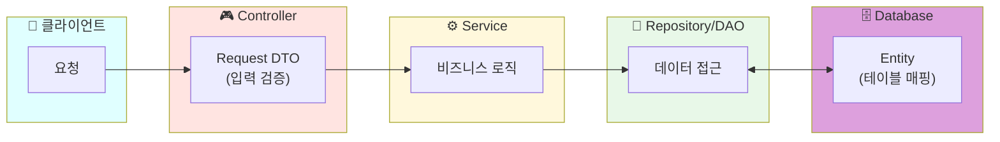
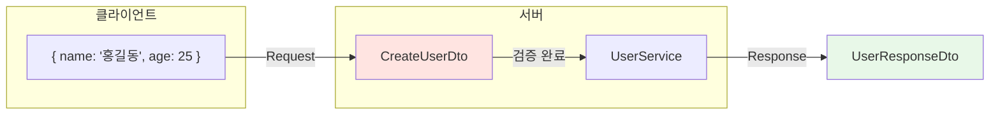
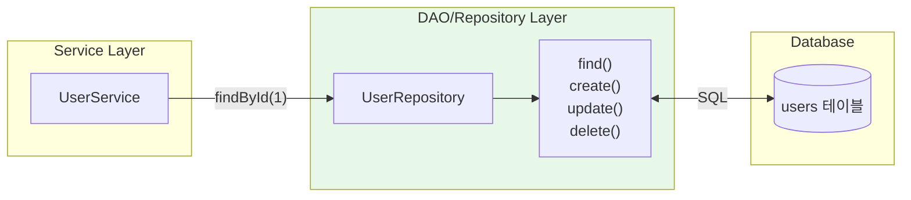
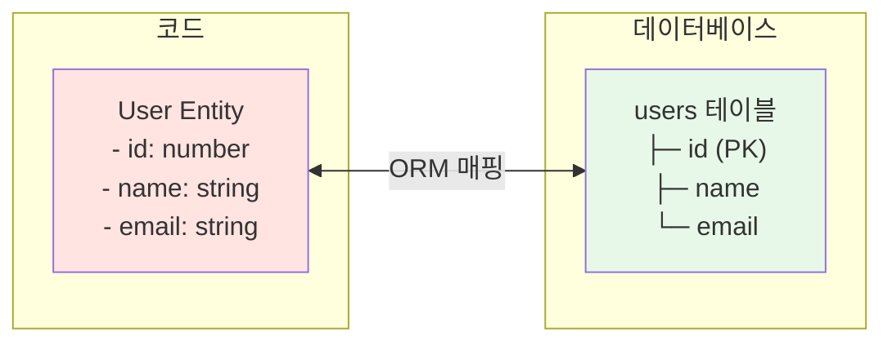
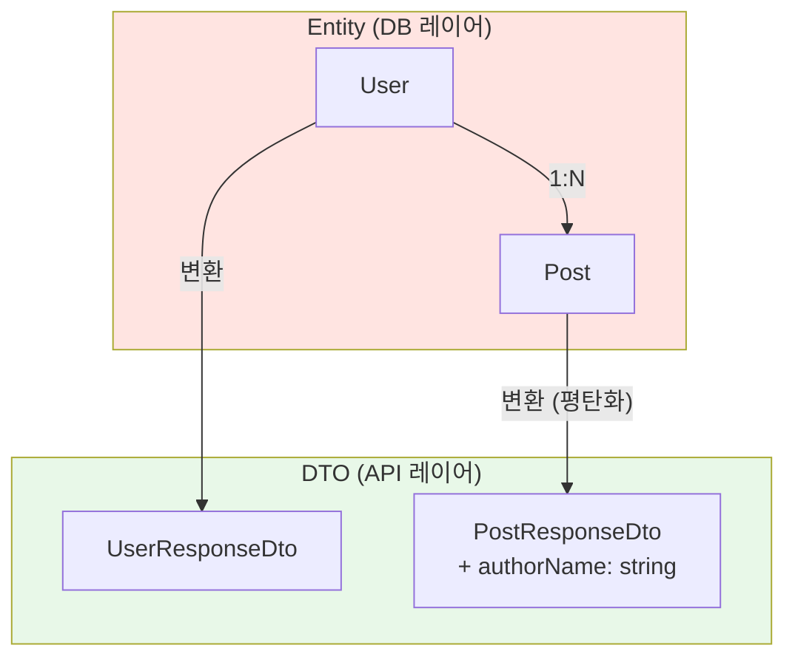
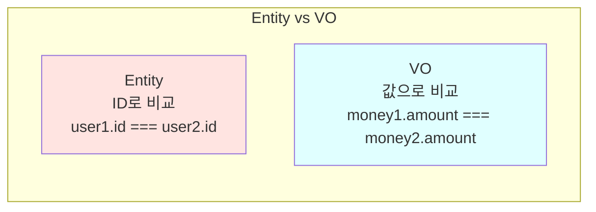
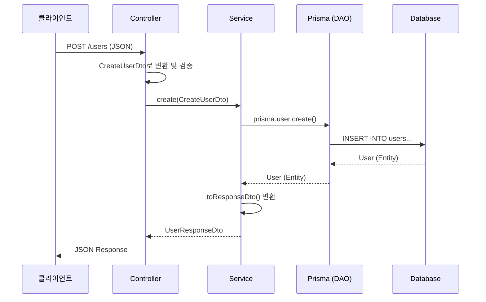

## DTO, DAO, Entity 패턴 이해하기

백엔드 개발을 하다 보면 DTO, DAO, Entity, VO, BO 같은 용어들을 자주 접하게 됩니다. 처음엔 비슷해 보여서 혼란스러운데, 각각의 역할을 명확히 이해하면 코드 구조가 훨씬 깔끔해집니다.

---

## 한눈에 보는 각 패턴의 역할



| 패턴 | 역할 | 비유 |
|------|------|------|
| **DTO** | 데이터 운반 | 택배 상자 📦 |
| **DAO/Repository** | DB 접근 로직 | 창고 관리자 👷 |
| **Entity** | DB 테이블 매핑 | 창고 물건 🏷️ |
| **VO** | 값 객체 (불변) | 화폐 💵 |
| **BO** | 비즈니스 객체 | 계산기 🧮 |

---

## DTO (Data Transfer Object)

### 핵심 개념

DTO는 **레이어 간 데이터를 전달하는 객체**입니다. 순수하게 데이터만 담고 있으며, 비즈니스 로직이 없습니다.



### 비유로 이해하기

> DTO는 **택배 상자**와 같습니다.
> - 내용물(데이터)만 담겨 있음
> - 배송(전송) 목적으로만 사용
> - 상자 자체는 아무 기능이 없음

### Request DTO 예시 (NestJS)

```typescript
// create-user.dto.ts
import { IsEmail, IsInt, IsString, Min, Max } from 'class-validator';
import { ApiProperty } from '@nestjs/swagger';

export class CreateUserDto {
  @ApiProperty({ description: '사용자 이름' })
  @IsString()
  name: string;

  @ApiProperty({ description: '이메일 주소' })
  @IsEmail()
  email: string;

  @ApiProperty({ description: '나이', minimum: 1, maximum: 150 })
  @IsInt()
  @Min(1)
  @Max(150)
  age: number;
}
```

### Response DTO 예시

```typescript
// user-response.dto.ts
export interface UserResponseDto {
  id: number;
  name: string;
  email: string;
  createdAt: string;
}
```

### Request DTO vs Response DTO

| 구분 | Request DTO | Response DTO |
|------|-------------|--------------|
| **용도** | 클라이언트 → 서버 | 서버 → 클라이언트 |
| **형태** | class + 데코레이터 | interface 가능 |
| **유효성 검사** | ✅ 필요 | ❌ 불필요 |
| **NestJS 데코레이터** | @IsString, @IsInt 등 | 선택적 |

---

## DAO (Data Access Object) / Repository

### 핵심 개념

DAO는 **데이터베이스 접근 로직을 캡슐화**하는 객체입니다. CRUD 메서드를 제공합니다.



### 비유로 이해하기

> DAO는 **창고 관리자**와 같습니다.
> - 물건(데이터)을 저장, 조회, 수정, 삭제
> - 창고(DB) 내부 구조는 관리자만 알면 됨
> - 외부에서는 "이거 가져와" 하면 됨

### Prisma에서의 DAO

Prisma를 사용하면 DAO를 직접 구현할 필요가 거의 없습니다. Prisma Client가 DAO 역할을 합니다.

```typescript
// 전통적인 DAO 패턴 (직접 구현)
class UserDAO {
  async findById(id: number): Promise<User | null> {
    return db.query('SELECT * FROM users WHERE id = ?', [id]);
  }
  
  async create(data: CreateUserData): Promise<User> {
    return db.query('INSERT INTO users...', [data]);
  }
}

// Prisma 사용 시 (Prisma가 DAO 역할)
class UserService {
  async findById(id: number) {
    return this.prisma.user.findUnique({ where: { id } });
  }
  
  async create(data: CreateUserDto) {
    return this.prisma.user.create({ data });
  }
}
```

---

## Entity

### 핵심 개념

Entity는 **데이터베이스 테이블과 1:1로 매핑되는 객체**입니다. 고유 식별자(ID)를 가집니다.



### Prisma에서의 Entity

Prisma에서는 `schema.prisma`에 모델을 정의하면 Entity가 자동 생성됩니다.

```prisma
// prisma/schema.prisma
model User {
  id        Int      @id @default(autoincrement())
  email     String   @unique
  name      String?
  posts     Post[]
  createdAt DateTime @default(now())
}

model Post {
  id       Int    @id @default(autoincrement())
  title    String
  content  String?
  author   User   @relation(fields: [authorId], references: [id])
  authorId Int
}
```

### Entity vs DTO

| 구분 | Entity | DTO |
|------|--------|-----|
| **목적** | DB 테이블 매핑 | 데이터 전송 |
| **위치** | Repository/DB 레이어 | Controller/Service 레이어 |
| **관계** | 다른 Entity와 관계 가짐 | 관계 없음 (평탄화) |
| **ID** | 필수 (고유 식별자) | 선택적 |



---

## VO (Value Object)

### 핵심 개념

VO는 **값 자체로 동등성을 판단**하는 객체입니다. ID가 없고, 불변(immutable)합니다.



### 비유로 이해하기

> VO는 **화폐**와 같습니다.
> - 10,000원짜리 두 장은 같은 가치 (값으로 비교)
> - 각 지폐의 일련번호(ID)는 상관없음
> - 한번 발행되면 금액 변경 불가 (불변)

### VO 예시

```typescript
// money.vo.ts
class Money {
  constructor(
    private readonly amount: number,
    private readonly currency: string
  ) {}

  // 값으로 동등성 비교
  equals(other: Money): boolean {
    return this.amount === other.amount && 
           this.currency === other.currency;
  }

  // 연산은 새 객체 반환 (불변성)
  add(other: Money): Money {
    if (this.currency !== other.currency) {
      throw new Error('Currency mismatch');
    }
    return new Money(this.amount + other.amount, this.currency);
  }
}

// 사용
const price1 = new Money(10000, 'KRW');
const price2 = new Money(10000, 'KRW');

console.log(price1.equals(price2)); // true (값이 같으면 같음)
console.log(price1 === price2);     // false (다른 객체)
```

### VO 활용 사례

| VO | 구성 값 | 사용 예시 |
|----|--------|----------|
| `Money` | amount, currency | 가격, 결제 금액 |
| `DateRange` | start, end | 예약 기간 |
| `Address` | city, street, zipCode | 배송 주소 |
| `Email` | value | 이메일 (유효성 검증 포함) |

---

## BO (Business Object)

### 핵심 개념

BO는 **비즈니스 로직을 포함하는 객체**입니다. 도메인 지식을 담고 있습니다.

```typescript
// fund.bo.ts
class Fund {
  constructor(
    public readonly id: number,
    public readonly name: string,
    public readonly aum: number,       // 운용자산
    public readonly category: string
  ) {}

  // 비즈니스 로직
  isLargeCap(): boolean {
    return this.aum >= 1_000_000_000_000; // 1조 이상
  }

  getAumTier(): 'small' | 'medium' | 'large' {
    if (this.aum < 100_000_000_000) return 'small';
    if (this.aum < 1_000_000_000_000) return 'medium';
    return 'large';
  }

  getRiskLevel(): 'low' | 'medium' | 'high' {
    // 카테고리에 따른 리스크 레벨 계산
    const highRiskCategories = ['주식', '파생상품'];
    return highRiskCategories.includes(this.category) 
      ? 'high' 
      : 'low';
  }
}
```

### DTO vs VO vs BO 비교

| 구분 | 로직 | 불변 | ID | 용도 |
|------|------|------|-----|------|
| **DTO** | ❌ 없음 | ❌ 아님 | 선택 | 데이터 전송 |
| **VO** | ✅ 동등성 | ✅ 불변 | ❌ 없음 | 값 표현 |
| **BO** | ✅ 비즈니스 | ❌ 아님 | ✅ 있음 | 도메인 로직 |

---

## 실무 예제: NestJS에서의 적용

### 전체 구조

```
src/
├── user/
│   ├── dto/
│   │   ├── create-user.dto.ts      # Request DTO
│   │   └── user-response.dto.ts    # Response DTO
│   ├── entities/
│   │   └── user.entity.ts          # Entity (Prisma가 대체)
│   ├── user.controller.ts
│   ├── user.service.ts
│   └── user.module.ts
└── prisma/
    └── prisma.service.ts           # DAO 역할
```

### Controller

```typescript
// user.controller.ts
@Controller('users')
export class UserController {
  constructor(private readonly userService: UserService) {}

  @Post()
  async create(@Body() createUserDto: CreateUserDto): Promise<UserResponseDto> {
    return this.userService.create(createUserDto);
  }

  @Get(':id')
  async findOne(@Param('id') id: string): Promise<UserResponseDto> {
    return this.userService.findOne(+id);
  }
}
```

### Service

```typescript
// user.service.ts
@Injectable()
export class UserService {
  constructor(private readonly prisma: PrismaService) {}

  async create(dto: CreateUserDto): Promise<UserResponseDto> {
    const user = await this.prisma.user.create({
      data: dto,
    });
    return this.toResponseDto(user);
  }

  async findOne(id: number): Promise<UserResponseDto> {
    const user = await this.prisma.user.findUnique({
      where: { id },
    });
    if (!user) throw new NotFoundException();
    return this.toResponseDto(user);
  }

  // Entity → Response DTO 변환
  private toResponseDto(user: User): UserResponseDto {
    return {
      id: user.id,
      name: user.name,
      email: user.email,
      createdAt: user.createdAt.toISOString(),
    };
  }
}
```

### 데이터 흐름



---

## 마치며

DTO는 데이터 전송용, DAO/Repository는 DB 접근 캡슐화, Entity는 DB 테이블 매핑, VO는 불변 값 객체, BO는 비즈니스 로직을 담당합니다. NestJS + Prisma 조합에서는 Request DTO에 class와 데코레이터를, Response DTO에 interface를 사용하고, Entity와 DAO는 Prisma가 담당합니다.
