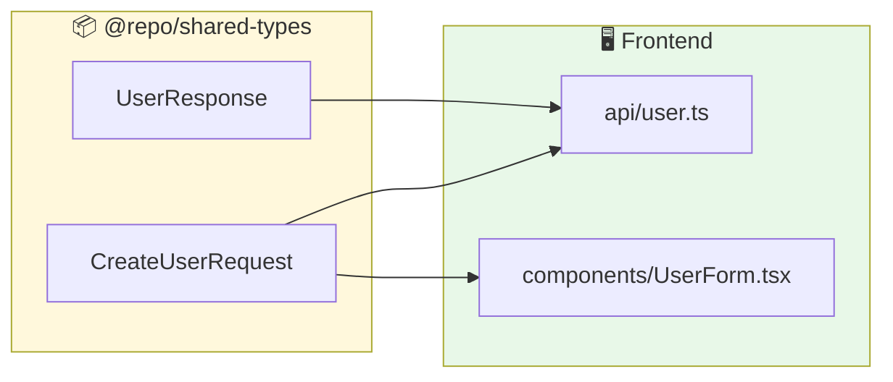
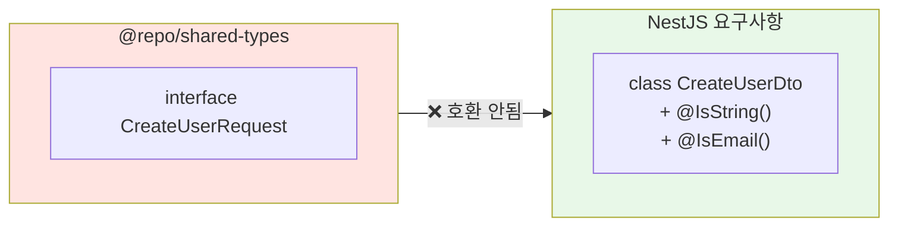
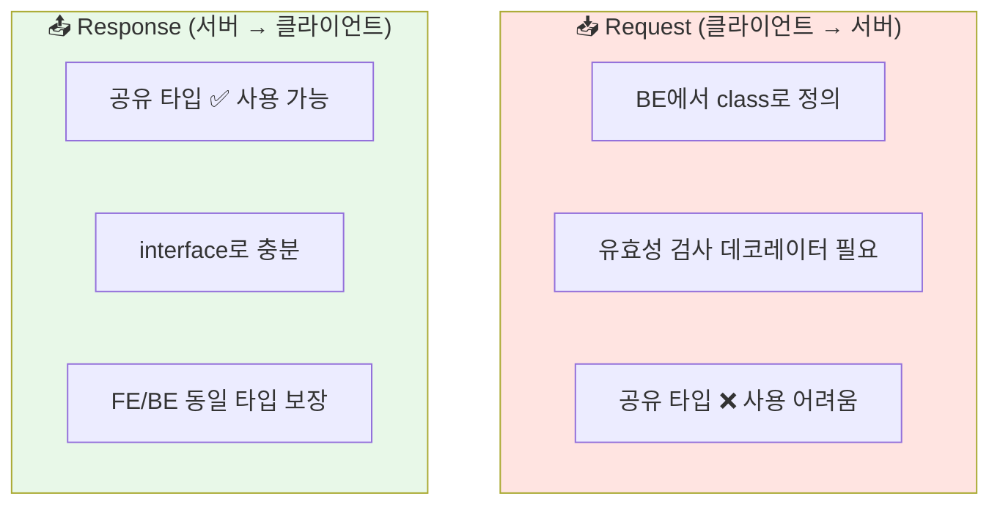
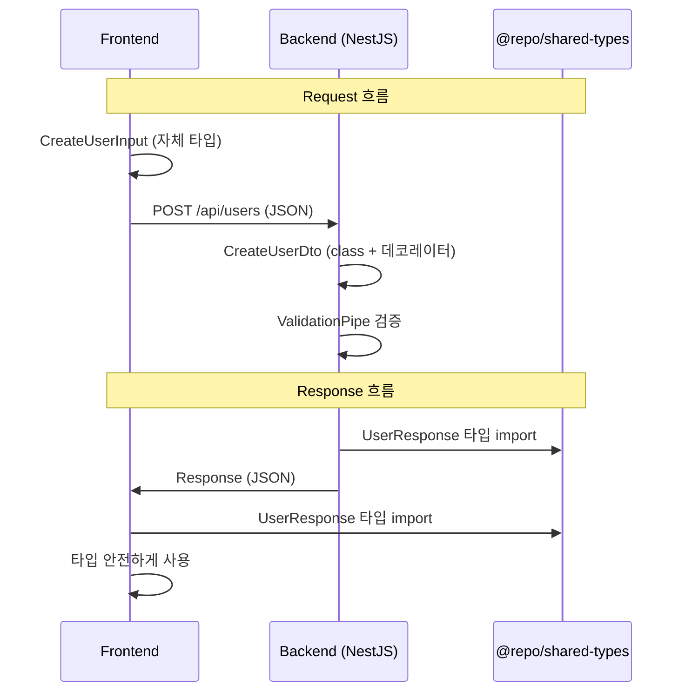
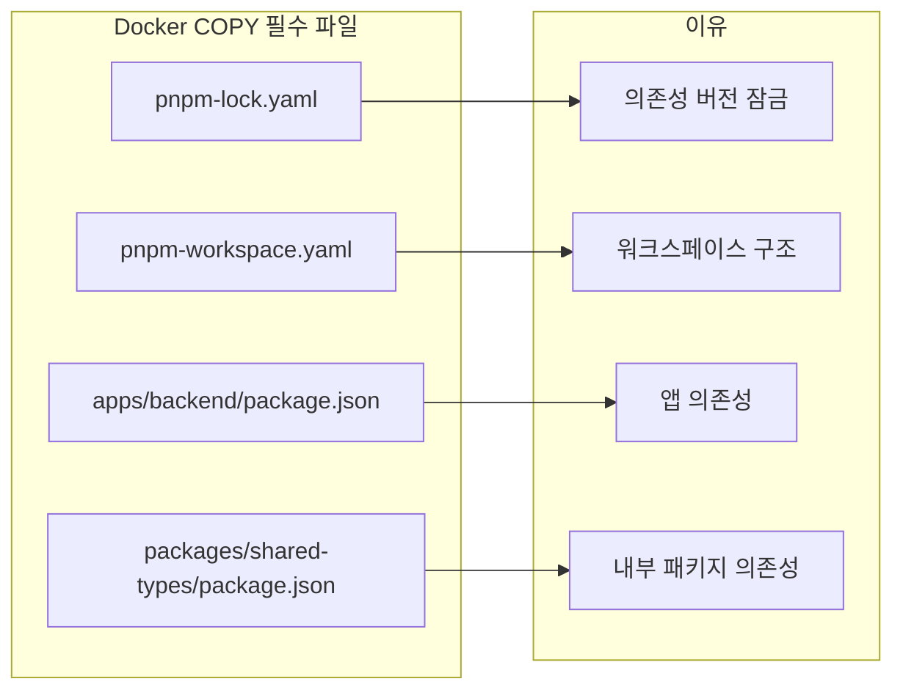
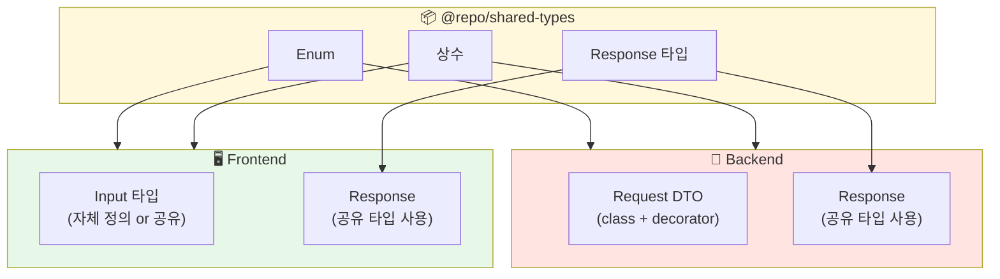

## 모노레포에서 타입 공유하기

모노레포에서 프론트엔드와 백엔드를 함께 관리하면 타입을 공유할 수 있다는 장점이 있습니다. 하지만 NestJS를 사용하면 몇 가지 제약이 있습니다. 이 문제를 어떻게 해결하는지 정리합니다.

---

## 모노레포 구조

```
my-project/
├── apps/
│   ├── frontend/          # React/Next.js
│   │   └── package.json
│   └── backend/           # NestJS
│       └── package.json
├── packages/
│   └── shared-types/      # 공유 타입 패키지
│       ├── src/
│       │   └── index.ts
│       └── package.json
├── pnpm-workspace.yaml
└── package.json
```

### pnpm-workspace.yaml

```yaml
packages:
  - 'apps/*'
  - 'packages/*'
```

---

## 공유 타입 패키지 만들기

### packages/shared-types/package.json

```json
{
  "name": "@repo/shared-types",
  "version": "1.0.0",
  "main": "./src/index.ts",
  "types": "./src/index.ts",
  "scripts": {
    "typecheck": "tsc --noEmit"
  },
  "devDependencies": {
    "typescript": "^5.0.0"
  }
}
```

### packages/shared-types/src/index.ts

```typescript
// User 관련 타입
export interface User {
  id: number;
  email: string;
  name: string;
  createdAt: string;
}

export interface CreateUserRequest {
  email: string;
  name: string;
  password: string;
}

export interface UserResponse {
  id: number;
  email: string;
  name: string;
  createdAt: string;
}

// API Response 타입
export interface ApiResponse<T> {
  success: boolean;
  data: T;
  message?: string;
}

export interface PaginatedResponse<T> {
  items: T[];
  total: number;
  page: number;
  pageSize: number;
  totalPages: number;
}
```

---

## 프론트엔드에서 사용하기

프론트엔드에서는 공유 타입을 자유롭게 사용할 수 있습니다.

### apps/frontend/package.json

```json
{
  "name": "frontend",
  "dependencies": {
    "@repo/shared-types": "workspace:*"
  }
}
```

### 사용 예시

```typescript
// apps/frontend/src/api/user.ts
import type { 
  CreateUserRequest, 
  UserResponse, 
  ApiResponse 
} from '@repo/shared-types';

export async function createUser(
  data: CreateUserRequest
): Promise<ApiResponse<UserResponse>> {
  const response = await fetch('/api/users', {
    method: 'POST',
    headers: { 'Content-Type': 'application/json' },
    body: JSON.stringify(data),
  });
  return response.json();
}
```



---

## 백엔드(NestJS)에서의 문제

### 왜 공유 타입을 그대로 쓰기 어려운가?

NestJS에서 Request DTO는 **class + 데코레이터**가 필요합니다. 하지만 공유 패키지의 타입은 **interface**입니다.



### 문제 상황

```typescript
// ❌ 이렇게 하고 싶지만...
import { CreateUserRequest } from '@repo/shared-types';

// NestJS ValidationPipe가 작동하지 않음!
@Post()
async create(@Body() dto: CreateUserRequest) {
  // interface는 런타임에 존재하지 않아서 검증 불가
}
```

```typescript
// ✅ NestJS는 이게 필요
class CreateUserDto {
  @IsEmail()
  email: string;

  @IsString()
  @MinLength(2)
  name: string;

  @IsString()
  @MinLength(8)
  password: string;
}
```

---

## 해결 전략: Request vs Response 분리

### 핵심 아이디어



| 타입 | 공유 패키지 사용 | 이유 |
|------|-----------------|------|
| **Request DTO** | ❌ BE에서 별도 정의 | 데코레이터 필요 |
| **Response DTO** | ✅ 공유 패키지 사용 | interface로 충분 |
| **공통 Enum** | ✅ 공유 패키지 사용 | 양쪽에서 동일하게 필요 |
| **공통 상수** | ✅ 공유 패키지 사용 | 양쪽에서 동일하게 필요 |

---

## 실전 적용

### 1. 공유 패키지 구조

```typescript
// packages/shared-types/src/index.ts

// ✅ Response 타입 (FE/BE 공유)
export interface UserResponse {
  id: number;
  email: string;
  name: string;
  createdAt: string;
}

export interface PostResponse {
  id: number;
  title: string;
  content: string;
  author: Pick<UserResponse, 'id' | 'name'>;
}

// ✅ 공통 Enum (FE/BE 공유)
export enum UserRole {
  ADMIN = 'admin',
  USER = 'user',
  GUEST = 'guest',
}

export enum PostStatus {
  DRAFT = 'draft',
  PUBLISHED = 'published',
  ARCHIVED = 'archived',
}

// ✅ API Response 래퍼 (FE/BE 공유)
export interface ApiResponse<T> {
  success: boolean;
  data: T;
  error?: string;
}
```

### 2. 백엔드 DTO 정의

```typescript
// apps/backend/src/user/dto/create-user.dto.ts
import { IsEmail, IsString, MinLength } from 'class-validator';
import { ApiProperty } from '@nestjs/swagger';

// Request DTO는 BE에서 class로 정의
export class CreateUserDto {
  @ApiProperty({ example: 'user@example.com' })
  @IsEmail()
  email: string;

  @ApiProperty({ example: '홍길동', minLength: 2 })
  @IsString()
  @MinLength(2)
  name: string;

  @ApiProperty({ minLength: 8 })
  @IsString()
  @MinLength(8)
  password: string;
}
```

```typescript
// apps/backend/src/user/user.service.ts
import type { UserResponse } from '@repo/shared-types';
import { CreateUserDto } from './dto/create-user.dto';

@Injectable()
export class UserService {
  async create(dto: CreateUserDto): Promise<UserResponse> {
    const user = await this.prisma.user.create({
      data: {
        email: dto.email,
        name: dto.name,
        password: await this.hashPassword(dto.password),
      },
    });

    // Response는 공유 타입 사용
    return {
      id: user.id,
      email: user.email,
      name: user.name,
      createdAt: user.createdAt.toISOString(),
    };
  }
}
```

### 3. 프론트엔드 사용

```typescript
// apps/frontend/src/api/user.ts
import type { UserResponse, ApiResponse } from '@repo/shared-types';

interface CreateUserInput {
  email: string;
  name: string;
  password: string;
}

export async function createUser(
  input: CreateUserInput
): Promise<ApiResponse<UserResponse>> {
  const res = await fetch('/api/users', {
    method: 'POST',
    headers: { 'Content-Type': 'application/json' },
    body: JSON.stringify(input),
  });
  return res.json();
}
```

---

## 데이터 흐름 정리



---

## Docker 빌드 시 주의사항

모노레포에서 Docker 빌드 시 내부 패키지 의존성을 처리해야 합니다.

### Dockerfile

```dockerfile
FROM node:20-alpine AS builder

RUN corepack enable && corepack prepare pnpm@10.25.0 --activate

WORKDIR /app

# workspace 설정 파일 복사
COPY pnpm-lock.yaml pnpm-workspace.yaml ./

# 필요한 패키지들의 package.json 복사
COPY apps/backend/package.json ./apps/backend/
COPY packages/shared-types/package.json ./packages/shared-types/

# 의존성 설치
RUN pnpm install --frozen-lockfile

# 소스코드 복사
COPY apps/backend ./apps/backend
COPY packages/shared-types ./packages/shared-types

# 빌드
RUN pnpm --filter backend build

# ... (생략)
```

### 핵심 포인트



---

## 고급: 타입 동기화 검증

공유 타입과 실제 API 응답이 일치하는지 검증할 수 있습니다.

### satisfies 키워드 활용

```typescript
// apps/backend/src/user/user.service.ts
import type { UserResponse } from '@repo/shared-types';

@Injectable()
export class UserService {
  async findOne(id: number): Promise<UserResponse> {
    const user = await this.prisma.user.findUnique({
      where: { id },
    });

    // satisfies로 타입 일치 검증
    return {
      id: user.id,
      email: user.email,
      name: user.name,
      createdAt: user.createdAt.toISOString(),
    } satisfies UserResponse;
  }
}
```

### 장점

- 컴파일 타임에 타입 불일치 감지
- Response 구조 변경 시 양쪽에서 에러 발생
- API 문서 없이도 타입으로 계약 유지

---

## 패턴 정리



---

## 마치며

모노레포에서 타입 공유의 핵심은 Response 타입과 Enum/상수는 공유 패키지에서 정의하고, Request DTO는 백엔드에서 class + 데코레이터로 별도 정의하는 것입니다. Docker 빌드 시에는 내부 패키지 의존성 파일 복사가 필수입니다.

Response 타입을 공유하면 백엔드에서 응답 구조가 변경될 때 프론트엔드에서도 즉시 타입 에러가 발생하여 버그를 사전에 방지할 수 있습니다.
