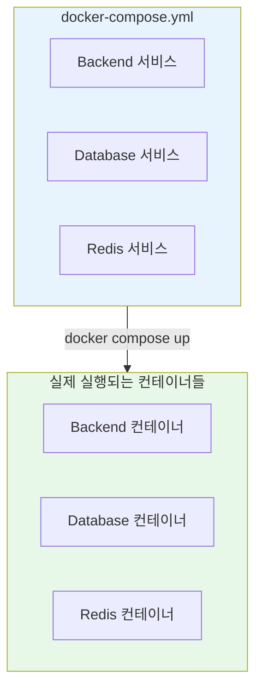
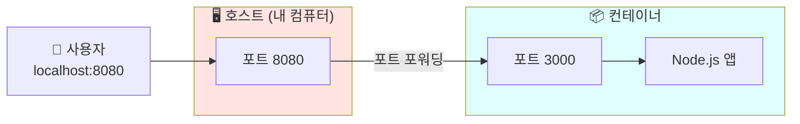
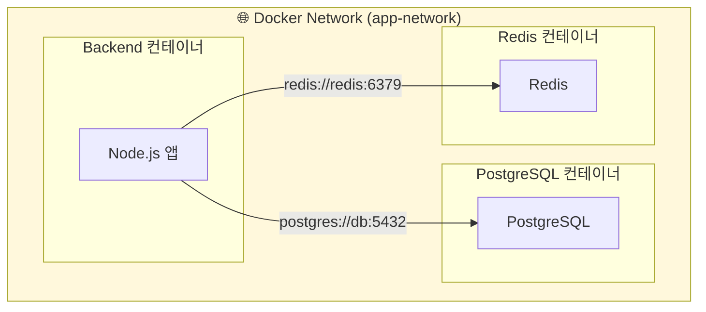
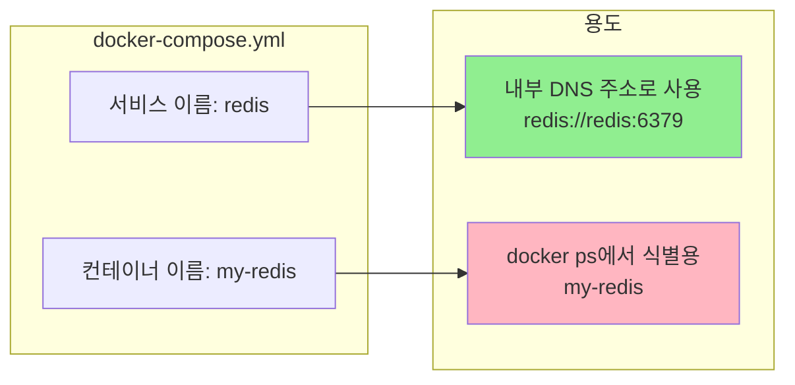
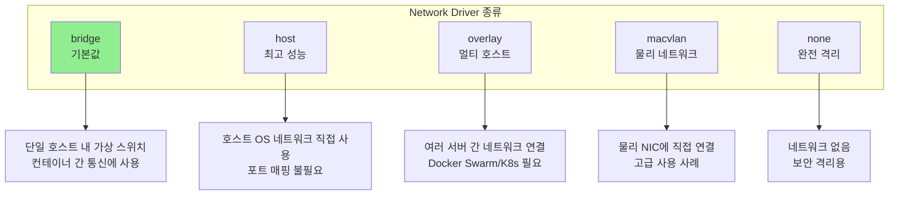
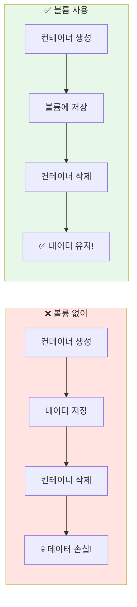
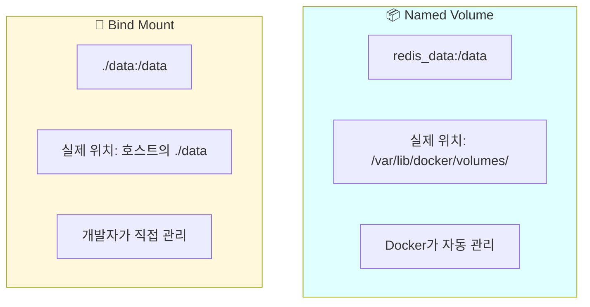
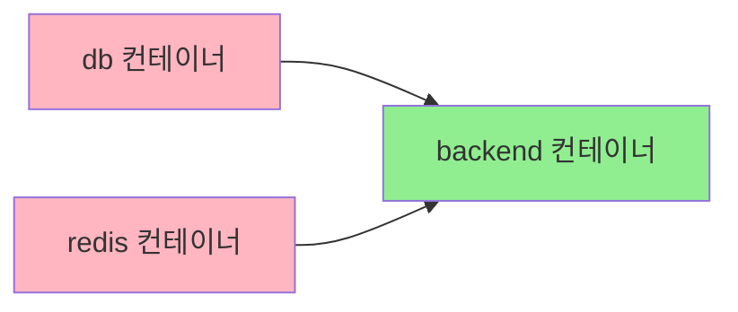
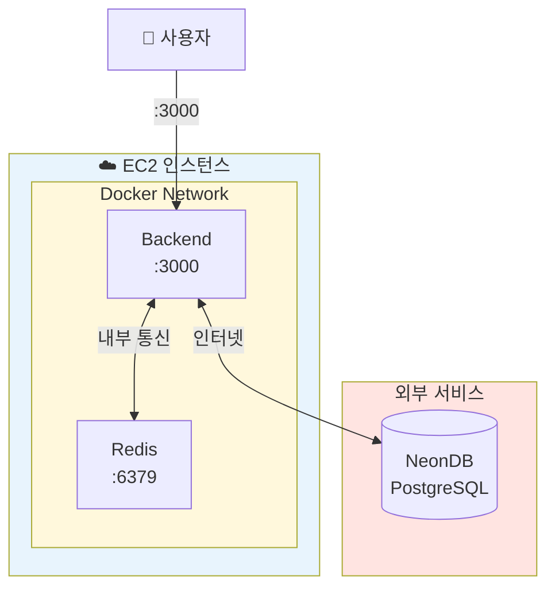

## Docker Compose 가이드: 네트워크, 볼륨, 포트 매핑

Docker Compose를 사용하면서 가장 헷갈리는 부분이 네트워크, 볼륨, 포트 매핑입니다. 이 세 가지 핵심 개념을 실무 예제와 함께 정리합니다.

---

## Docker Compose란?

Docker Compose는 **여러 컨테이너를 정의하고 실행하기 위한 도구**입니다. 쉽게 말해 인프라를 코드로 관리(IaC)할 수 있게 해주는 도구죠.



### Docker CLI vs Docker Compose

| 방식 | 명령어 예시 | 특징 |
|------|------------|------|
| **Docker CLI** | `docker run -d -p 3000:3000 --network my-net my-app` | 컨테이너마다 긴 명령어 입력 필요 |
| **Docker Compose** | `docker compose up` | YAML 파일에 모든 설정 정의, 한 번에 실행 |

---

## 포트 매핑 (Port Mapping)

### 기본 개념

포트 매핑은 **호스트(내 컴퓨터)의 포트**와 **컨테이너 내부의 포트**를 연결하는 것입니다.

```yaml
services:
  backend:
    ports:
      - "8080:3000"  # 호스트:컨테이너
```



### 포트 매핑 예시

```yaml
services:
  # 같은 포트로 매핑
  backend:
    ports:
      - "3000:3000"   # 호스트 3000 → 컨테이너 3000

  # 다른 포트로 매핑 (포트 충돌 해결)
  backend-dev:
    ports:
      - "3001:3000"   # 호스트 3001 → 컨테이너 3000

  # 여러 포트 매핑
  nginx:
    ports:
      - "80:80"       # HTTP
      - "443:443"     # HTTPS
```

### 자주 하는 실수

```yaml
# ❌ 잘못된 이해: 컨테이너 포트를 바꾸면 앱도 바뀐다?
services:
  backend:
    ports:
      - "3000:8080"   # 앱이 3000에서 실행되는데 8080으로 매핑하면 안됨!

# ✅ 올바른 이해: 앱이 실행되는 포트와 일치해야 함
services:
  backend:
    ports:
      - "8080:3000"   # 앱은 3000에서 실행, 외부에서 8080으로 접근
```

> 💡 **참고**: 컨테이너 내부 포트(오른쪽)는 앱이 실제로 리슨하는 포트와 같아야 합니다. 변경할 수 있는 건 호스트 포트(왼쪽)뿐입니다.

---

## Docker 네트워크 (Network)

### 왜 네트워크가 필요한가?

Docker 컨테이너는 기본적으로 **격리된 환경**에서 실행됩니다. 컨테이너 간 통신을 위해서는 같은 네트워크에 있어야 합니다.



### 서비스 이름 vs 컨테이너 이름

Docker Compose에서 헷갈리는 개념 중 하나가 바로 **서비스 이름**과 **컨테이너 이름**의 차이입니다.

```yaml
services:
  redis:                     # 👈 서비스 이름 (DNS로 사용)
    image: redis:7
    container_name: my-redis  # 👈 컨테이너 이름 (식별용)
```



| 구분 | 서비스 이름 | 컨테이너 이름 |
|------|------------|--------------|
| **정의 위치** | `services:` 하위 키 | `container_name:` 속성 |
| **용도** | Docker 내부 DNS | docker ps 식별 |
| **통신 시 사용** | ✅ 가능 | ❌ 권장하지 않음 |
| **예시** | `redis://redis:6379` | `docker logs my-redis` |

### Network Driver 종류

```yaml
networks:
  app-network:
    driver: bridge  # 기본값, 대부분 이걸 사용
```



> 💡 **실무 팁**: 대부분의 경우 `bridge` 드라이버면 충분합니다. driver를 생략하면 자동으로 `bridge`가 적용됩니다.

### 네트워크 설정 예시

```yaml
version: "3.8"

services:
  backend:
    build: .
    networks:
      - app-network  # 👈 이 네트워크에 연결
    environment:
      DATABASE_URL: "postgres://db:5432/mydb"  # 서비스 이름으로 접근
      REDIS_URL: "redis://redis:6379"

  db:
    image: postgres:15
    networks:
      - app-network

  redis:
    image: redis:7
    networks:
      - app-network

networks:
  app-network:
    driver: bridge  # 생략 가능 (기본값)
```

---

## Docker 볼륨 (Volume)

### 왜 볼륨이 필요한가?

Docker 컨테이너는 **일회용**입니다. 컨테이너를 삭제하면 내부 데이터도 함께 사라집니다. 데이터를 영구적으로 보존하려면 **볼륨**이 필요합니다.



### Named Volume vs Bind Mount

Docker에서 데이터를 유지하는 방법은 크게 두 가지입니다.



| 구분 | Named Volume | Bind Mount |
|------|-------------|------------|
| **문법** | `volume_name:/container/path` | `./host/path:/container/path` |
| **경로 시작** | 이름만 (경로 구분자 없음) | `./` 또는 `/`로 시작 |
| **관리 주체** | Docker | 개발자 |
| **volumes 섹션** | 정의 필요 | 정의 불필요 |
| **사용 사례** | 프로덕션 데이터베이스 | 개발 시 코드 즉시 반영 |

### 볼륨 구분 방법

```yaml
volumes:
  # Named Volume - 이름만 있고 경로 구분자 없음
  - redis_data:/data          # ✅ Named Volume

  # Bind Mount - ./ 또는 / 로 시작하는 경로
  - ./local-data:/data        # ✅ Bind Mount (상대 경로)
  - /var/mydata:/data         # ✅ Bind Mount (절대 경로)
```

### 실전 예제

```yaml
version: "3.8"

services:
  postgres:
    image: postgres:15
    volumes:
      - pg_data:/var/lib/postgresql/data  # Named Volume (영구 저장)
    environment:
      POSTGRES_PASSWORD: secret

  redis:
    image: redis:7
    volumes:
      - redis_data:/data  # Named Volume (영구 저장)
    command: redis-server --appendonly yes

  backend:
    build: .
    volumes:
      - ./src:/app/src  # Bind Mount (개발 시 핫리로드용)

# Named Volume은 하단에 선언 필요
volumes:
  pg_data:
  redis_data:
```

### Volume Driver

```yaml
volumes:
  pg_data:
    driver: local  # 기본값, 호스트 로컬 저장소

  # 고급 사용 (NFS, 클라우드 스토리지 등)
  shared_data:
    driver: nfs
```

| Driver | 설명 | 사용 사례 |
|--------|------|----------|
| **local** | 호스트 로컬 저장소 (기본값) | 대부분의 경우 |
| **nfs** | 네트워크 파일 시스템 | 여러 서버에서 공유 |
| **aws-ebs** | AWS EBS 볼륨 | AWS 환경 |
| **azure-file** | Azure 파일 공유 | Azure 환경 |

---

## Docker Compose 고급 기능

### depends_on: 시작 순서 제어

컨테이너 시작 순서가 중요할 때 사용합니다.

```yaml
services:
  backend:
    build: .
    depends_on:
      - db
      - redis  # db, redis가 먼저 시작된 후 backend 시작

  db:
    image: postgres:15

  redis:
    image: redis:7
```



> ⚠️ **주의**: `depends_on`은 컨테이너 **시작 순서**만 보장합니다. 서비스가 **준비(ready)**될 때까지 기다리지 않습니다. 예를 들어 PostgreSQL 컨테이너가 시작되어도 DB가 연결을 받을 준비가 안 됐을 수 있습니다.

### healthcheck: 헬스체크

서비스가 실제로 준비되었는지 확인합니다.

```yaml
services:
  db:
    image: postgres:15
    healthcheck:
      test: ["CMD-SHELL", "pg_isready -U postgres"]
      interval: 5s
      timeout: 5s
      retries: 5

  backend:
    build: .
    depends_on:
      db:
        condition: service_healthy  # 👈 헬스체크 통과 후 시작
```

### 환경별 설정 분리

개발(dev)과 프로덕션(prod) 설정을 분리할 수 있습니다.

```
project/
├── docker-compose.yml          # 공통 설정
├── docker-compose.dev.yml      # 개발용 오버라이드
└── docker-compose.prod.yml     # 프로덕션용 오버라이드
```

```bash
# 개발 환경
docker compose -f docker-compose.yml -f docker-compose.dev.yml up

# 프로덕션 환경
docker compose -f docker-compose.yml -f docker-compose.prod.yml up
```

---

## 실전 예제: BE + Redis + 외부 DB

소규모 프로젝트에서 자주 사용하는 구성입니다.

```yaml
version: "3.8"

services:
  backend:
    build:
      context: .
      dockerfile: Dockerfile
    ports:
      - "3000:3000"
    environment:
      DATABASE_URL: ${DATABASE_URL}  # 외부 DB (NeonDB 등)
      REDIS_URL: redis://redis:6379
    depends_on:
      - redis
    networks:
      - app-network

  redis:
    image: redis:7-alpine
    volumes:
      - redis_data:/data
    networks:
      - app-network
    command: redis-server --appendonly yes

networks:
  app-network:
    driver: bridge

volumes:
  redis_data:
```



---

## 자주 사용하는 명령어

```bash
# 빌드 및 실행 (백그라운드)
docker compose up --build -d

# 빌드만
docker compose build

# 실행만 (이미 빌드된 이미지 사용)
docker compose up -d

# 로그 확인 (실시간)
docker compose logs -f backend

# 컨테이너 중지 및 삭제
docker compose down

# 볼륨까지 삭제
docker compose down -v

# 네트워크 확인
docker network ls
docker network inspect app-network

# 볼륨 확인
docker volume ls
docker volume inspect redis_data
```

---

## 마치며

Docker Compose의 핵심은 포트 매핑(`호스트:컨테이너`), 네트워크(같은 네트워크의 컨테이너끼리 서비스 이름으로 통신), 볼륨(컨테이너 삭제 후에도 데이터 유지)입니다. 서비스 이름으로 통신한다는 점과 Named Volume은 하단에 정의해야 한다는 점이 중요합니다.
