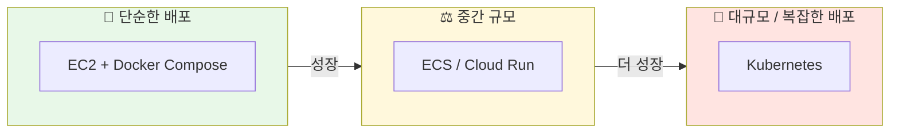
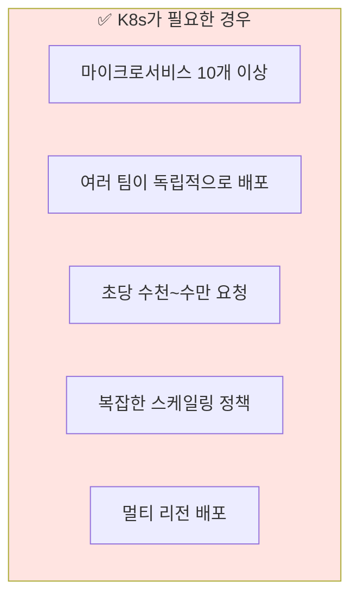
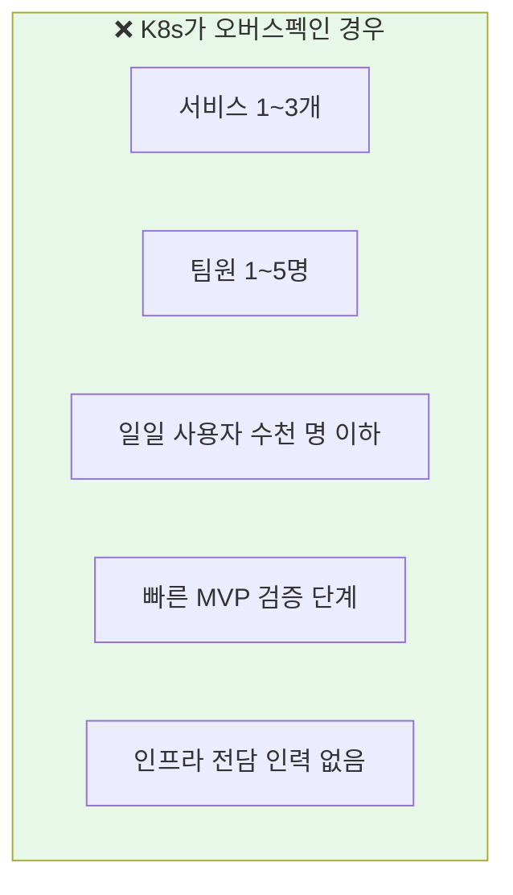
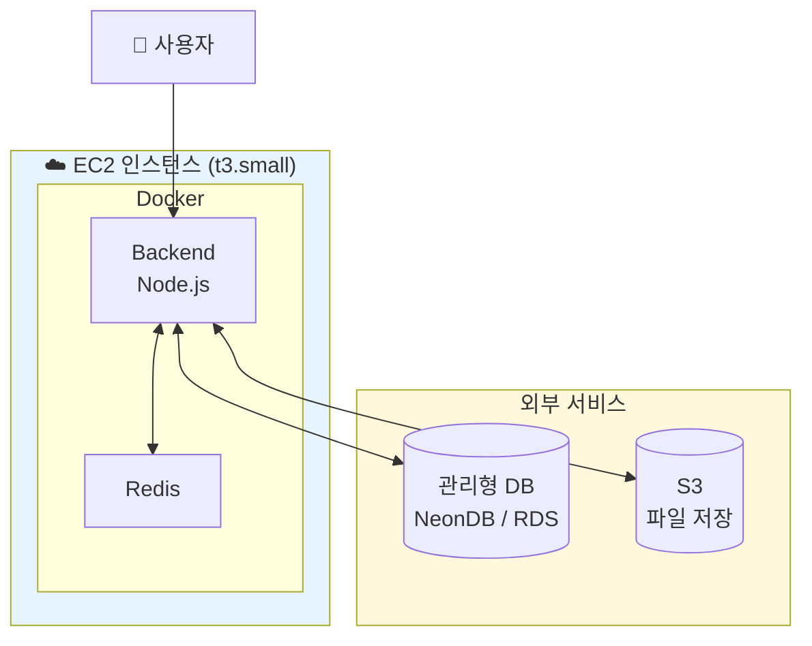
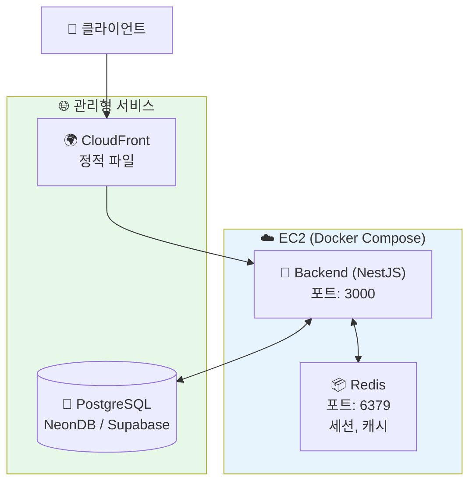
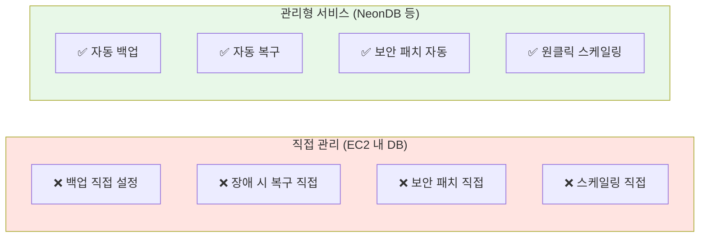
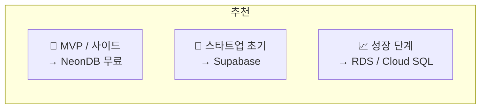
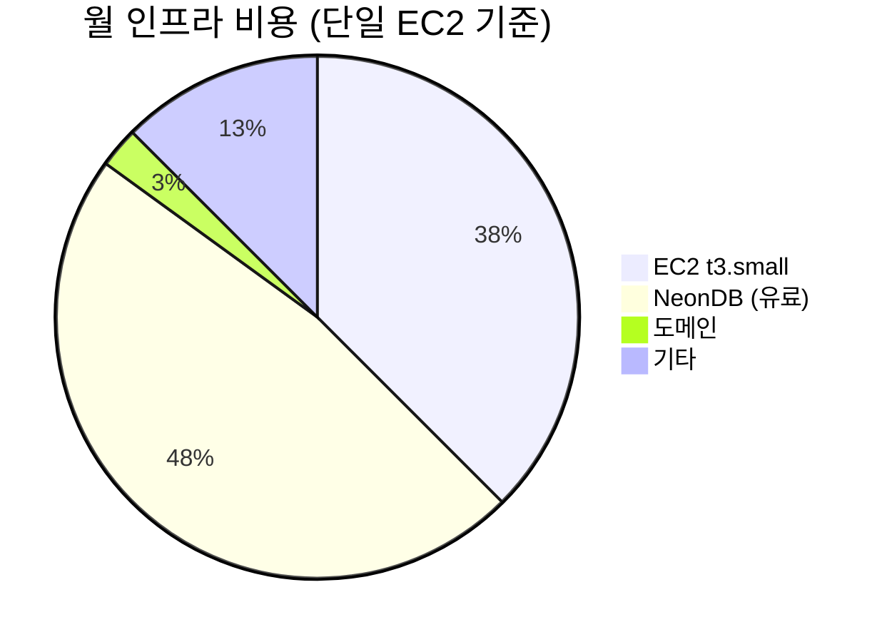
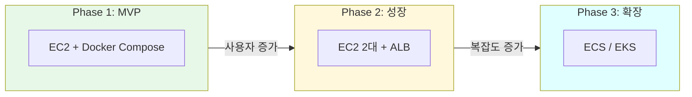

## 컨테이너 배포 전략: EC2 단일 서버 vs Kubernetes

사이드 프로젝트나 스타트업 초기 단계에서 가장 많이 하는 고민 중 하나가 "어디에 어떻게 배포하지?"입니다. Kubernetes가 대세라고 하는데, 과연 내 프로젝트에도 필요할까요? 상황에 맞는 적정 인프라 선택 방법을 정리합니다.

---

## 배포 옵션 비교



| 방식 | 적합한 상황 | 월 비용 (예상) | 복잡도 |
|------|------------|---------------|--------|
| **EC2 + Docker Compose** | 사이드 프로젝트, MVP | $5~50 | ⭐ |
| **ECS / Cloud Run** | 중소규모 서비스 | $50~200 | ⭐⭐ |
| **Kubernetes** | 대규모, MSA | $200+ | ⭐⭐⭐⭐ |

---

## 언제 Kubernetes가 필요한가?

### Kubernetes가 필요한 경우



### Kubernetes가 오버스펙인 경우



### 판단 기준 체크리스트

```
□ 서비스(마이크로서비스)가 5개 이상인가?
□ 여러 팀이 독립적으로 배포해야 하는가?
□ 오토스케일링이 필수적인가?
□ 99.99% 이상의 가용성이 필요한가?
□ 인프라 전담 인력이 있는가?

→ 3개 이상 Yes라면 Kubernetes 고려
→ 2개 이하라면 단순한 방식 추천
```

---

## EC2 단일 서버 배포

### 왜 단일 서버인가?

대부분의 사이드 프로젝트와 초기 스타트업은 **단일 EC2 인스턴스**로 충분합니다.



### 장점

| 장점 | 설명 |
|------|------|
| **비용 효율** | t3.small 기준 월 $15~20 |
| **단순함** | 학습 곡선 낮음, 빠른 배포 |
| **디버깅 용이** | SSH로 직접 접속하여 확인 |
| **충분한 성능** | 일일 수천~수만 요청 처리 가능 |

### 단점

| 단점 | 해결 방법 |
|------|----------|
| 단일 장애점 (SPOF) | 중요한 서비스는 2대 운영 |
| 수동 스케일링 | 성장하면 ECS/K8s로 이전 |
| 배포 시 다운타임 | Blue-Green 배포 적용 |

---

## 권장 아키텍처: BE + Redis + 외부 DB

### 구성 요소



### 왜 이 구성인가?

| 컴포넌트 | 위치 | 이유 |
|---------|------|------|
| **Backend** | EC2 | 핵심 로직, 직접 제어 필요 |
| **Redis** | EC2 | 낮은 지연 필요, 데이터 소실 허용 |
| **PostgreSQL** | 외부 (NeonDB) | 백업, 복구, 스케일링 자동화 |

### DB를 외부 서비스로 분리하는 이유



---

## 관리형 DB 서비스 비교

### PostgreSQL 옵션

| 서비스 | 무료 티어 | 유료 시작 | 특징 |
|--------|----------|----------|------|
| **NeonDB** | 0.5GB | $19/월 | 서버리스, 빠른 시작 |
| **Supabase** | 500MB | $25/월 | Firebase 대체, 인증 포함 |
| **PlanetScale** | 5GB | $29/월 | MySQL, 브랜칭 기능 |
| **AWS RDS** | 12개월 무료 | $15/월~ | 안정적, 설정 복잡 |

### 추천



---

## Docker Compose 설정 예시

### docker-compose.yml

```yaml
version: "3.8"

services:
  backend:
    build:
      context: .
      dockerfile: Dockerfile
    ports:
      - "3000:3000"
    environment:
      NODE_ENV: production
      DATABASE_URL: ${DATABASE_URL}      # 외부 DB 연결
      REDIS_URL: redis://redis:6379
    depends_on:
      - redis
    restart: unless-stopped
    networks:
      - app-network

  redis:
    image: redis:7-alpine
    volumes:
      - redis_data:/data
    command: redis-server --appendonly yes
    restart: unless-stopped
    networks:
      - app-network
    # 포트 노출 안함 - 내부 통신만

networks:
  app-network:
    driver: bridge

volumes:
  redis_data:
```

### 핵심 포인트

1. **Redis는 외부에 노출하지 않음** - 내부 통신만 사용
2. **DB는 환경변수로 외부 서비스 연결** - 관리형 DB 사용
3. **restart: unless-stopped** - 서버 재시작 시 자동 실행

---

## 비용 비교

### 월 예상 비용



| 구성 | EC2 + Docker | ECS Fargate | EKS (K8s) |
|------|-------------|-------------|-----------|
| **컴퓨팅** | $15 (t3.small) | $30~50 | $73+ (클러스터) |
| **DB (관리형)** | $0~19 | $0~19 | $0~19 |
| **로드밸런서** | 불필요 | $16 | $16 |
| **총 비용** | **$15~35** | **$50~85** | **$100+** |

> 💡 **결론**: MVP 단계에서는 EC2 단일 서버가 가장 비용 효율적입니다.

---

## 배포 시나리오별 가이드

### 시나리오 1: 사이드 프로젝트 / MVP

```
👤 사용자: 일일 100~1,000명
💰 예산: 최소화
👨‍💻 인력: 1~2명

→ EC2 t3.micro/small + Docker Compose + NeonDB 무료
→ 월 $10~20
```

### 시나리오 2: 초기 스타트업

```
👤 사용자: 일일 1,000~10,000명
💰 예산: 월 $50~100
👨‍💻 인력: 3~5명

→ EC2 t3.medium + Docker Compose + NeonDB/Supabase 유료
→ 필요시 EC2 추가 (로드밸런서 도입)
→ 월 $50~100
```

### 시나리오 3: 성장 단계

```
👤 사용자: 일일 10,000~100,000명
💰 예산: 월 $200+
👨‍💻 인력: 5~15명, DevOps 전담

→ ECS/EKS 또는 Kubernetes
→ RDS Multi-AZ
→ 오토스케일링 설정
```

---

## 마이그레이션 경로

나중에 규모가 커지면 어떻게 해야 할까요?



### Phase 1 → Phase 2

```bash
# 기존 서버 복제
# ALB(Application Load Balancer) 추가
# Health Check 설정
```

### Phase 2 → Phase 3

```bash
# Docker Compose → ECS Task Definition 변환
# 또는 Kubernetes manifest 작성
# CI/CD 파이프라인 구축
```

> 💡 **핵심**: 처음부터 완벽한 인프라를 구축하려 하지 마세요. 성장하면서 점진적으로 개선하면 됩니다.

---

## EC2 배포 체크리스트

### 초기 설정

```
□ EC2 인스턴스 생성 (Amazon Linux 2023 / Ubuntu)
□ 보안 그룹 설정 (22, 80, 443 포트)
□ Elastic IP 할당 (고정 IP)
□ Docker & Docker Compose 설치
□ 도메인 연결 (Route 53 / Cloudflare)
```

### 보안 설정

```
□ SSH 키 기반 인증 (비밀번호 비활성화)
□ fail2ban 설치 (브루트포스 방지)
□ UFW/iptables 방화벽 설정
□ 정기적인 보안 업데이트
□ 환경변수로 민감 정보 관리 (.env)
```

### 운영 설정

```
□ systemd로 Docker 자동 시작
□ CloudWatch 또는 로깅 서비스 연동
□ 간단한 헬스체크 스크립트
□ 정기 백업 (Redis 데이터)
```

---

## 자주 하는 실수

### 1. 처음부터 Kubernetes 도입

```
❌ "요즘 다 쿠버네티스 쓰니까..."
✅ "우리 규모에 맞는 인프라부터 시작하자"
```

### 2. DB를 EC2 내부에서 운영

```
❌ EC2 내 PostgreSQL 직접 설치
✅ NeonDB/Supabase 같은 관리형 서비스 사용
```

### 3. 모든 것을 직접 구축

```
❌ 인증, 파일 저장, 이메일 모두 직접 구현
✅ 관리형 서비스 활용 (Supabase Auth, S3, SES)
```

---

## 마치며

인프라 선택의 핵심은 지금 필요한 것만 구축하고, 점진적으로 개선하며, 관리형 서비스를 활용하는 것입니다. 대부분의 사이드 프로젝트와 초기 스타트업은 EC2 + Docker Compose + 관리형 DB 조합으로 충분합니다. Kubernetes는 정말 필요할 때 도입해도 늦지 않습니다.

지금 상황에 맞는 인프라가 가장 좋은 인프라입니다.
