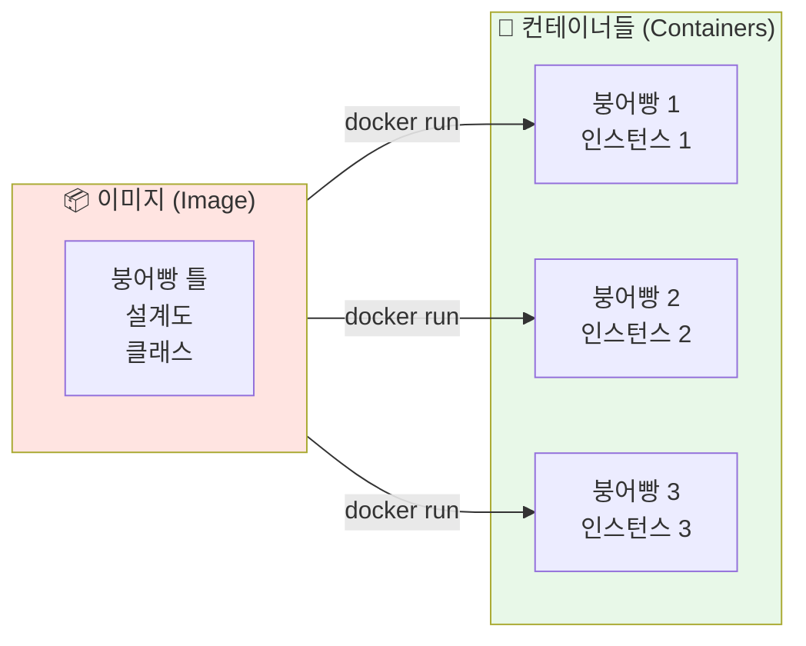
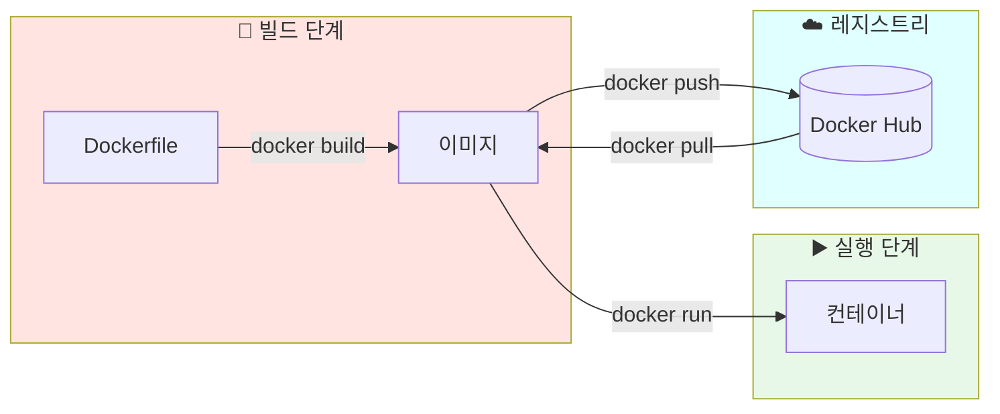
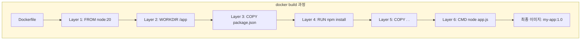
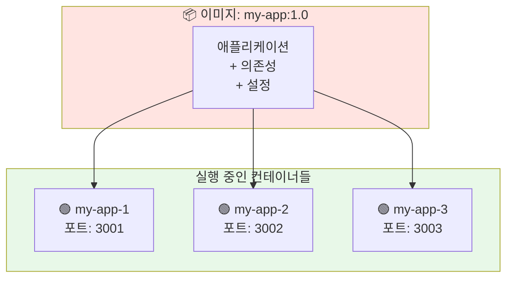
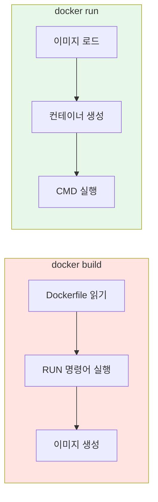
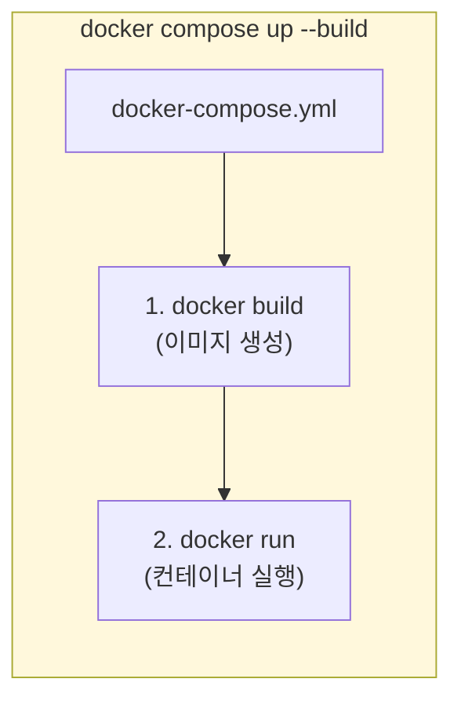
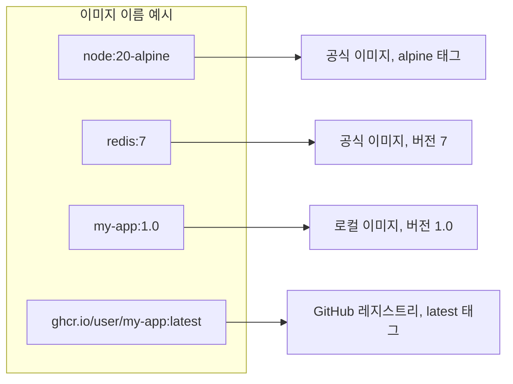
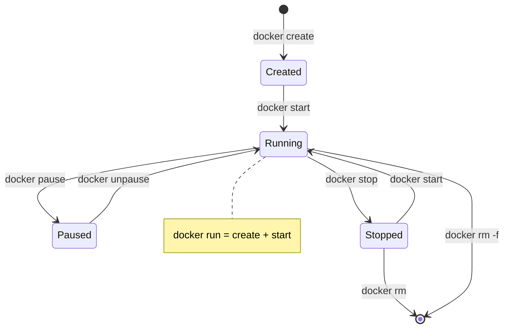

## Docker 기초: 이미지와 컨테이너의 관계

Docker를 처음 접하면 이미지와 컨테이너라는 용어가 자주 등장합니다. 비슷해 보이지만 완전히 다른 개념인데, 이 둘의 관계를 명확히 이해하면 Docker를 훨씬 편하게 사용할 수 있습니다.

---

## 이미지 vs 컨테이너

### 핵심 비유: 붕어빵 틀과 붕어빵



| 개념 | 이미지 (Image) | 컨테이너 (Container) |
|------|---------------|---------------------|
| **비유** | 붕어빵 틀, 설계도 | 붕어빵, 실제 제품 |
| **OOP 비유** | 클래스 (Class) | 인스턴스 (Instance) |
| **특성** | 불변 (Immutable) | 가변 (Mutable) |
| **생성** | `docker build` | `docker run` |
| **개수** | 하나 | 여러 개 가능 |

### 핵심 특징

**이미지 (Image)**
- ✅ 불변의 템플릿 (한번 만들면 변하지 않음)
- ✅ 애플리케이션 실행에 필요한 모든 것 포함
- ✅ 하나의 이미지로 여러 컨테이너 생성 가능
- ✅ 레지스트리에 저장/공유 가능 (Docker Hub 등)

**컨테이너 (Container)**
- ✅ 이미지를 기반으로 생성된 실행 환경
- ✅ 독립된 파일 시스템, 네트워크, 프로세스
- ✅ 시작, 중지, 삭제 가능
- ✅ 삭제하면 내부 변경사항도 함께 삭제됨

---

## 빌드에서 실행까지

Docker의 전체 흐름을 살펴보겠습니다.



### 1단계: 빌드 (Build)

Dockerfile을 기반으로 이미지를 생성합니다.

```bash
# 이미지 빌드
docker build -t my-app:1.0 .

# -t: 태그(이름) 지정
# my-app: 이미지 이름
# 1.0: 버전 태그
# .: 빌드 컨텍스트 (현재 디렉토리)
```



### 2단계: 실행 (Run)

이미지를 기반으로 컨테이너를 생성하고 실행합니다.

```bash
# 컨테이너 실행
docker run -d -p 3000:3000 --name my-container my-app:1.0

# -d: 백그라운드 실행 (detached)
# -p 3000:3000: 포트 매핑 (호스트:컨테이너)
# --name: 컨테이너 이름 지정
# my-app:1.0: 사용할 이미지
```

---

## 하나의 이미지, 여러 컨테이너

같은 이미지로 여러 컨테이너를 동시에 실행할 수 있습니다.



```bash
# 같은 이미지로 3개의 컨테이너 실행
docker run -d -p 3001:3000 --name my-app-1 my-app:1.0
docker run -d -p 3002:3000 --name my-app-2 my-app:1.0
docker run -d -p 3003:3000 --name my-app-3 my-app:1.0
```

> 💡 **사용 사례**: 로드 밸런싱, A/B 테스트, 개발/스테이징/프로덕션 환경 분리 등

---

## 자주 사용하는 명령어

### 이미지 관련

```bash
# 이미지 목록 확인
docker images

# 이미지 빌드
docker build -t my-app:1.0 .

# 이미지 삭제
docker rmi my-app:1.0

# 사용하지 않는 이미지 정리
docker image prune
```

### 컨테이너 관련

```bash
# 실행 중인 컨테이너 목록
docker ps

# 모든 컨테이너 목록 (중지된 것 포함)
docker ps -a

# 컨테이너 실행
docker run -d -p 3000:3000 my-app:1.0

# 컨테이너 중지
docker stop my-container

# 컨테이너 시작 (중지된 컨테이너)
docker start my-container

# 컨테이너 삭제
docker rm my-container

# 컨테이너 로그 확인
docker logs my-container
docker logs -f my-container  # 실시간
```

### 디버깅

```bash
# 실행 중인 컨테이너에 접속
docker exec -it my-container /bin/sh

# 컨테이너 상세 정보
docker inspect my-container
```

---

## docker build vs docker run

이 두 명령어의 차이를 명확히 이해해야 합니다.



| 명령어 | 목적 | 결과물 | 실행되는 Dockerfile 명령어 |
|--------|------|--------|---------------------------|
| `docker build` | 이미지 생성 | 이미지 | `RUN` |
| `docker run` | 컨테이너 실행 | 컨테이너 | `CMD`, `ENTRYPOINT` |

---

## Docker Compose와 함께 사용하기

`docker-compose.yml`을 사용하면 빌드와 실행을 한 번에 할 수 있습니다.

```yaml
# docker-compose.yml
version: "3.8"

services:
  backend:
    build:
      context: .
      dockerfile: Dockerfile
    ports:
      - "3000:3000"
```

```bash
# 빌드 + 실행 (한 번에)
docker compose up --build

# 빌드만
docker compose build

# 실행만 (이미 빌드된 이미지 사용)
docker compose up
```



---

## 이미지 네이밍 규칙

이미지 이름은 다음 형식을 따릅니다:

```
[레지스트리/][사용자/]이미지명[:태그]
```



| 형식 | 예시 | 설명 |
|------|------|------|
| `이미지:태그` | `node:20` | 공식 이미지 |
| `사용자/이미지:태그` | `library/node:20` | Docker Hub 사용자 |
| `레지스트리/사용자/이미지:태그` | `ghcr.io/user/app:1.0` | 커스텀 레지스트리 |

> 💡 **팁**: 태그를 생략하면 `:latest`가 사용됩니다. 하지만 프로덕션에서는 항상 명시적인 버전 태그를 사용하세요!

---

## 컨테이너 라이프사이클



| 상태 | 설명 | 관련 명령어 |
|------|------|------------|
| **Created** | 생성됨, 실행 전 | `docker create` |
| **Running** | 실행 중 | `docker run`, `docker start` |
| **Paused** | 일시 중지 | `docker pause` |
| **Stopped** | 중지됨 | `docker stop` |
| **Removed** | 삭제됨 | `docker rm` |

---

## 실전 예제: 전체 흐름

```bash
# 1. Dockerfile 작성
cat > Dockerfile << 'EOF'
FROM node:20-alpine
WORKDIR /app
COPY package*.json ./
RUN npm install
COPY . .
CMD ["node", "app.js"]
EOF

# 2. 이미지 빌드
docker build -t my-node-app:1.0 .

# 3. 이미지 확인
docker images | grep my-node-app

# 4. 컨테이너 실행
docker run -d -p 3000:3000 --name my-app my-node-app:1.0

# 5. 컨테이너 확인
docker ps

# 6. 로그 확인
docker logs my-app

# 7. 컨테이너 접속
docker exec -it my-app /bin/sh

# 8. 정리
docker stop my-app
docker rm my-app
docker rmi my-node-app:1.0
```

---

## 마치며

Docker의 핵심은 이미지(불변의 템플릿)와 컨테이너(실행 중인 인스턴스)의 관계입니다. `docker build`는 이미지를 생성하고 RUN을 실행하며, `docker run`은 컨테이너를 실행하고 CMD를 실행합니다. 이미지와 컨테이너의 관계를 클래스와 인스턴스로 생각하면 직관적으로 이해됩니다.

다음 글에서는 Docker에서 Prisma를 사용할 때 자주 만나는 바이너리 타겟 문제를 다룹니다.
