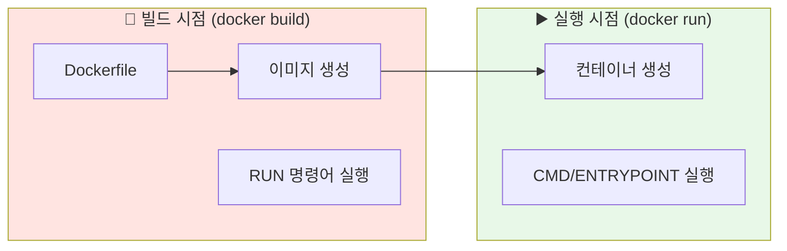
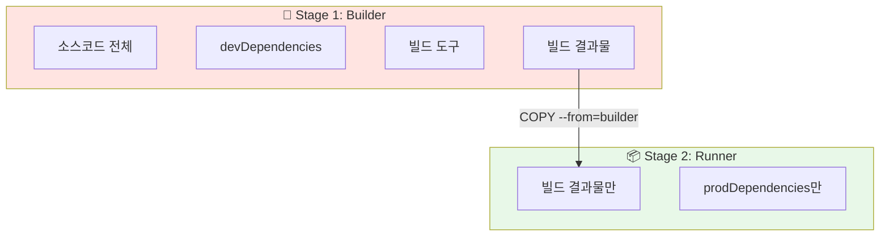
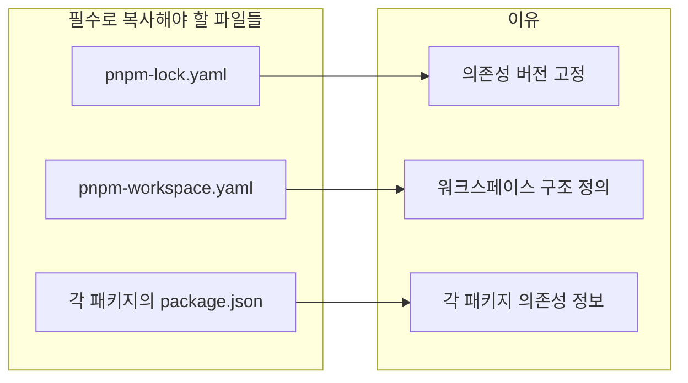
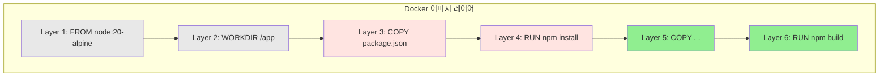
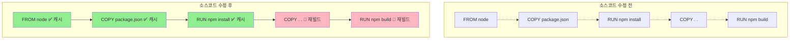
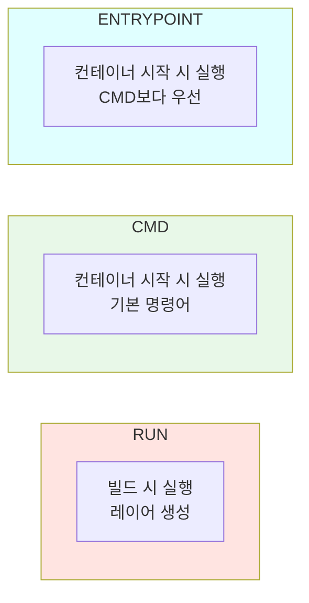

## Dockerfile 멀티스테이지 빌드와 레이어 캐싱 최적화

Dockerfile을 작성할 때 가장 중요한 두 가지가 있습니다. 멀티스테이지 빌드와 레이어 캐싱입니다. 이 두 가지를 잘 활용하면 이미지 크기는 1/4로 줄이고, 빌드 시간은 5배 단축할 수 있습니다.

---

## 빌드 vs 실행: 두 가지 다른 시점

Dockerfile을 이해하려면 먼저 **빌드 시점**과 **실행 시점**을 구분해야 합니다.



| 시점 | 명령어 | 설명 |
|------|--------|------|
| **빌드** | `RUN` | 이미지 생성 시 실행 (패키지 설치, 빌드) |
| **실행** | `CMD` | 컨테이너 시작 시 실행 (앱 시작) |
| **실행** | `ENTRYPOINT` | 컨테이너 시작 시 실행 (CMD보다 우선) |

### 예시로 이해하기

```dockerfile
# 빌드 시점에 실행
RUN npm install          # 의존성 설치
RUN npm run build        # 앱 빌드

# 실행 시점에 실행
CMD ["node", "dist/main.js"]  # 앱 시작
```

---

## 멀티스테이지 빌드란?

### 단일 스테이지의 문제점

하나의 스테이지로 Dockerfile을 작성하면 어떻게 될까요?

```dockerfile
# ❌ 단일 스테이지 - 모든 것이 최종 이미지에 포함됨
FROM node:20

WORKDIR /app
COPY . .
RUN npm install
RUN npm run build

CMD ["node", "dist/main.js"]
```

이렇게 하면 최종 이미지에 **불필요한 것들**이 모두 포함됩니다:

- 소스코드 전체 (TypeScript 파일들)
- devDependencies (테스트 도구, 타입 정의 등)
- 빌드 도구 (TypeScript 컴파일러 등)
- 빌드 캐시

결과: **이미지 크기 800MB+** 😱

### 멀티스테이지 빌드 적용

```dockerfile
# ✅ 멀티스테이지 - 필요한 것만 최종 이미지에 포함

# Stage 1: Builder (빌드 전용, 나중에 버려짐)
FROM node:20 AS builder
WORKDIR /app
COPY package*.json ./
RUN npm install
COPY . .
RUN npm run build

# Stage 2: Runner (프로덕션용, 최종 이미지)
FROM node:20-alpine AS runner
WORKDIR /app
COPY --from=builder /app/dist ./dist
COPY --from=builder /app/node_modules ./node_modules
CMD ["node", "dist/main.js"]
```



### 용량 비교

| 방식 | 포함 내용 | 이미지 크기 |
|------|----------|-------------|
| **단일 스테이지** | 소스 + devDeps + 빌드도구 + 결과물 | ~800MB |
| **멀티스테이지** | 결과물 + prodDeps만 | ~200MB |

> 💡 **핵심 포인트**: Builder 스테이지는 임시 이미지를 생성하고 **버려집니다**. 최종 이미지에는 Runner 스테이지만 남습니다.

---

## 모노레포에서의 멀티스테이지 빌드

pnpm workspace를 사용하는 모노레포에서는 조금 다른 접근이 필요합니다.

```dockerfile
# Stage 1: Builder
FROM node:20-alpine AS builder

# corepack으로 pnpm 설치
RUN corepack enable && corepack prepare pnpm@10.25.0 --activate

WORKDIR /app

# 의존성 파일 먼저 복사 (캐시 활용)
COPY pnpm-lock.yaml pnpm-workspace.yaml ./
COPY apps/backend/package.json ./apps/backend/
COPY packages/shared/package.json ./packages/shared/

# 의존성 설치
RUN pnpm install --frozen-lockfile

# 소스코드 복사 및 빌드
COPY . .
RUN pnpm --filter backend build

# Stage 2: Runner
FROM node:20-alpine AS runner

RUN corepack enable && corepack prepare pnpm@10.25.0 --activate

WORKDIR /app

# 프로덕션 의존성만 설치
COPY pnpm-lock.yaml pnpm-workspace.yaml ./
COPY apps/backend/package.json ./apps/backend/
RUN pnpm install --prod --frozen-lockfile

# 빌드 결과물만 복사
COPY --from=builder /app/apps/backend/dist ./apps/backend/dist

# non-root 사용자로 실행 (보안)
RUN addgroup --system app && adduser --system --ingroup app app
USER app

CMD ["node", "apps/backend/dist/main.js"]
```

### 모노레포 빌드 시 주의사항



---

## 레이어 캐싱 최적화

### Docker 레이어란?

Docker 이미지는 **레이어의 스택**입니다. Dockerfile의 각 명령어가 하나의 레이어를 생성합니다.



### 캐싱 규칙

> ⚠️ **중요**: 한 레이어가 변경되면 그 **위의 모든 레이어**가 재빌드됩니다.



### 잘못된 순서 vs 올바른 순서

```dockerfile
# ❌ 잘못된 순서 - 소스 변경 시 의존성도 재설치
COPY . .                    # 소스 변경 → 이 레이어부터 재빌드
RUN npm install             # 매번 재설치 😭
RUN npm run build
```

```dockerfile
# ✅ 올바른 순서 - 소스 변경해도 의존성은 캐시됨
COPY package*.json ./       # 의존성 파일만 먼저
RUN npm install             # package.json 안 바뀌면 캐시! 🎉
COPY . .                    # 소스 변경 → 여기만 재빌드
RUN npm run build
```

### 실제 효과

| 상황 | 잘못된 순서 | 올바른 순서 |
|------|------------|-------------|
| **소스코드만 수정** | 5분 | 1분 |
| **10번 빌드** | 50분 | 14분 |
| **절약 시간** | - | **36분** |

> 💡 **핵심 원칙**: 변경이 적은 파일을 먼저 복사하세요. 의존성 파일 → 소스코드 순서로!

---

## Dockerfile 명령어 상세

### WORKDIR

컨테이너 내 작업 디렉토리를 설정합니다. 이후 모든 명령어는 이 경로 기준으로 실행됩니다.

```dockerfile
WORKDIR /app
COPY package.json ./    # /app/package.json에 복사됨
```

### COPY 문법

```dockerfile
COPY <호스트 경로> <컨테이너 경로>

# 예시
COPY package.json ./              # /app/package.json
COPY src ./src                    # /app/src/
COPY --from=builder /app/dist .   # 다른 스테이지에서 복사
```

### RUN vs CMD vs ENTRYPOINT



```dockerfile
# RUN - 빌드 시 실행 (여러 개 가능)
RUN npm install
RUN npm run build

# CMD - 컨테이너 시작 시 실행 (마지막 하나만)
CMD ["node", "dist/main.js"]

# ENTRYPOINT - 고정 명령어 (CMD와 결합 가능)
ENTRYPOINT ["node"]
CMD ["dist/main.js"]  # node dist/main.js로 실행됨
```

### CMD 형식: Exec vs Shell

```dockerfile
# Exec 형식 (권장) - 시그널 처리에 유리
CMD ["node", "dist/main.js"]

# Shell 형식 - /bin/sh -c로 래핑됨
CMD node dist/main.js
```

> 💡 **권장**: Exec 형식(`["command", "arg"]`)을 사용하세요. Shell 형식은 프로세스 종료 시그널이 제대로 전달되지 않을 수 있습니다.

---

## .dockerignore 설정

빌드 컨텍스트에서 불필요한 파일을 제외합니다.

```
# .dockerignore
node_modules
.git
.env
*.log
dist
coverage
.turbo
```

> ⚠️ **중요**: `node_modules`를 반드시 제외하세요! 호스트의 `node_modules`가 복사되면 OS 호환성 문제가 발생할 수 있습니다.

---

## 보안: non-root 사용자

기본적으로 컨테이너는 root 권한으로 실행됩니다. 보안을 위해 non-root 사용자를 사용하세요.

```dockerfile
# 시스템 사용자 생성
RUN addgroup --system app && adduser --system --ingroup app app

# 파일 소유권 변경 (필요시)
COPY --chown=app:app --from=builder /app/dist ./dist

# non-root 사용자로 전환
USER app

CMD ["node", "dist/main.js"]
```

---

## 환경변수 처리

### Dockerfile에는 .env 파일 넣지 않기

```dockerfile
# ❌ 절대 하지 마세요!
COPY .env ./

# ✅ 런타임에 주입
# docker-compose.yml이나 docker run에서 주입
```

### 환경변수 주입 방법

```yaml
# docker-compose.yml
services:
  backend:
    build: .
    environment:
      - NODE_ENV=production
      - DATABASE_URL=${DATABASE_URL}  # .env 파일에서 읽어옴
```

```bash
# docker run
docker run -e NODE_ENV=production -e DATABASE_URL=... my-app

# .env 파일 사용
docker run --env-file .env my-app
```

---

## 완성된 Dockerfile 예제

```dockerfile
# ============================================
# Stage 1: Builder
# ============================================
FROM node:20-alpine AS builder

# pnpm 설치
RUN corepack enable && corepack prepare pnpm@10.25.0 --activate

WORKDIR /app

# 1. 의존성 파일 먼저 복사 (캐시 최적화)
COPY pnpm-lock.yaml pnpm-workspace.yaml ./
COPY apps/backend/package.json ./apps/backend/

# 2. 의존성 설치
RUN pnpm install --frozen-lockfile

# 3. 소스코드 복사
COPY . .

# 4. 빌드
RUN pnpm --filter backend build

# ============================================
# Stage 2: Runner
# ============================================
FROM node:20-alpine AS runner

RUN corepack enable && corepack prepare pnpm@10.25.0 --activate

WORKDIR /app

# 1. 프로덕션 의존성만 설치
COPY pnpm-lock.yaml pnpm-workspace.yaml ./
COPY apps/backend/package.json ./apps/backend/
RUN pnpm install --prod --frozen-lockfile

# 2. 빌드 결과물 복사
COPY --from=builder /app/apps/backend/dist ./apps/backend/dist

# 3. non-root 사용자 설정
RUN addgroup --system app && adduser --system --ingroup app app
USER app

# 4. 실행
EXPOSE 3000
CMD ["node", "apps/backend/dist/main.js"]
```

---

## 마치며

Dockerfile 최적화의 핵심은 멀티스테이지 빌드로 Builder와 Runner를 분리하여 이미지 크기를 최소화하고, 변경이 적은 파일을 먼저 복사하여 레이어 캐싱을 활용하는 것입니다. 보안을 위해 non-root 사용자를 사용하고, 환경변수는 런타임에 주입합니다.

다음 글에서는 Prisma와 Docker를 함께 사용할 때 자주 만나는 바이너리 타겟 문제를 다룹니다.
