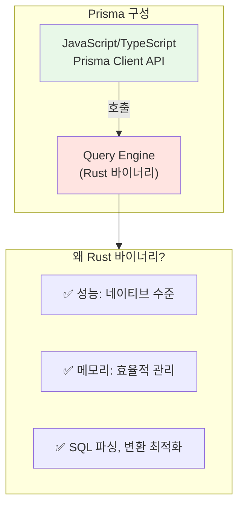
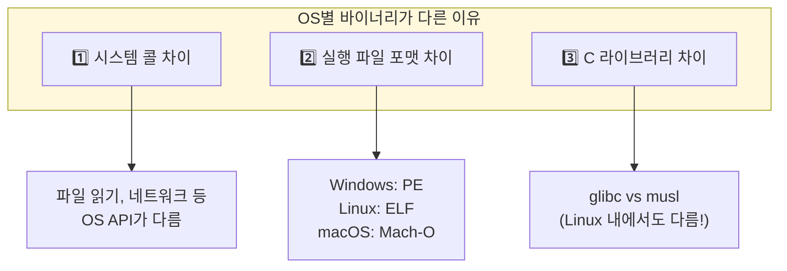
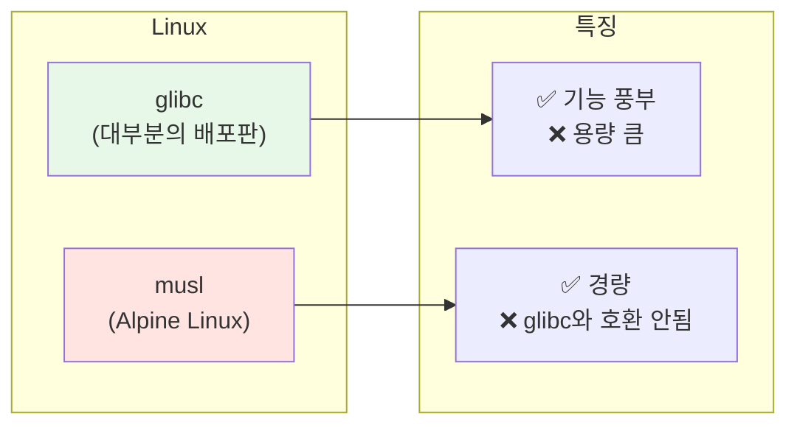
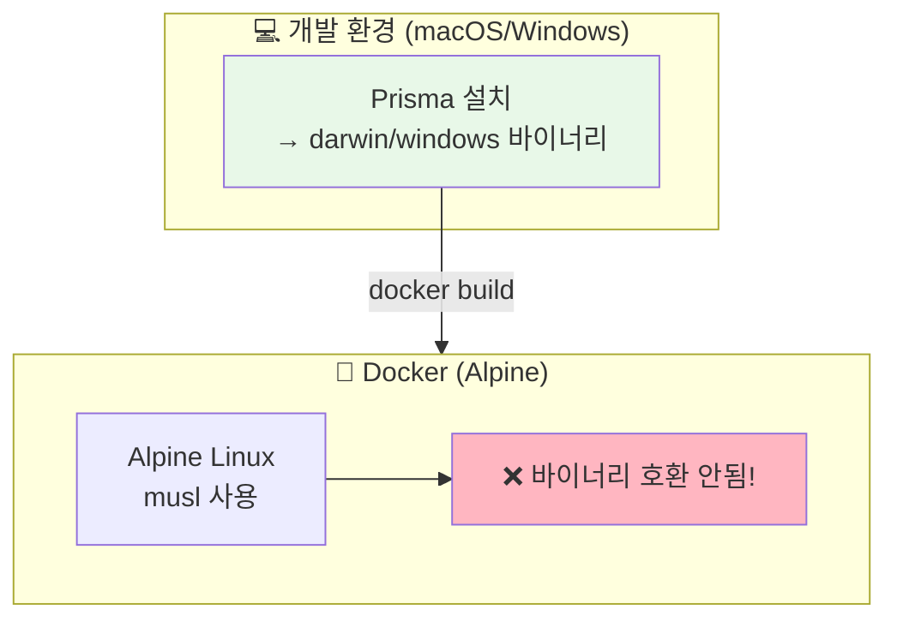
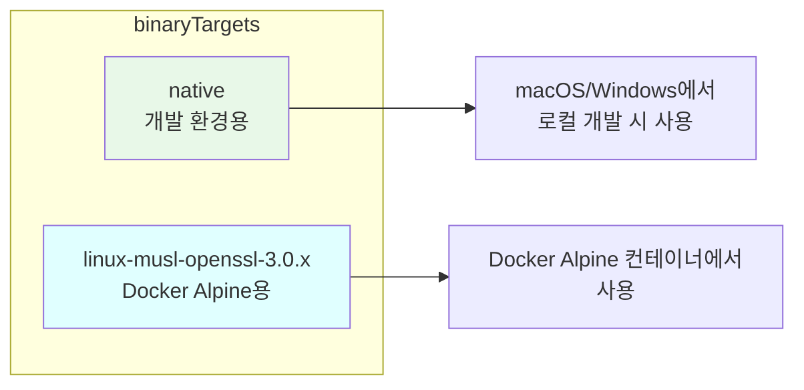
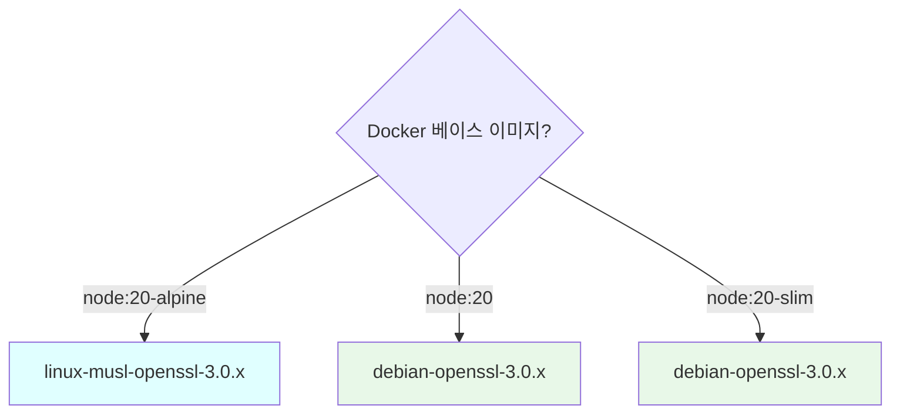
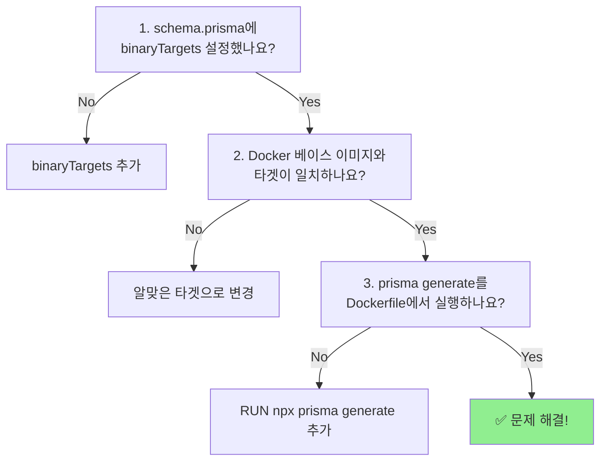

## Prisma와 Docker: 바이너리 타겟의 이해

Docker 환경에서 Prisma를 사용하다 보면 이런 에러를 만날 수 있습니다:

```
Error: Query engine binary for current platform "linux-musl-openssl-3.0.x" 
could not be found.
```

이 에러가 왜 발생하는지, 그리고 어떻게 해결하는지 정리합니다.

---

## 바이너리(Binary)란?

### 기본 개념

바이너리는 **CPU가 직접 실행할 수 있는 기계어로 된 파일**입니다.


### JavaScript는 인터프리터 언어 아닌가요?

맞습니다! JavaScript 자체는 바이너리가 아닙니다. 하지만 Prisma는 **성능이 중요한 부분을 Rust로 작성**했고, 이 Rust 코드가 바이너리로 컴파일됩니다.



---

## OS마다 바이너리가 다른 이유

### 핵심 질문

> **Q: 왜 macOS에서 빌드한 바이너리가 Linux에서 안 돌아가나요?**

### 세 가지 이유



#### 1. 시스템 콜 (System Call) 차이

프로그램이 OS 기능(파일 읽기, 네트워크 등)을 사용할 때 호출하는 방식이 OS마다 다릅니다.

```
# 파일 열기 시스템 콜
Linux:   open()    → 시스템 콜 번호 2
macOS:   open()    → 시스템 콜 번호 5
Windows: CreateFile() → 완전히 다른 API
```

#### 2. 실행 파일 포맷 차이

각 OS는 실행 파일의 구조가 다릅니다.

| OS | 실행 파일 포맷 | 확장자 |
|-----|--------------|--------|
| Windows | PE (Portable Executable) | .exe |
| Linux | ELF (Executable and Linkable Format) | 없음 |
| macOS | Mach-O | 없음 |

#### 3. C 라이브러리 차이

프로그램이 사용하는 기본 C 함수들(`printf`, `malloc` 등)의 구현체가 다릅니다.



---

## Alpine Linux와 musl

### Alpine Linux란?

Alpine Linux는 **초경량 Linux 배포판**입니다. Docker에서 이미지 크기를 줄이기 위해 자주 사용됩니다.

```bash
# 일반 Node.js 이미지
FROM node:20          # ~1GB

# Alpine 기반 이미지
FROM node:20-alpine   # ~150MB
```

### 왜 문제가 되나요?

Alpine Linux는 **glibc 대신 musl을 사용**합니다. 따라서:

- glibc용으로 빌드된 바이너리 → Alpine에서 ❌ 실행 안됨
- musl용으로 빌드된 바이너리 → Alpine에서 ✅ 실행됨



---

## 에러 메시지 이해하기

```
Error: Query engine binary for current platform "linux-musl-openssl-3.0.x" 
could not be found.
```

이 에러 메시지를 분석해보면:

| 부분 | 의미 |
|------|------|
| `linux` | Linux OS |
| `musl` | Alpine Linux (musl 사용) |
| `openssl-3.0.x` | OpenSSL 3.0.x 버전 |

즉, **"Alpine Linux + OpenSSL 3.0용 Query Engine 바이너리가 없다"**는 의미입니다.

---

## 해결 방법

### 1. binaryTargets 설정

`prisma/schema.prisma` 파일에서 필요한 바이너리 타겟을 명시합니다.

```prisma
generator client {
  provider      = "prisma-client-js"
  binaryTargets = ["native", "linux-musl-openssl-3.0.x"]
}
```



### 2. 주요 바이너리 타겟 목록

| 타겟 | 환경 |
|------|------|
| `native` | 현재 개발 환경 (자동 감지) |
| `linux-musl-openssl-3.0.x` | Alpine Linux + OpenSSL 3.0 |
| `linux-musl` | Alpine Linux (구버전) |
| `debian-openssl-3.0.x` | Debian/Ubuntu + OpenSSL 3.0 |
| `debian-openssl-1.1.x` | Debian/Ubuntu + OpenSSL 1.1 |
| `rhel-openssl-3.0.x` | RHEL/CentOS + OpenSSL 3.0 |

### 3. 환경별 타겟 선택



---

## 실전 예제

### schema.prisma

```prisma
datasource db {
  provider = "postgresql"
  url      = env("DATABASE_URL")
}

generator client {
  provider      = "prisma-client-js"
  binaryTargets = ["native", "linux-musl-openssl-3.0.x"]
}

model User {
  id    Int    @id @default(autoincrement())
  email String @unique
  name  String?
}
```

### Dockerfile

```dockerfile
# Stage 1: Builder
FROM node:20-alpine AS builder

WORKDIR /app

# Prisma CLI와 Client 생성을 위한 의존성
COPY package*.json ./
COPY prisma ./prisma

RUN npm install

# Prisma Client 생성 (중요!)
RUN npx prisma generate

COPY . .
RUN npm run build

# Stage 2: Runner
FROM node:20-alpine AS runner

WORKDIR /app

COPY --from=builder /app/node_modules ./node_modules
COPY --from=builder /app/dist ./dist
COPY --from=builder /app/prisma ./prisma

CMD ["node", "dist/main.js"]
```

> ⚠️ **중요**: `prisma generate`는 Builder 스테이지에서 실행해야 합니다. 이 명령어가 현재 환경에 맞는 바이너리를 생성합니다.

---

## 트러블슈팅

### 에러 1: 바이너리를 찾을 수 없음

```
Error: Query engine binary for current platform "linux-musl-openssl-3.0.x" 
could not be found.
```

**해결**: `schema.prisma`에 해당 타겟 추가

```prisma
binaryTargets = ["native", "linux-musl-openssl-3.0.x"]
```

### 에러 2: prisma generate 안 함

```
Error: @prisma/client did not initialize yet. 
Please run "prisma generate" and try to import it again.
```

**해결**: Dockerfile에서 `prisma generate` 실행

```dockerfile
RUN npx prisma generate
```

### 에러 3: OpenSSL 버전 불일치

```
Error: libssl.so.1.1: cannot open shared object file
```

**해결**: 올바른 OpenSSL 버전의 타겟 사용

```prisma
# OpenSSL 1.1인 경우
binaryTargets = ["native", "linux-musl"]

# OpenSSL 3.0인 경우
binaryTargets = ["native", "linux-musl-openssl-3.0.x"]
```

### 현재 환경 확인하기

어떤 바이너리 타겟이 필요한지 확인하려면:

```bash
# 컨테이너 내에서 실행
npx prisma -v
```

출력 예시:
```
prisma                  : 5.x.x
@prisma/client          : 5.x.x
Computed binaryTarget   : linux-musl-openssl-3.0.x  # 👈 이게 필요한 타겟
```

---

## 정리: 해결 체크리스트



### Quick Fix

```prisma
// prisma/schema.prisma
generator client {
  provider      = "prisma-client-js"
  binaryTargets = ["native", "linux-musl-openssl-3.0.x"]
}
```

```dockerfile
# Dockerfile
RUN npx prisma generate
```

---

## 마치며

Prisma와 Docker를 함께 사용할 때 발생하는 바이너리 타겟 문제는 OS, C 라이브러리(glibc/musl), OpenSSL 버전에 따라 다른 바이너리가 필요하기 때문입니다. `binaryTargets`에 Docker 환경에 맞는 타겟을 명시하고, `prisma generate`를 Docker 빌드 시 실행하면 해결됩니다.

Alpine 이미지를 사용한다면 `linux-musl-openssl-3.0.x`를, 일반 Debian 기반 이미지를 사용한다면 `debian-openssl-3.0.x`를 사용합니다.

다음 글에서는 백엔드 아키텍처의 기본 패턴인 DTO, DAO, Entity를 다룹니다.
