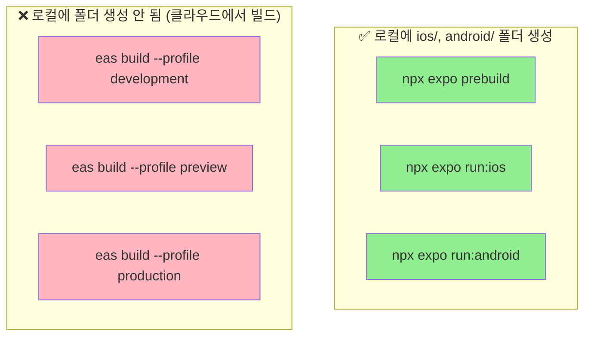
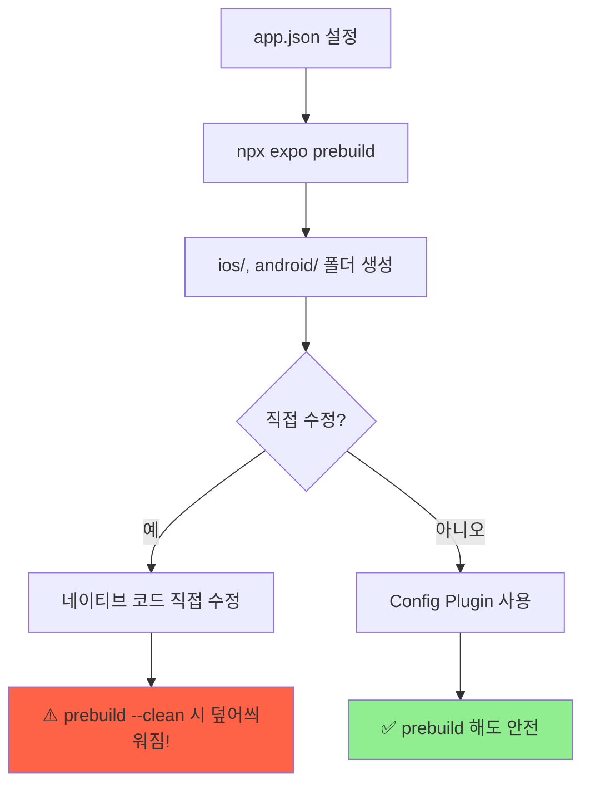
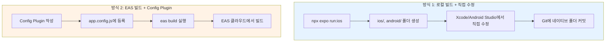

## Expo 네이티브 폴더 생성 시점과 구조

네이티브 폴더(`ios/`, `android/`)가 언제 생성되는지, 어떤 구조인지, 어떻게 수정하는지 정리합니다.

<Toc>
1. [언제 네이티브 폴더가 생성되나?](#언제-네이티브-폴더가-생성되나)
2. [네이티브 폴더 구조](#네이티브-폴더-구조)
3. [네이티브 코드 언어](#네이티브-코드-언어)
4. [네이티브 코드 직접 수정하기](#네이티브-코드-직접-수정하기)
5. [Prebuild와 직접 수정의 관계](#prebuild와-직접-수정의-관계)
6. [두 가지 네이티브 개발 방식 비교](#두-가지-네이티브-개발-방식-비교)
7. [Config Plugin 예시](#config-plugin-예시)
</Toc>

---

## 언제 네이티브 폴더가 생성되나?

**네이티브 폴더(`ios/`, `android/`)는 Preview나 Production 빌드에서만 생기는 게 아닙니다!**



| 명령어                            | 네이티브 폴더 생성 위치 | 설명                           |
| --------------------------------- | ----------------------- | ------------------------------ |
| `npx expo prebuild`               | ✅ 로컬                 | 네이티브 코드만 생성 (빌드 X)  |
| `npx expo run:ios`                | ✅ 로컬                 | prebuild 자동 실행 + 로컬 빌드 |
| `npx expo run:android`            | ✅ 로컬                 | prebuild 자동 실행 + 로컬 빌드 |
| `eas build --profile development` | ❌ EAS 클라우드         | 로컬 폴더 불필요               |
| `eas build --profile preview`     | ❌ EAS 클라우드         | 로컬 폴더 불필요               |
| `eas build --profile production`  | ❌ EAS 클라우드         | 로컬 폴더 불필요               |

### 핵심 포인트

- **로컬 빌드** (`npx expo run:*`): 로컬에 네이티브 폴더 생성됨
- **EAS 빌드** (`eas build`): EAS 클라우드에서 빌드하므로 로컬 폴더 불필요
- **Prebuild**: 빌드 없이 네이티브 코드만 생성

---

## 네이티브 폴더 구조

`npx expo prebuild` 또는 `npx expo run:ios/android` 실행 후 생성되는 폴더 구조:

```
my-app/
├── app.json
├── package.json
├── App.tsx
├── android/                    # 🤖 Android 네이티브 프로젝트
│   ├── app/
│   │   ├── src/
│   │   │   └── main/
│   │   │       ├── java/       # ☕ Java/Kotlin 코드
│   │   │       │   └── com/myapp/
│   │   │       │       ├── MainActivity.kt      # 📱 메인 액티비티
│   │   │       │       └── MainApplication.kt   # 🚀 앱 시작점
│   │   │       ├── res/        # 🎨 리소스 (아이콘, 스플래시 등)
│   │   │       └── AndroidManifest.xml  # ⚙️ 앱 설정, 권한
│   │   └── build.gradle        # 📦 앱 빌드 설정
│   ├── build.gradle            # 📦 프로젝트 빌드 설정
│   └── settings.gradle
│
└── ios/                        # 🍎 iOS 네이티브 프로젝트
    ├── MyApp/
    │   ├── AppDelegate.swift   # 🚀 앱 시작점 (Swift)
    │   ├── Info.plist          # ⚙️ 앱 설정, 권한
    │   └── Images.xcassets/    # 🎨 아이콘, 이미지
    ├── MyApp.xcodeproj/        # 📁 Xcode 프로젝트
    └── Podfile                 # 📦 iOS 의존성 관리
```

### 주요 파일 설명

#### iOS

| 파일/폴더             | 역할                        |
| --------------------- | --------------------------- |
| `AppDelegate.swift`   | 앱 시작점, 라이프사이클     |
| `Info.plist`          | 앱 설정, 권한, 메타데이터   |
| `Images.xcassets/`    | 앱 아이콘, 스플래시 이미지  |
| `MyApp.xcodeproj/`    | Xcode 프로젝트 설정         |
| `Podfile`             | CocoaPods 의존성 관리       |

#### Android

| 파일/폴더               | 역할                      |
| ----------------------- | ------------------------- |
| `MainActivity.kt`       | 메인 액티비티             |
| `MainApplication.kt`    | 앱 시작점, 초기화         |
| `AndroidManifest.xml`   | 앱 설정, 권한, 컴포넌트   |
| `res/`                  | 리소스 (아이콘, 문자열)   |
| `build.gradle`          | Gradle 빌드 설정          |

---

## 네이티브 코드 언어

| 플랫폼      | 주요 언어 | 레거시 언어 | 파일 확장자          |
| ----------- | --------- | ----------- | -------------------- |
| **iOS**     | Swift     | Objective-C | `.swift`, `.m`, `.h` |
| **Android** | Kotlin    | Java        | `.kt`, `.java`       |

> 💡 **참고**: Expo의 기본 템플릿은 **Swift**와 **Kotlin**을 사용합니다. 하지만 React Native 생태계의 많은 라이브러리들은 아직 Objective-C와 Java로 작성되어 있어서, 두 언어가 혼재되어 있을 수 있습니다.

---

## 네이티브 코드 직접 수정하기

로컬 빌드(`npx expo run:ios/android`)를 사용하면 네이티브 코드를 직접 수정할 수 있습니다!

### iOS (Xcode에서 수정)

```bash
# ios 폴더를 Xcode에서 열기
open ios/MyApp.xcworkspace
```

```swift
// ios/MyApp/AppDelegate.swift
import UIKit
import Expo

@main
class AppDelegate: ExpoAppDelegate {
  override func application(
    _ application: UIApplication,
    didFinishLaunchingWithOptions launchOptions: [UIApplication.LaunchOptionsKey: Any]?
  ) -> Bool {
    // 🔧 여기에 커스텀 네이티브 코드 추가 가능!
    print("앱이 시작되었습니다!")
    return super.application(application, didFinishLaunchingWithOptions: launchOptions)
  }
}
```

### Android (Android Studio에서 수정)

```bash
# android 폴더를 Android Studio에서 열기
# Android Studio > Open > android 폴더 선택
```

```kotlin
// android/app/src/main/java/com/myapp/MainActivity.kt
package com.myapp

import android.os.Bundle
import com.facebook.react.ReactActivity
import expo.modules.ReactActivityDelegateWrapper

class MainActivity : ReactActivity() {
  override fun onCreate(savedInstanceState: Bundle?) {
    super.onCreate(savedInstanceState)
    // 🔧 여기에 커스텀 네이티브 코드 추가 가능!
    println("앱이 시작되었습니다!")
  }

  override fun getMainComponentName(): String = "main"
}
```

---

## Prebuild와 직접 수정의 관계



### ⚠️ 직접 수정 시 주의사항

1. `npx expo prebuild --clean` 실행 시 **모든 수정사항이 사라집니다!**
2. 직접 수정한 경우 `ios/`, `android/` 폴더를 **Git에 커밋**해야 합니다
3. 가능하면 **Config Plugin**을 사용하는 것이 권장됩니다

### Git 관리 전략

```bash
# 네이티브 폴더를 Git에 포함시키려면
# .gitignore에서 제거

# 네이티브 폴더를 Git에서 제외하려면 (EAS 빌드 사용 시)
# .gitignore에 추가:
ios/
android/
```

---

## 두 가지 네이티브 개발 방식 비교



| 방식                         | 장점                     | 단점                      | 추천 상황                    |
| ---------------------------- | ------------------------ | ------------------------- | ---------------------------- |
| **로컬 빌드 + 직접 수정**    | 자유로운 수정, 빠른 반복 | 환경 설정 필요, 폴더 관리 | 복잡한 네이티브 커스터마이징 |
| **EAS 빌드 + Config Plugin** | 깔끔한 관리, CI/CD 용이  | Plugin 작성 필요          | 일반적인 설정 변경           |

### 언제 어떤 방식을 선택?

**로컬 빌드 + 직접 수정**
- 네이티브 코드를 자주 수정해야 할 때
- 특수한 네이티브 SDK 통합이 필요할 때
- 빠른 네이티브 디버깅이 필요할 때

**EAS 빌드 + Config Plugin**
- 권한 설정, 앱 아이콘 등 간단한 설정만 변경할 때
- CI/CD 파이프라인을 구축할 때
- 팀원들이 네이티브 환경 설정 없이 개발해야 할 때

---

## Config Plugin 예시

네이티브 코드를 직접 수정하지 않고도 설정을 변경할 수 있습니다.

### 기본 권한 설정

```javascript
// app.config.js
export default {
  expo: {
    name: "My App",
    plugins: [
      // 카메라 권한 설정 (네이티브 코드 직접 수정 불필요!)
      [
        "expo-camera",
        {
          cameraPermission: "사진 촬영을 위해 카메라 접근이 필요합니다.",
        },
      ],
      // 위치 권한 설정
      [
        "expo-location",
        {
          locationAlwaysAndWhenInUsePermission:
            "위치 기반 서비스를 위해 필요합니다.",
        },
      ],
    ],
  },
};
```

### 빌드 속성 설정

```javascript
// app.config.js
export default {
  expo: {
    name: "My App",
    plugins: [
      [
        "expo-build-properties",
        {
          android: {
            compileSdkVersion: 34,
            targetSdkVersion: 34,
            minSdkVersion: 24,
          },
          ios: {
            deploymentTarget: "15.0",
          },
        },
      ],
    ],
  },
};
```

### 커스텀 Config Plugin 만들기

```javascript
// plugins/withCustomConfig.js
const { withInfoPlist, withAndroidManifest } = require("@expo/config-plugins");

function withCustomConfig(config) {
  // iOS Info.plist 수정
  config = withInfoPlist(config, (config) => {
    config.modResults.NSPhotoLibraryUsageDescription = "사진 접근이 필요합니다.";
    return config;
  });

  // Android Manifest 수정
  config = withAndroidManifest(config, (config) => {
    // 권한 추가 등
    return config;
  });

  return config;
}

module.exports = withCustomConfig;
```

```javascript
// app.config.js에서 사용
export default {
  expo: {
    plugins: ["./plugins/withCustomConfig"],
  },
};
```

---

## 마무리

로컬 빌드 시에만 네이티브 폴더가 생성되고, EAS 빌드는 클라우드에서 처리됩니다. 직접 수정보다는 Config Plugin 사용이 권장되며, 직접 수정한 경우 `prebuild --clean` 실행 시 덮어씌워질 수 있다는 점을 기억해두면 됩니다.
