# Expo 빌드 종류 완벽 가이드

Expo를 사용하여 React Native 앱을 개발할 때 다양한 빌드 방식이 있습니다. 이 문서에서는 각 빌드 방식의 차이점, 사용 시나리오, 그리고 Metro 서버에 대해 자세히 설명합니다.

<Toc>
1. [Metro 서버란?](#metro-서버란)
2. [⭐ React Native 앱의 구조 이해하기](#-react-native-앱의-구조-이해하기-핵심)
3. [⭐ JS 코드와 네이티브 코드가 공존하는 원리](#-js-코드와-네이티브-코드가-공존하는-원리)
4. [⭐ Hermes 엔진이란?](#-hermes-엔진이란)
5. [⭐ 커스텀 네이티브 모듈 만들기](#-커스텀-네이티브-모듈-만들기)
6. [⭐ Metro 서버가 필요한 이유와 Hot Reload 원리](#-metro-서버가-필요한-이유와-hot-reload-원리)
7. [⭐ 왜 Preview/Production에서는 Metro가 필요 없을까?](#-왜-previewproduction에서는-metro가-필요-없을까)
8. [⭐ Development Build에서 Hot Reload가 되는 원리](#-development-build에서-hot-reload가-되는-원리)
9. [⭐ 개발 워크플로우 정리](#-개발-워크플로우-정리)
10. [빌드 종류 개요](#빌드-종류-개요)
11. [Expo Go](#1-expo-go)
12. [Development Build](#2-development-build-개발-빌드)
13. [Prebuild](#3-prebuild)
14. [Preview Build](#4-preview-build)
15. [Production Build](#5-production-build)
16. [빌드 비교 요약](#빌드-비교-요약)
17. [빌드 선택 가이드](#빌드-선택-가이드)
18. [⭐ 네이티브 폴더 생성 시점과 구조](#-네이티브-폴더-생성-시점과-구조-중요)
</Toc>

---


## Metro 서버란?

Metro는 React Native와 Expo의 **공식 JavaScript 번들러**입니다. 웹 개발에서 Webpack이나 Vite가 하는 역할과 비슷합니다.

### Metro의 주요 역할

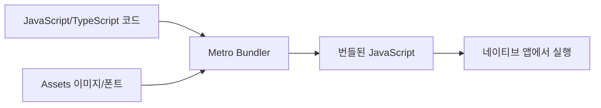

| 기능                | 설명                                      |
| ------------------- | ----------------------------------------- |
| **코드 번들링**     | 여러 JS/TS 파일을 하나의 번들로 합침      |
| **Hot Reload**      | 코드 변경 시 앱을 새로고침 없이 즉시 반영 |
| **Fast Refresh**    | 컴포넌트 상태를 유지하면서 변경사항 반영  |
| **Asset 처리**      | 이미지, 폰트 등의 리소스 처리             |
| **TypeScript 지원** | TS 코드를 JS로 변환                       |

### Metro 서버 시작 방법

```bash
npx expo start
```

이 명령어를 실행하면 기본적으로 `http://localhost:8081`에서 Metro 서버가 시작됩니다.

---

## ⭐ React Native 앱의 구조 이해하기 (핵심!)

Metro 서버가 왜 필요한지, 그리고 Hot Reload가 어떻게 작동하는지 이해하려면 먼저 **React Native 앱의 구조**를 알아야 합니다.

### 🚨 중요한 오해 바로잡기

> **Q: React Native로 작성한 JS 코드가 Swift/Kotlin으로 변환되나요?**
>
> **A: 아니요!** JS 코드는 **그대로 JavaScript로 실행**됩니다. 변환되지 않습니다!

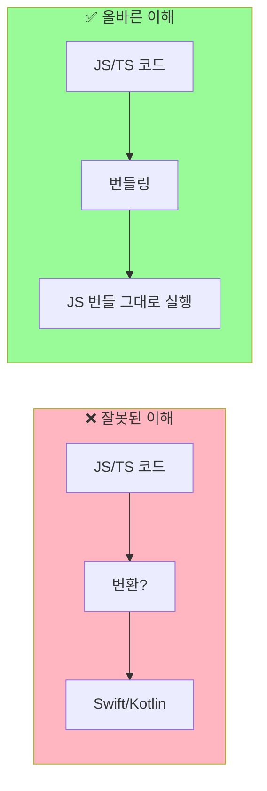

### 두 개의 레이어

React Native 앱은 크게 **두 개의 레이어**로 구성됩니다:

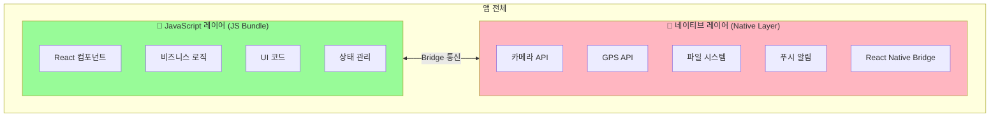

### 비유로 이해하기 🎮

> React Native 앱은 **게임기(네이티브)와 게임 카트리지(JavaScript)**와 같습니다.
>
> - **네이티브 레이어** = 게임기 본체 (Nintendo Switch)
>
>   - 하드웨어 기능 제공 (화면, 버튼, 스피커)
>   - 한번 만들면 쉽게 바꿀 수 없음
>   - 컴파일이 필요함
>
> - **JavaScript 레이어** = 게임 카트리지
>   - 실제 게임 내용 (로직, UI)
>   - 쉽게 교체 가능
>   - 컴파일 없이 바로 실행

| 레이어         | 역할                  | 변경 시        | 예시                         |
| -------------- | --------------------- | -------------- | ---------------------------- |
| **네이티브**   | 하드웨어/OS 기능 접근 | 재빌드 필요    | 카메라, GPS, 푸시 알림       |
| **JavaScript** | UI, 비즈니스 로직     | 즉시 반영 가능 | 버튼 색상, 텍스트, 화면 구성 |

---

## ⭐ JS 코드와 네이티브 코드가 공존하는 원리

### 핵심 개념: Bridge (다리) 아키텍처

React Native의 핵심은 **JavaScript 엔진**과 **네이티브 플랫폼** 사이의 **Bridge(다리)**입니다.

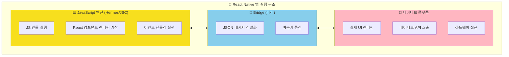

### 비유로 이해하기 🌐

> React Native는 **통역사가 있는 국제 회의**와 같습니다.
>
> - **JavaScript** = 영어로 말하는 발표자
> - **Bridge** = 통역사 (영어 ↔ 한국어/일본어 번역)
> - **Native** = 한국어(iOS)/일본어(Android)를 사용하는 청중
>
> 발표자(JS)가 "버튼을 빨간색으로 바꿔주세요"라고 말하면,
> 통역사(Bridge)가 이를 네이티브 언어로 번역해서 전달합니다.

### 실제 동작 과정

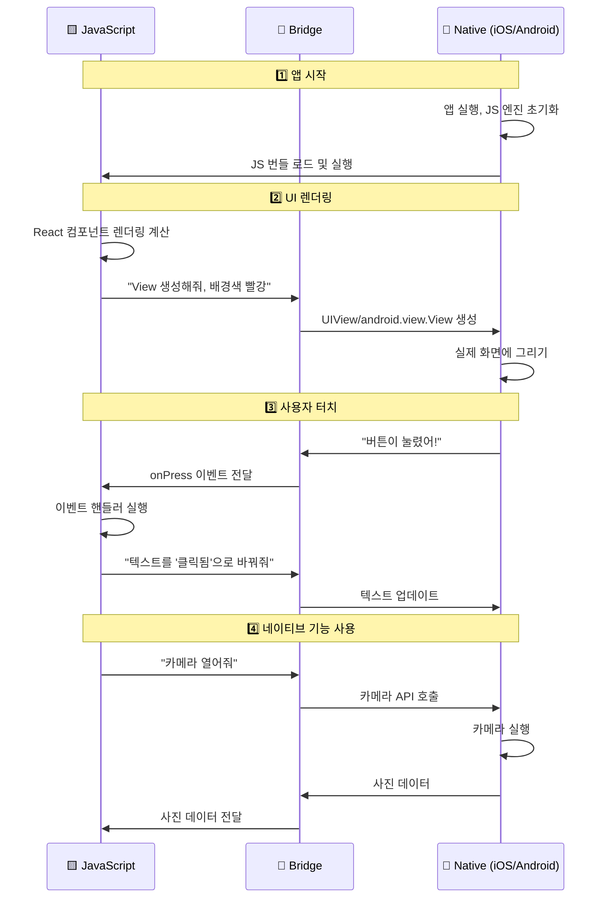

### 코드로 이해하기

당신이 작성하는 React Native 코드:

```tsx
// App.tsx - 당신이 작성하는 코드
import { View, Text, TouchableOpacity } from "react-native";

export default function App() {
  const handlePress = () => {
    console.log("버튼 클릭!");
  };

  return (
    <View style={{ backgroundColor: "red", padding: 20 }}>
      <Text>안녕하세요!</Text>
      <TouchableOpacity onPress={handlePress}>
        <Text>클릭하세요</Text>
      </TouchableOpacity>
    </View>
  );
}
```

이 코드가 실행될 때 내부적으로 일어나는 일:

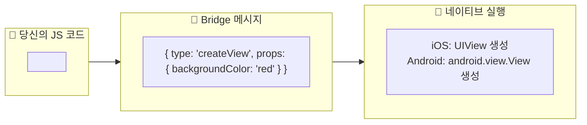

### 네이티브 폴더의 역할

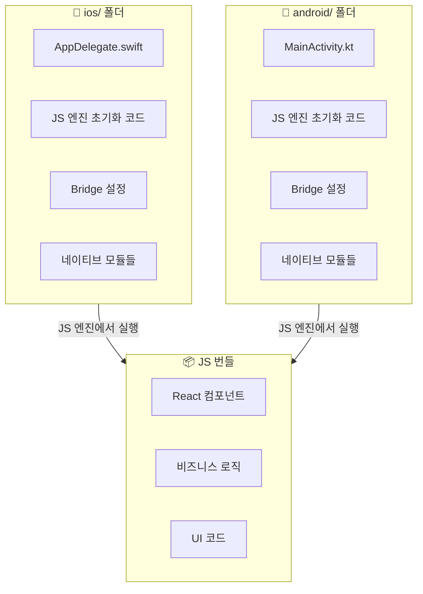

**네이티브 폴더(`ios/`, `android/`)에 있는 것:**

- ✅ 앱 시작점 (AppDelegate, MainActivity)
- ✅ JavaScript 엔진 초기화 코드
- ✅ Bridge 설정
- ✅ 네이티브 모듈 (카메라, GPS 등)
- ✅ 앱 설정 (권한, 아이콘 등)

**네이티브 폴더에 없는 것:**

- ❌ 당신의 React 컴포넌트 (JS로 실행됨)
- ❌ 비즈니스 로직 (JS로 실행됨)
- ❌ 화면 구성 코드 (JS로 실행됨)

### 정리: 앱의 구성 요소

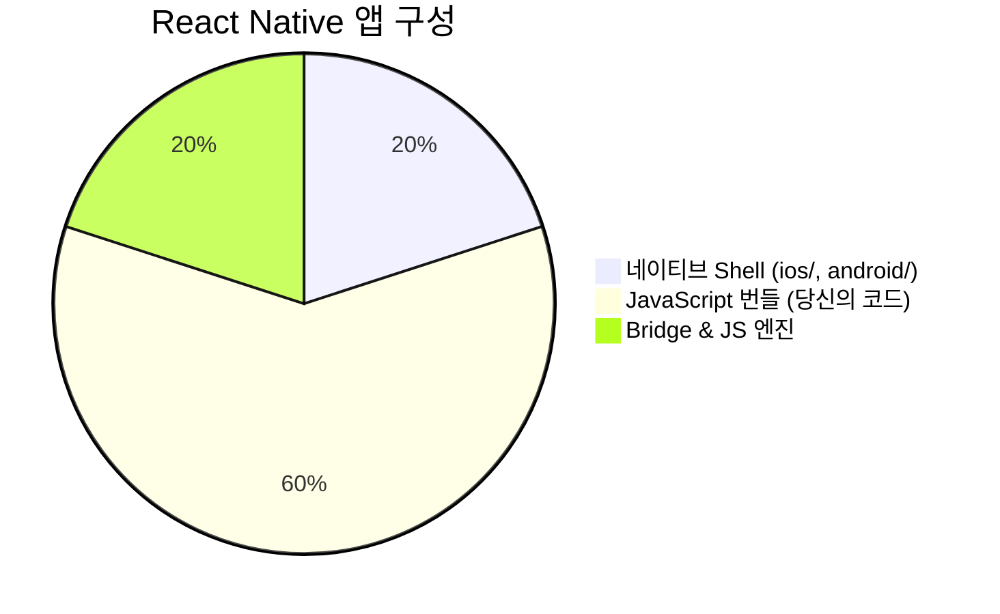

| 구성 요소          | 언어          | 역할                     | 위치                    |
| ------------------ | ------------- | ------------------------ | ----------------------- |
| **네이티브 Shell** | Swift/Kotlin  | 앱 껍데기, 하드웨어 접근 | `ios/`, `android/`      |
| **JS 엔진**        | C++           | JavaScript 실행          | 앱에 내장               |
| **Bridge**         | C++/Java/ObjC | JS ↔ Native 통신         | 앱에 내장               |
| **JS 번들**        | JavaScript    | UI, 로직 (당신의 코드)   | Metro 서버 또는 앱 내장 |

### New Architecture (새로운 아키텍처)

> 💡 **참고**: React Native 0.68+부터 **New Architecture**가 도입되었습니다.
> 기존 Bridge 대신 **JSI (JavaScript Interface)**를 사용하여 더 빠른 통신이 가능합니다.

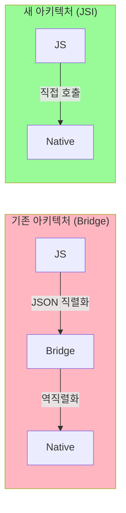

| 아키텍처         | 통신 방식            | 속도 | 특징            |
| ---------------- | -------------------- | ---- | --------------- |
| **Old (Bridge)** | JSON 직렬화/역직렬화 | 느림 | 비동기, 안정적  |
| **New (JSI)**    | 직접 메모리 접근     | 빠름 | 동기 가능, 최신 |

---

## ⭐ Hermes 엔진이란?

### JavaScript 엔진의 역할

JavaScript 엔진은 **JS 코드를 실행하는 프로그램**입니다. 웹 브라우저마다 다른 JS 엔진을 사용하듯이, React Native도 JS 엔진이 필요합니다.

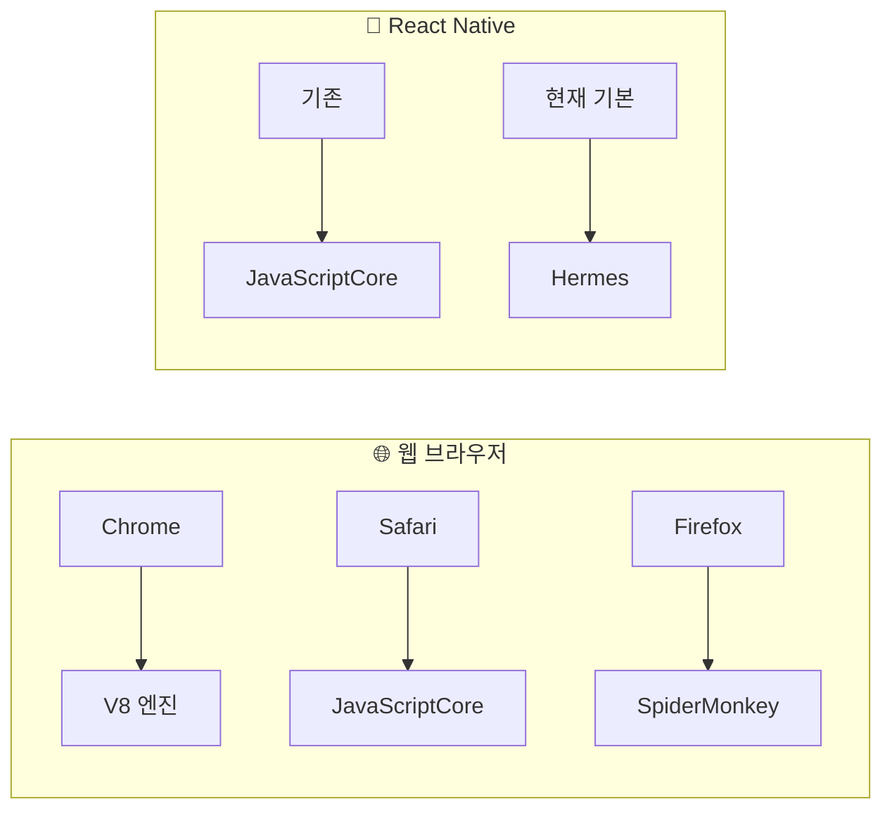

### Hermes란?

**Hermes**는 Meta(Facebook)가 React Native를 위해 **특별히 만든 JavaScript 엔진**입니다.

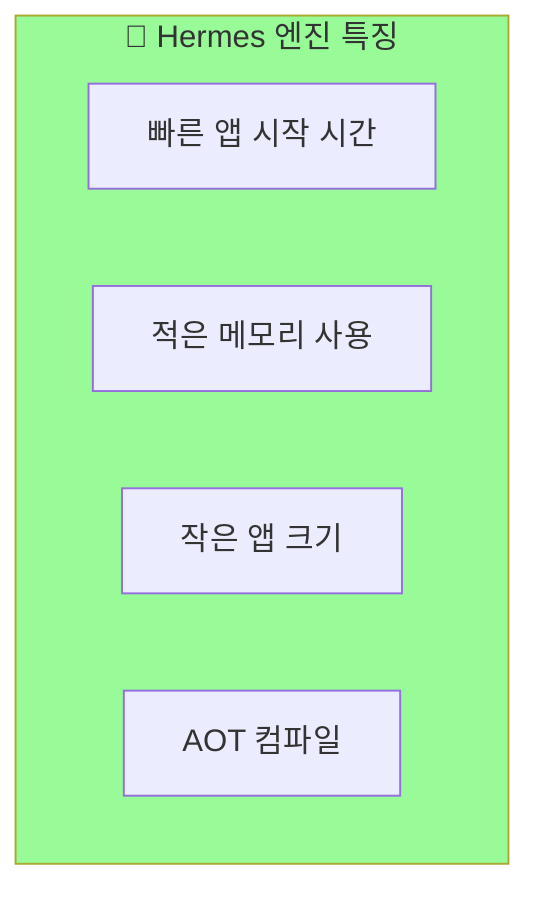

### 왜 Hermes를 만들었나?

기존 JavaScriptCore(JSC)의 문제점:

| 문제             | JSC                 | Hermes             |
| ---------------- | ------------------- | ------------------ |
| **앱 시작 시간** | 느림 (JS 파싱 필요) | 빠름 (미리 컴파일) |
| **메모리 사용**  | 많음                | 적음 (최적화)      |
| **앱 크기**      | 큼                  | 작음               |

### Hermes의 핵심: AOT 컴파일 (Ahead-Of-Time)


### 비유로 이해하기 📚

> **JSC** = 원서를 읽을 때마다 번역하는 것
>
> - 책을 펼칠 때마다 번역 시작 (느림)
>
> **Hermes** = 미리 번역해둔 책을 읽는 것
>
> - 이미 번역되어 있어서 바로 읽기 가능 (빠름)

### Hermes 활성화 확인

Expo SDK 48+ 에서는 **Hermes가 기본으로 활성화**되어 있습니다.

```json
// app.json
{
  "expo": {
    "jsEngine": "hermes" // 기본값 (생략 가능)
  }
}
```

JSC로 변경하려면 (권장하지 않음):

```json
{
  "expo": {
    "jsEngine": "jsc"
  }
}
```

### Hermes vs JSC 비교

| 특성             | Hermes             | JavaScriptCore     |
| ---------------- | ------------------ | ------------------ |
| **앱 시작 시간** | ⚡ 빠름            | 🐢 느림            |
| **메모리 사용**  | 📉 적음            | 📈 많음            |
| **앱 크기**      | 📦 작음            | 📦 큼              |
| **디버깅**       | ✅ Chrome DevTools | ✅ Safari DevTools |
| **Expo 기본값**  | ✅ (SDK 48+)       | ❌                 |

---

## ⭐ 커스텀 네이티브 모듈 만들기

### 사용자도 Bridge를 통해 JS ↔ Native 통신 가능!

React Native에서 제공하는 기본 모듈 외에도, **직접 네이티브 모듈을 만들어서** JS 코드와 통신할 수 있습니다.

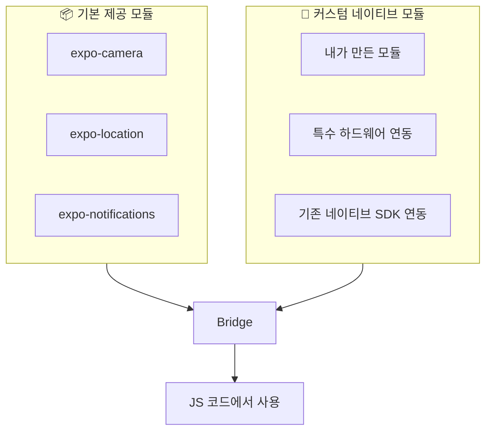

### 언제 커스텀 네이티브 모듈이 필요한가?

| 상황                       | 예시                     |
| -------------------------- | ------------------------ |
| **특수 하드웨어 연동**     | 블루투스 장비, IoT 기기  |
| **기존 네이티브 SDK 사용** | 결제 SDK, 광고 SDK       |
| **성능 최적화**            | 이미지 처리, 암호화      |
| **플랫폼 특화 기능**       | iOS 위젯, Android 서비스 |

### Expo Modules API로 쉽게 만들기

Expo는 **Expo Modules API**를 제공하여 네이티브 모듈을 쉽게 만들 수 있습니다.

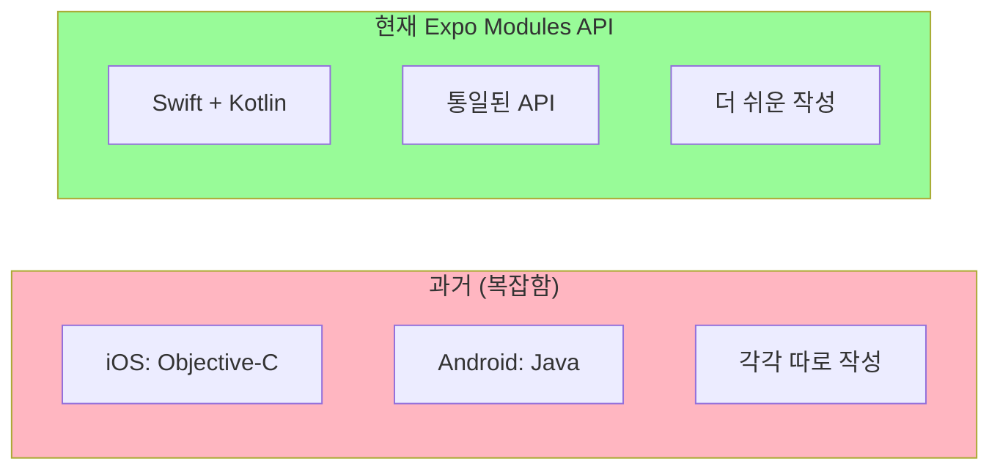

### 커스텀 네이티브 모듈 예시

#### 1. 모듈 생성

```bash
npx create-expo-module my-native-module
```

#### 2. iOS 네이티브 코드 (Swift)

```swift
// ios/MyNativeModule.swift
import ExpoModulesCore

public class MyNativeModule: Module {
  public func definition() -> ModuleDefinition {
    Name("MyNativeModule")

    // JS에서 호출할 수 있는 함수 정의
    Function("getDeviceName") { () -> String in
      return UIDevice.current.name
    }

    // 비동기 함수
    AsyncFunction("doHeavyWork") { (input: String) -> String in
      // 네이티브에서 무거운 작업 수행
      return "처리 완료: \(input)"
    }
  }
}
```

#### 3. Android 네이티브 코드 (Kotlin)

```kotlin
// android/src/main/java/expo/modules/mynativemodule/MyNativeModule.kt
package expo.modules.mynativemodule

import expo.modules.kotlin.modules.Module
import expo.modules.kotlin.modules.ModuleDefinition
import android.os.Build

class MyNativeModule : Module() {
  override fun definition() = ModuleDefinition {
    Name("MyNativeModule")

    // JS에서 호출할 수 있는 함수 정의
    Function("getDeviceName") {
      Build.MODEL
    }

    // 비동기 함수
    AsyncFunction("doHeavyWork") { input: String ->
      // 네이티브에서 무거운 작업 수행
      "처리 완료: $input"
    }
  }
}
```

#### 4. JavaScript에서 사용

```tsx
// App.tsx
import { MyNativeModule } from "my-native-module";

export default function App() {
  const [deviceName, setDeviceName] = useState("");

  useEffect(() => {
    // 네이티브 함수 호출!
    const name = MyNativeModule.getDeviceName();
    setDeviceName(name);
  }, []);

  const handleHeavyWork = async () => {
    // 비동기 네이티브 함수 호출
    const result = await MyNativeModule.doHeavyWork("테스트 데이터");
    console.log(result); // "처리 완료: 테스트 데이터"
  };

  return (
    <View>
      <Text>디바이스: {deviceName}</Text>
      <Button title="무거운 작업" onPress={handleHeavyWork} />
    </View>
  );
}
```

### 통신 흐름

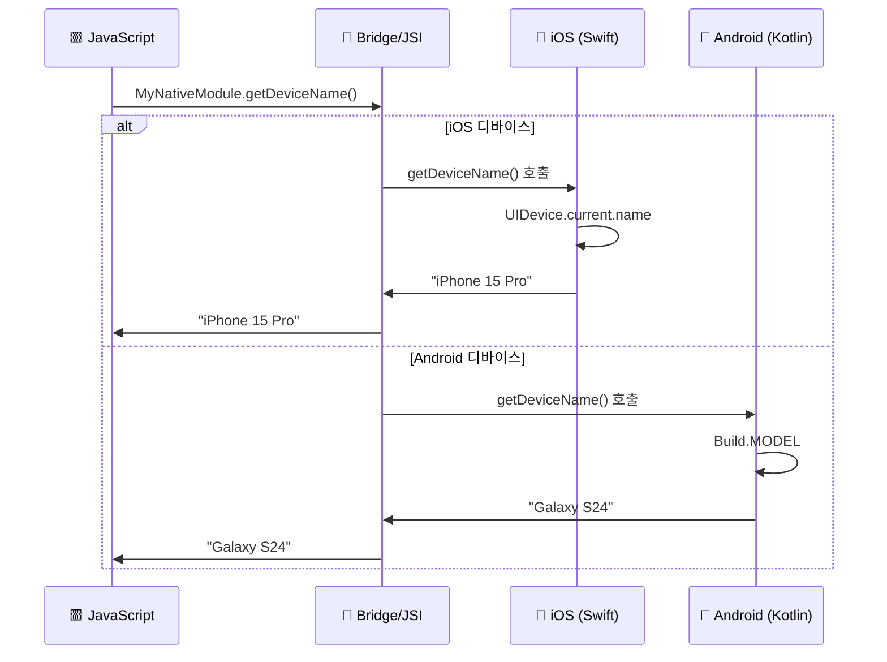

### 정리: 네이티브 모듈의 종류

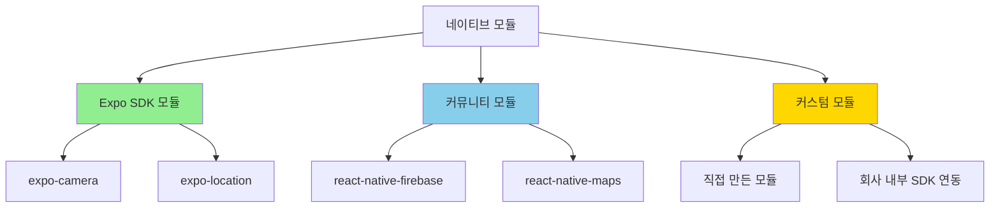

| 종류              | 설명                          | 예시                       |
| ----------------- | ----------------------------- | -------------------------- |
| **Expo SDK 모듈** | Expo 팀이 만든 공식 모듈      | expo-camera, expo-location |
| **커뮤니티 모듈** | 오픈소스 커뮤니티가 만든 모듈 | react-native-firebase      |
| **커스텀 모듈**   | 직접 만드는 모듈              | 특수 하드웨어 연동         |

---

## ⭐ Metro 서버가 필요한 이유와 Hot Reload 원리

### 개발 모드 (Expo Go / Development Build)

개발 중에는 JavaScript 코드를 **실시간으로 수정하고 테스트**해야 합니다. 이때 Metro 서버가 핵심 역할을 합니다.

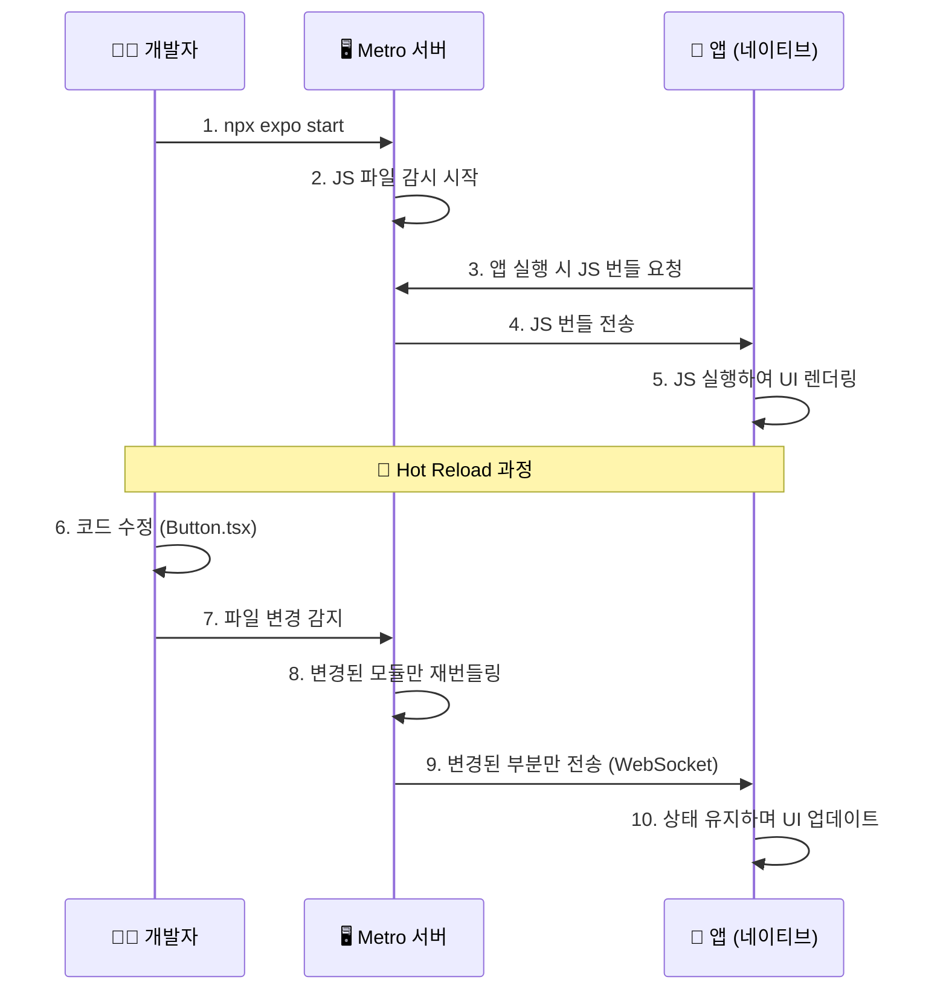

### Hot Reload가 가능한 이유

**핵심 포인트**: JavaScript 코드는 **인터프리터 언어**이기 때문에 컴파일 없이 즉시 실행할 수 있습니다!

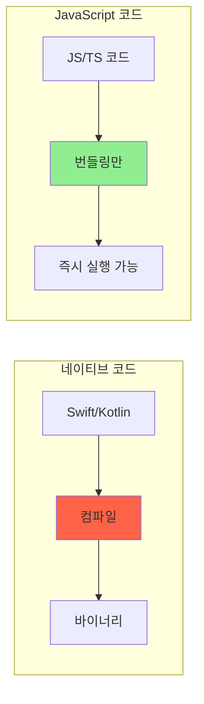

| 언어                    | 실행 방식                | 변경 시                  |
| ----------------------- | ------------------------ | ------------------------ |
| Swift/Kotlin (네이티브) | 컴파일 → 바이너리        | 전체 재빌드 필요 (수 분) |
| JavaScript              | 번들링 → 인터프리터 실행 | 번들만 교체 (수 초)      |

### Metro 서버의 역할 정리

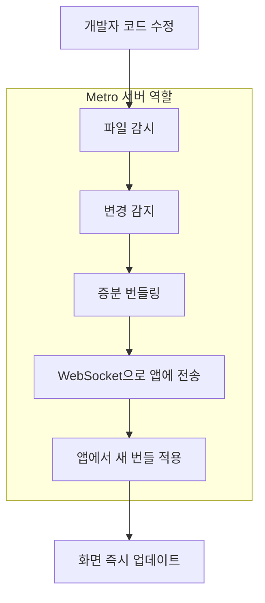

**Metro 서버가 하는 일:**

1. **파일 감시 (Watch)**: 프로젝트의 모든 JS/TS 파일 변경 감시
2. **번들링 (Bundle)**: 변경된 파일만 빠르게 재번들링
3. **전송 (Serve)**: WebSocket을 통해 앱에 새 코드 전송
4. **HMR (Hot Module Replacement)**: 상태를 유지하면서 변경된 모듈만 교체

---

## ⭐ 왜 Preview/Production에서는 Metro가 필요 없을까?

### 배포 빌드의 구조

Preview와 Production 빌드에서는 **JavaScript 번들이 앱 안에 내장**됩니다!


### 비유로 이해하기 📺

> **개발 모드** = 넷플릭스 스트리밍
>
> - 영상(JS)을 서버(Metro)에서 실시간으로 받아옴
> - 인터넷 연결 필수
> - 영상 변경 시 바로 반영
>
> **배포 모드** = DVD에 구운 영화
>
> - 영상(JS)이 디스크(앱) 안에 들어있음
> - 인터넷 연결 불필요
> - 영상 변경하려면 새 DVD 필요 (새 빌드)

### 빌드 과정 비교

```mermaid
flowchart TB
    subgraph 개발빌드["개발 빌드"]
        A1[JS 코드] --> B1[Metro 서버에서 제공]
        C1[네이티브 코드] --> D1[앱에 포함]
        B1 -.->|실시간 연결| E1[실행 중인 앱]
        D1 --> E1
    end

    subgraph 배포빌드["배포 빌드"]
        A2[JS 코드] --> B2[번들로 컴파일]
        C2[네이티브 코드] --> D2[앱에 포함]
        B2 --> E2[앱에 내장]
        D2 --> F2[최종 앱 패키지]
        E2 --> F2
    end

    style B1 fill:#87CEEB
    style E2 fill:#FFD700
```

| 구분             | 개발 빌드         | 배포 빌드      |
| ---------------- | ----------------- | -------------- |
| **JS 번들 위치** | Metro 서버 (외부) | 앱 내부 (내장) |
| **Metro 필요**   | ✅ 필수           | ❌ 불필요      |
| **Hot Reload**   | ✅ 가능           | ❌ 불가능      |
| **인터넷 필요**  | ✅ 개발 서버 연결 | ❌ 독립 실행   |
| **JS 변경 시**   | 즉시 반영         | 새 빌드 필요   |

---

## ⭐ Development Build에서 Hot Reload가 되는 원리

이 부분이 가장 헷갈리는 부분이죠! **"빌드가 필요한데 어떻게 Hot Reload가 가능하지?"**

### 핵심 이해: 빌드는 네이티브만!

```mermaid
flowchart TB
    subgraph 한번만빌드["🔨 한 번만 빌드 (네이티브)"]
        A[네이티브 코드]
        B[expo-dev-client]
        C[커스텀 네이티브 라이브러리]
        A --> D[Development Build APK/IPA]
        B --> D
        C --> D
    end

    subgraph 계속변경["🔄 계속 변경 가능 (JavaScript)"]
        E[React 컴포넌트]
        F[비즈니스 로직]
        G[스타일]
        E --> H[Metro 서버]
        F --> H
        G --> H
    end

    D <-->|실시간 연결| H

    style D fill:#FFB6C1
    style H fill:#98FB98
```

### 비유로 이해하기 🎮

> Development Build는 **게임기 본체를 한 번 조립**하는 것과 같습니다.
>
> 1. **게임기 조립 (빌드)**: 한 번만 하면 됨
>
>    - 원하는 컨트롤러 추가 (네이티브 라이브러리)
>    - 특수 기능 추가 (카메라, GPS 등)
>
> 2. **게임 카트리지 교체 (Hot Reload)**: 무한히 가능
>    - 게임기를 다시 조립할 필요 없음
>    - 카트리지(JS)만 바꾸면 됨

### 실제 워크플로우

```mermaid
sequenceDiagram
    participant Dev as 👨‍💻 개발자
    participant Build as 🔨 빌드 시스템
    participant Phone as 📱 디바이스
    participant Metro as 🖥️ Metro 서버

    Note over Dev,Metro: 1️⃣ 최초 1회: Development Build 생성
    Dev->>Build: npx expo run:ios (또는 eas build)
    Build->>Build: 네이티브 코드 컴파일 (5-10분)
    Build->>Phone: Development Build 설치

    Note over Dev,Metro: 2️⃣ 이후: Hot Reload로 개발
    Dev->>Metro: npx expo start
    Phone->>Metro: Metro 서버에 연결

    loop 개발 중 (무한 반복)
        Dev->>Dev: JS 코드 수정
        Metro->>Phone: 변경사항 즉시 전송
        Phone->>Phone: 화면 업데이트 (1-2초)
    end

    Note over Dev,Metro: 3️⃣ 네이티브 변경 시에만 재빌드
    Dev->>Dev: 새 네이티브 라이브러리 추가
    Dev->>Build: npx expo run:ios (재빌드)
```

### 언제 재빌드가 필요한가?

| 변경 내용                      | 재빌드 필요? | 이유                 |
| ------------------------------ | ------------ | -------------------- |
| 버튼 색상 변경                 | ❌           | JS 코드 (Hot Reload) |
| 새 화면 추가                   | ❌           | JS 코드 (Hot Reload) |
| API 호출 로직 변경             | ❌           | JS 코드 (Hot Reload) |
| 새 npm 패키지 (JS만)           | ❌           | JS 코드 (Hot Reload) |
| **react-native-firebase 추가** | ✅           | 네이티브 코드 포함   |
| **카메라 권한 설정 변경**      | ✅           | 네이티브 설정        |
| **앱 아이콘 변경**             | ✅           | 네이티브 리소스      |
| **Expo SDK 업그레이드**        | ✅           | 네이티브 코드 변경   |

### 정리: Development Build의 장점

```mermaid
flowchart LR
    A[Development Build] --> B[네이티브 자유도]
    A --> C[Hot Reload 유지]
    A --> D[디버깅 도구]

    B --> B1[어떤 라이브러리든 사용]
    C --> C1[빠른 개발 속도]
    D --> D1[expo-dev-client 메뉴]

    style A fill:#87CEEB
```

**Development Build = 네이티브 자유도 + Hot Reload의 편리함**

- Expo Go처럼 빠른 개발 (Hot Reload)
- 하지만 네이티브 제한 없음 (커스텀 라이브러리 사용 가능)
- 네이티브 변경 시에만 재빌드 (보통 드묾)

---

## ⭐ 개발 워크플로우 정리

### 네이티브 코드가 필요 없는 경우

```mermaid
flowchart LR
    A[Expo Go로 개발] --> B[개발 완료]
    B --> C[Preview Build]
    C --> D[테스트]
    D --> E[Production Build]
    E --> F[스토어 배포]

    style A fill:#90EE90
    style C fill:#FFA500
    style E fill:#FF6347
```

이 경우 **Expo Go만으로 개발**하다가 배포 시점에 Preview/Production 빌드를 하면 됩니다!

### 네이티브 코드가 필요한 경우

```mermaid
flowchart LR
    A[Expo Go로 시작] --> B{네이티브 필요?}
    B -->|예| C[Development Build 생성]
    C --> D[Hot Reload로 개발]
    D --> E[Preview Build]
    E --> F[Production Build]

    style A fill:#90EE90
    style C fill:#87CEEB
    style E fill:#FFA500
    style F fill:#FF6347
```

네이티브 라이브러리가 필요해지면 **Development Build를 한 번 생성**하고, 이후에는 Hot Reload로 계속 개발합니다!

---

## 빌드 종류 개요

```mermaid
flowchart TB
    subgraph 개발 단계
        A[Expo Go] --> B[Development Build]
    end

    subgraph 빌드 과정
        C[Prebuild] --> D[네이티브 코드 생성]
    end

    subgraph 배포 단계
        E[Preview Build] --> F[Production Build]
    end

    B --> C
    D --> E

    style A fill:#90EE90
    style B fill:#87CEEB
    style C fill:#FFD700
    style E fill:#FFA500
    style F fill:#FF6347
```

---

## 1. Expo Go

### 개념

Expo Go는 Expo 팀이 만들어서 App Store와 Google Play에 이미 배포해 놓은 **샌드박스 앱**입니다. 별도의 빌드 없이 바로 앱을 실행해볼 수 있습니다.

### 비유로 이해하기 🏠

> Expo Go는 **모델하우스**와 같습니다.
>
> - 이미 지어진 집(앱)에서 가구 배치(JavaScript 코드)만 바꿔볼 수 있음
> - 벽을 허물거나 새 방을 만드는 것(네이티브 코드 수정)은 불가능

### 특징

```mermaid
flowchart LR
    subgraph Expo Go 앱
        A[고정된 네이티브 코드]
        B[Expo SDK 라이브러리들]
    end

    subgraph 개발자 컴퓨터
        C[JavaScript 코드]
        D[Metro 서버]
    end

    D -->|번들 전송| A
    C --> D
```

| 항목                           | 내용                                 |
| ------------------------------ | ------------------------------------ |
| **Metro 서버**                 | ✅ 사용 (필수)                       |
| **네이티브 코드 수정**         | ❌ 불가능                            |
| **커스텀 네이티브 라이브러리** | ❌ 불가능                            |
| **빌드 필요**                  | ❌ 불필요                            |
| **설치 방법**                  | App Store / Google Play에서 다운로드 |
| **사용 가능한 라이브러리**     | Expo SDK에 포함된 것만               |

### 장점과 단점

**장점:**

- 🚀 즉시 시작 가능 (빌드 시간 0)
- 📱 QR 코드로 바로 테스트
- 🎓 학습 및 프로토타이핑에 최적

**단점:**

- 🔒 네이티브 코드 수정 불가
- 📦 Expo SDK에 없는 라이브러리 사용 불가
- 🏪 스토어 배포 불가

### 사용 예시

```bash
# 프로젝트 생성
npx create-expo-app my-app

# Metro 서버 시작
cd my-app
npx expo start

# Expo Go 앱에서 QR 코드 스캔
```

---

## 2. Development Build (개발 빌드)

### 개념

Development Build는 **나만의 Expo Go**를 만드는 것입니다. `expo-dev-client` 라이브러리를 포함한 디버그 빌드로, Expo Go의 제한 없이 모든 네이티브 기능을 사용할 수 있습니다.

### 비유로 이해하기 🏗️

> Development Build는 **내 땅에 직접 짓는 집**과 같습니다.
>
> - 원하는 대로 방을 추가하고 (네이티브 라이브러리 추가)
> - 구조를 변경할 수 있음 (네이티브 코드 수정)
> - 하지만 아직 공사 중이라 디버깅 도구가 있음

### 특징

```mermaid
flowchart TB
    subgraph Development Build
        A[커스텀 네이티브 코드]
        B[expo-dev-client]
        C[디버깅 도구]
    end

    subgraph 개발 환경
        D[Metro 서버]
        E[JavaScript 코드]
    end

    D -->|Hot Reload| A
    E --> D
    B --> C
```

| 항목                           | 내용                       |
| ------------------------------ | -------------------------- |
| **Metro 서버**                 | ✅ 사용 (필수)             |
| **네이티브 코드 수정**         | ✅ 가능                    |
| **커스텀 네이티브 라이브러리** | ✅ 가능                    |
| **빌드 필요**                  | ✅ 필요 (네이티브 변경 시) |
| **디버깅 도구**                | ✅ 포함                    |
| **스토어 배포**                | ❌ 불가 (디버그 빌드)      |

### Expo Go vs Development Build

```mermaid
flowchart LR
    subgraph Expo Go
        A1[Expo 팀이 만든 앱]
        A2[고정된 네이티브 코드]
        A3[제한된 라이브러리]
    end

    subgraph Development Build
        B1[내가 만든 앱]
        B2[커스텀 네이티브 코드]
        B3[모든 라이브러리 사용 가능]
    end

    A1 -.->|진화| B1
```

### 설정 방법

```bash
# expo-dev-client 설치
npx expo install expo-dev-client

# 개발 빌드 생성 (EAS 사용)
eas build --profile development --platform ios
eas build --profile development --platform android

# 또는 로컬에서 빌드
npx expo run:ios
npx expo run:android
```

### eas.json 설정 예시

```json
{
  "build": {
    "development": {
      "developmentClient": true,
      "distribution": "internal",
      "ios": {
        "simulator": true
      }
    }
  }
}
```

---

## 3. Prebuild

### 개념

Prebuild는 **네이티브 코드를 자동 생성**하는 Expo의 핵심 기능입니다. `app.json` 설정과 config plugin을 기반으로 `android/`와 `ios/` 폴더를 생성합니다.

### 비유로 이해하기 📐

> Prebuild는 **설계도(app.json)를 실제 건물 골조(네이티브 코드)로 변환**하는 과정입니다.
>
> - 설계도만 관리하면 됨 (app.json, config plugins)
> - 골조는 언제든 다시 생성 가능
> - 직접 골조를 수정하면 다음 생성 시 덮어씌워질 수 있음

### Prebuild 프로세스

```mermaid
flowchart TB
    A[app.json / app.config.js] --> D[npx expo prebuild]
    B[Config Plugins] --> D
    C[package.json 의존성] --> D

    D --> E[android/ 폴더]
    D --> F[ios/ 폴더]

    E --> G[Android 네이티브 프로젝트]
    F --> H[iOS 네이티브 프로젝트]

    style D fill:#FFD700
```

### 특징

| 항목           | 내용                                |
| -------------- | ----------------------------------- |
| **Metro 서버** | ❌ 직접 사용 안 함 (빌드 준비 단계) |
| **목적**       | 네이티브 프로젝트 파일 생성         |
| **실행 시점**  | 빌드 전, 네이티브 설정 변경 시      |
| **결과물**     | `android/`, `ios/` 폴더             |

### 사용 방법

```bash
# 기본 prebuild (기존 파일 위에 덮어쓰기)
npx expo prebuild

# 클린 prebuild (기존 폴더 삭제 후 새로 생성)
npx expo prebuild --clean

# 특정 플랫폼만
npx expo prebuild --platform ios
npx expo prebuild --platform android
```

### Prebuild가 필요한 경우

1. **네이티브 라이브러리 추가/제거 시**

   ```bash
   npx expo install react-native-firebase
   npx expo prebuild --clean
   ```

2. **app.json 네이티브 설정 변경 시**

   - 앱 아이콘, 스플래시 스크린 변경
   - 권한 설정 변경
   - 번들 ID 변경

3. **Expo SDK 업그레이드 시**
   ```bash
   npx expo install expo@latest
   npx expo prebuild --clean
   ```

### Config Plugin 예시

```javascript
// app.config.js
export default {
  expo: {
    name: "My App",
    plugins: [
      [
        "expo-camera",
        {
          cameraPermission: "카메라 접근이 필요합니다.",
        },
      ],
      [
        "expo-location",
        {
          locationAlwaysAndWhenInUsePermission: "위치 정보가 필요합니다.",
        },
      ],
    ],
  },
};
```

---

## 4. Preview Build

### 개념

Preview Build는 **내부 테스트용 빌드**입니다. 실제 앱처럼 동작하지만 스토어에 배포하기 전 팀원들과 테스트하기 위한 용도입니다.

### 비유로 이해하기 🏠

> Preview Build는 **완공 전 내부 점검**과 같습니다.
>
> - 실제 거주할 수 있는 상태 (앱 실행 가능)
> - 하지만 아직 입주 전 (스토어 배포 전)
> - 관계자들만 들어가서 확인 (내부 테스터)

### 특징

```mermaid
flowchart LR
    A[Preview Build] --> B[내부 배포]
    B --> C[TestFlight / Internal Testing]
    B --> D[Ad-hoc 배포]
    B --> E[EAS 내부 배포]

    style A fill:#FFA500
```

| 항목            | 내용                      |
| --------------- | ------------------------- |
| **Metro 서버**  | ❌ 사용 안 함 (번들 내장) |
| **디버깅 도구** | ❌ 제거됨                 |
| **코드 최적화** | ⚠️ 부분적                 |
| **배포 대상**   | 내부 테스터               |
| **스토어 배포** | ❌ 불가                   |

### eas.json 설정

```json
{
  "build": {
    "preview": {
      "distribution": "internal",
      "channel": "preview",
      "ios": {
        "simulator": false
      },
      "android": {
        "buildType": "apk"
      }
    }
  }
}
```

### 빌드 명령어

```bash
# Preview 빌드 생성
eas build --profile preview --platform ios
eas build --profile preview --platform android

# 또는 둘 다
eas build --profile preview --platform all
```

---

## 5. Production Build

### 개념

Production Build는 **스토어 배포용 최종 빌드**입니다. 모든 최적화가 적용되고, 코드 서명이 완료된 릴리즈 빌드입니다.

### 비유로 이해하기 🏢

> Production Build는 **완공된 건물의 준공 검사 완료 상태**입니다.
>
> - 모든 마감 완료 (최적화)
> - 사용 승인 완료 (코드 서명)
> - 입주 가능 (스토어 배포)

### 특징

```mermaid
flowchart TB
    A[Production Build] --> B[코드 최적화]
    A --> C[코드 서명]
    A --> D[난독화]

    B --> E[App Store]
    C --> E
    D --> E

    B --> F[Google Play]
    C --> F
    D --> F

    style A fill:#FF6347
    style E fill:#007AFF
    style F fill:#34A853
```

| 항목            | 내용                      |
| --------------- | ------------------------- |
| **Metro 서버**  | ❌ 사용 안 함 (번들 내장) |
| **디버깅 도구** | ❌ 완전 제거              |
| **코드 최적화** | ✅ 완전 최적화            |
| **코드 난독화** | ✅ 적용                   |
| **코드 서명**   | ✅ 필수                   |
| **스토어 배포** | ✅ 가능                   |

### eas.json 설정

```json
{
  "build": {
    "production": {
      "distribution": "store",
      "channel": "production",
      "ios": {
        "resourceClass": "m-medium"
      },
      "android": {
        "buildType": "app-bundle"
      }
    }
  }
}
```

### 빌드 및 제출

```bash
# Production 빌드 생성
eas build --profile production --platform ios
eas build --profile production --platform android

# 스토어에 제출
eas submit --platform ios
eas submit --platform android
```

---

## 빌드 비교 요약

### 전체 비교표

| 특성              | Expo Go         | Development Build | Preview Build | Production Build |
| ----------------- | --------------- | ----------------- | ------------- | ---------------- |
| **Metro 서버**    | ✅ 필수         | ✅ 필수           | ❌ 불필요     | ❌ 불필요        |
| **빌드 필요**     | ❌              | ✅                | ✅            | ✅               |
| **네이티브 수정** | ❌              | ✅                | ✅            | ✅               |
| **디버깅 도구**   | ✅              | ✅                | ❌            | ❌               |
| **Hot Reload**    | ✅              | ✅                | ❌            | ❌               |
| **코드 최적화**   | ❌              | ❌                | ⚠️ 부분       | ✅ 완전          |
| **스토어 배포**   | ❌              | ❌                | ❌            | ✅               |
| **사용 목적**     | 학습/프로토타입 | 개발              | 내부 테스트   | 배포             |

### 개발 흐름도

```mermaid
flowchart TB
    A[프로젝트 시작] --> B{네이티브 코드 필요?}

    B -->|아니오| C[Expo Go로 개발]
    B -->|예| D[Development Build 생성]

    C --> E{기능 추가 필요?}
    E -->|네이티브 필요| D
    E -->|JS만 필요| C

    D --> F[Prebuild로 네이티브 코드 생성]
    F --> G[개발 및 테스트]

    G --> H[Preview Build]
    H --> I[내부 테스트]

    I --> J{버그 발견?}
    J -->|예| G
    J -->|아니오| K[Production Build]

    K --> L[스토어 배포]

    style C fill:#90EE90
    style D fill:#87CEEB
    style F fill:#FFD700
    style H fill:#FFA500
    style K fill:#FF6347
```

---

## 빌드 선택 가이드

### 상황별 추천

```mermaid
flowchart TB
    A[어떤 빌드를 사용할까?] --> B{React Native 처음?}

    B -->|예| C[Expo Go 추천]
    C --> C1[빠른 시작, 학습에 최적]

    B -->|아니오| D{커스텀 네이티브 코드 필요?}

    D -->|아니오| E{프로토타입?}
    E -->|예| C
    E -->|아니오| F[Development Build]

    D -->|예| F
    F --> F1[자유로운 네이티브 확장]

    F --> G{팀 테스트 필요?}
    G -->|예| H[Preview Build]
    H --> H1[내부 배포용]

    G -->|아니오| I{스토어 배포?}
    I -->|예| J[Production Build]
    J --> J1[최종 배포용]

    style C fill:#90EE90
    style F fill:#87CEEB
    style H fill:#FFA500
    style J fill:#FF6347
```

### 체크리스트

**Expo Go를 선택하세요 if:**

- [ ] React Native를 처음 배우는 중
- [ ] 빠른 프로토타이핑이 필요
- [ ] Expo SDK 라이브러리만 사용
- [ ] 스토어 배포 계획 없음

**Development Build를 선택하세요 if:**

- [ ] 커스텀 네이티브 라이브러리 필요 (예: react-native-firebase)
- [ ] 네이티브 코드 수정 필요
- [ ] 실제 프로덕션 앱 개발 중
- [ ] Hot Reload로 빠른 개발 필요

**Preview Build를 선택하세요 if:**

- [ ] QA 팀에게 테스트 배포 필요
- [ ] 스토어 배포 전 내부 검증 필요
- [ ] 실제 디바이스에서 성능 테스트 필요

**Production Build를 선택하세요 if:**

- [ ] App Store / Google Play 배포 준비 완료
- [ ] 모든 기능 테스트 완료
- [ ] 최종 사용자에게 배포할 준비 완료

---

## 추가 팁

### EAS Update 활용

Development Build와 Preview/Production Build 모두 EAS Update를 통해 JavaScript 코드를 OTA(Over-The-Air)로 업데이트할 수 있습니다.

```bash
# 업데이트 발행
eas update --branch preview --message "버그 수정"
```

### 로컬 빌드 vs EAS 빌드

| 방식          | 장점                    | 단점                 |
| ------------- | ----------------------- | -------------------- |
| **로컬 빌드** | 빠름, 무료              | 환경 설정 필요       |
| **EAS 빌드**  | 환경 설정 불필요, CI/CD | 빌드 시간, 유료 플랜 |

```bash
# 로컬 빌드
npx expo run:ios
npx expo run:android

# EAS 빌드
eas build --platform ios
eas build --platform android
```

---

## ⭐ 네이티브 폴더 생성 시점과 구조 (중요!)

### 언제 네이티브 폴더가 생성되나?

많은 분들이 헷갈리는 부분입니다. **네이티브 폴더(`ios/`, `android/`)는 Preview나 Production 빌드에서만 생기는 게 아닙니다!**

```mermaid
flowchart TB
    subgraph 로컬에 폴더 생성됨["✅ 로컬에 ios/, android/ 폴더 생성"]
        A[npx expo prebuild]
        B[npx expo run:ios]
        C[npx expo run:android]
    end

    subgraph 로컬에 폴더 없음["❌ 로컬에 폴더 생성 안 됨 (클라우드에서 빌드)"]
        D[eas build --profile development]
        E[eas build --profile preview]
        F[eas build --profile production]
    end

    style A fill:#90EE90
    style B fill:#90EE90
    style C fill:#90EE90
    style D fill:#FFB6C1
    style E fill:#FFB6C1
    style F fill:#FFB6C1
```

| 명령어                            | 네이티브 폴더 생성 위치 | 설명                           |
| --------------------------------- | ----------------------- | ------------------------------ |
| `npx expo prebuild`               | ✅ 로컬                 | 네이티브 코드만 생성 (빌드 X)  |
| `npx expo run:ios`                | ✅ 로컬                 | prebuild 자동 실행 + 로컬 빌드 |
| `npx expo run:android`            | ✅ 로컬                 | prebuild 자동 실행 + 로컬 빌드 |
| `eas build --profile development` | ❌ EAS 클라우드         | 로컬 폴더 불필요               |
| `eas build --profile preview`     | ❌ EAS 클라우드         | 로컬 폴더 불필요               |
| `eas build --profile production`  | ❌ EAS 클라우드         | 로컬 폴더 불필요               |

### 네이티브 폴더 구조

`npx expo prebuild` 또는 `npx expo run:ios/android` 실행 후 생성되는 폴더 구조:

```
my-app/
├── app.json
├── package.json
├── App.tsx
├── android/                    # 🤖 Android 네이티브 프로젝트
│   ├── app/
│   │   ├── src/
│   │   │   └── main/
│   │   │       ├── java/       # ☕ Java/Kotlin 코드
│   │   │       │   └── com/myapp/
│   │   │       │       ├── MainActivity.kt      # 📱 메인 액티비티
│   │   │       │       └── MainApplication.kt   # 🚀 앱 시작점
│   │   │       ├── res/        # 🎨 리소스 (아이콘, 스플래시 등)
│   │   │       └── AndroidManifest.xml  # ⚙️ 앱 설정, 권한
│   │   └── build.gradle        # 📦 앱 빌드 설정
│   ├── build.gradle            # 📦 프로젝트 빌드 설정
│   └── settings.gradle
│
└── ios/                        # 🍎 iOS 네이티브 프로젝트
    ├── MyApp/
    │   ├── AppDelegate.swift   # 🚀 앱 시작점 (Swift)
    │   ├── Info.plist          # ⚙️ 앱 설정, 권한
    │   └── Images.xcassets/    # 🎨 아이콘, 이미지
    ├── MyApp.xcodeproj/        # 📁 Xcode 프로젝트
    └── Podfile                 # 📦 iOS 의존성 관리
```

### 네이티브 코드 언어

| 플랫폼      | 주요 언어 | 레거시 언어 | 파일 확장자          |
| ----------- | --------- | ----------- | -------------------- |
| **iOS**     | Swift     | Objective-C | `.swift`, `.m`, `.h` |
| **Android** | Kotlin    | Java        | `.kt`, `.java`       |

> 💡 **참고**: Expo의 기본 템플릿은 **Swift**와 **Kotlin**을 사용합니다. 하지만 React Native 생태계의 많은 라이브러리들은 아직 Objective-C와 Java로 작성되어 있어서, 두 언어가 혼재되어 있을 수 있습니다.

### 네이티브 코드 직접 수정하기

로컬 빌드(`npx expo run:ios/android`)를 사용하면 네이티브 코드를 직접 수정할 수 있습니다!

#### iOS (Xcode에서 수정)

```bash
# ios 폴더를 Xcode에서 열기
open ios/MyApp.xcworkspace
```

```swift
// ios/MyApp/AppDelegate.swift
import UIKit
import Expo

@main
class AppDelegate: ExpoAppDelegate {
  override func application(
    _ application: UIApplication,
    didFinishLaunchingWithOptions launchOptions: [UIApplication.LaunchOptionsKey: Any]?
  ) -> Bool {
    // 🔧 여기에 커스텀 네이티브 코드 추가 가능!
    print("앱이 시작되었습니다!")
    return super.application(application, didFinishLaunchingWithOptions: launchOptions)
  }
}
```

#### Android (Android Studio에서 수정)

```bash
# android 폴더를 Android Studio에서 열기
# Android Studio > Open > android 폴더 선택
```

```kotlin
// android/app/src/main/java/com/myapp/MainActivity.kt
package com.myapp

import android.os.Bundle
import com.facebook.react.ReactActivity
import expo.modules.ReactActivityDelegateWrapper

class MainActivity : ReactActivity() {
  override fun onCreate(savedInstanceState: Bundle?) {
    super.onCreate(savedInstanceState)
    // 🔧 여기에 커스텀 네이티브 코드 추가 가능!
    println("앱이 시작되었습니다!")
  }

  override fun getMainComponentName(): String = "main"
}
```

### ⚠️ 주의: Prebuild와 직접 수정의 관계

```mermaid
flowchart TB
    A[app.json 설정] --> B[npx expo prebuild]
    B --> C[ios/, android/ 폴더 생성]
    C --> D{직접 수정?}

    D -->|예| E[네이티브 코드 직접 수정]
    E --> F[⚠️ prebuild --clean 시 덮어씌워짐!]

    D -->|아니오| G[Config Plugin 사용]
    G --> H[✅ prebuild 해도 안전]

    style F fill:#FF6347
    style H fill:#90EE90
```

**직접 수정 시 주의사항:**

1. `npx expo prebuild --clean` 실행 시 **모든 수정사항이 사라집니다!**
2. 직접 수정한 경우 `ios/`, `android/` 폴더를 **Git에 커밋**해야 합니다
3. 가능하면 **Config Plugin**을 사용하는 것이 권장됩니다

### 두 가지 네이티브 개발 방식 비교

```mermaid
flowchart TB
    subgraph 방식1["방식 1: 로컬 빌드 + 직접 수정"]
        A1[npx expo run:ios] --> B1[ios/, android/ 폴더 생성]
        B1 --> C1[Xcode/Android Studio에서 직접 수정]
        C1 --> D1[Git에 네이티브 폴더 커밋]
    end

    subgraph 방식2["방식 2: EAS 빌드 + Config Plugin"]
        A2[Config Plugin 작성] --> B2[app.config.js에 등록]
        B2 --> C2[eas build 실행]
        C2 --> D2[EAS 클라우드에서 빌드]
    end

    style 방식1 fill:#E6F3FF
    style 방식2 fill:#FFF3E6
```

| 방식                         | 장점                     | 단점                      | 추천 상황                    |
| ---------------------------- | ------------------------ | ------------------------- | ---------------------------- |
| **로컬 빌드 + 직접 수정**    | 자유로운 수정, 빠른 반복 | 환경 설정 필요, 폴더 관리 | 복잡한 네이티브 커스터마이징 |
| **EAS 빌드 + Config Plugin** | 깔끔한 관리, CI/CD 용이  | Plugin 작성 필요          | 일반적인 설정 변경           |

### Config Plugin 예시 (네이티브 코드 수정 없이 설정)

```javascript
// app.config.js
export default {
  expo: {
    name: "My App",
    plugins: [
      // 카메라 권한 설정 (네이티브 코드 직접 수정 불필요!)
      [
        "expo-camera",
        {
          cameraPermission: "사진 촬영을 위해 카메라 접근이 필요합니다.",
        },
      ],
      // 위치 권한 설정
      [
        "expo-location",
        {
          locationAlwaysAndWhenInUsePermission:
            "위치 기반 서비스를 위해 필요합니다.",
        },
      ],
      // 커스텀 설정 (AndroidManifest.xml, Info.plist 수정)
      [
        "expo-build-properties",
        {
          android: {
            compileSdkVersion: 34,
            targetSdkVersion: 34,
            minSdkVersion: 24,
          },
          ios: {
            deploymentTarget: "15.0",
          },
        },
      ],
    ],
  },
};
```

---

## 마무리

Expo의 다양한 빌드 옵션은 개발 단계에 따라 최적의 워크플로우를 제공합니다:

1. **Expo Go**: 빠른 시작과 학습
2. **Development Build**: 자유로운 개발 환경
3. **Prebuild**: 네이티브 코드 자동 생성
4. **Preview Build**: 내부 테스트
5. **Production Build**: 최종 배포

프로젝트의 요구사항과 개발 단계에 맞는 빌드 방식을 선택하여 효율적인 개발을 진행하세요! 🚀
