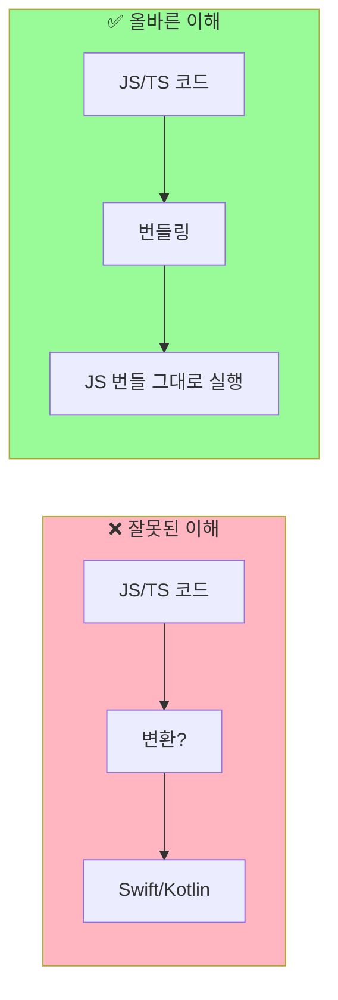
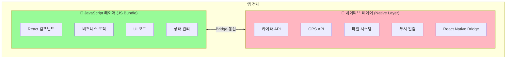
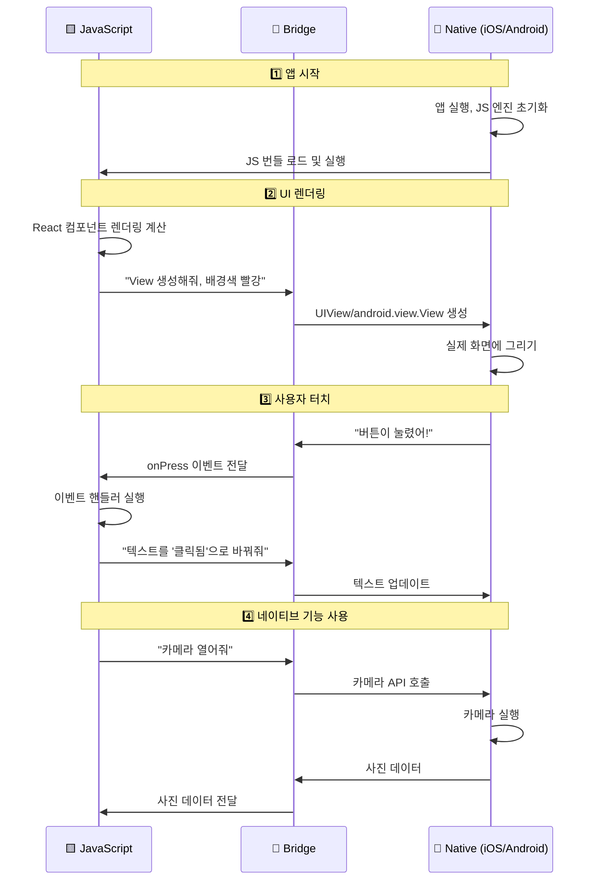
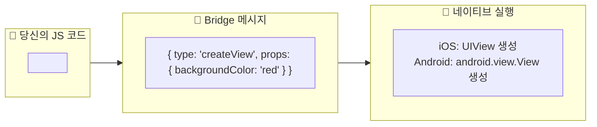
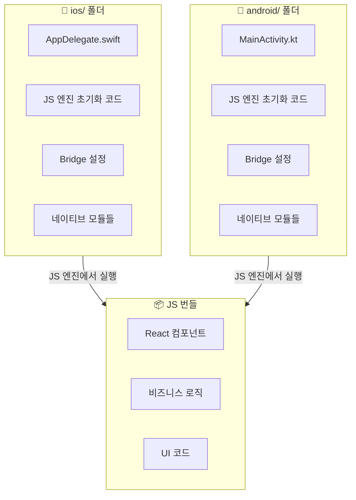
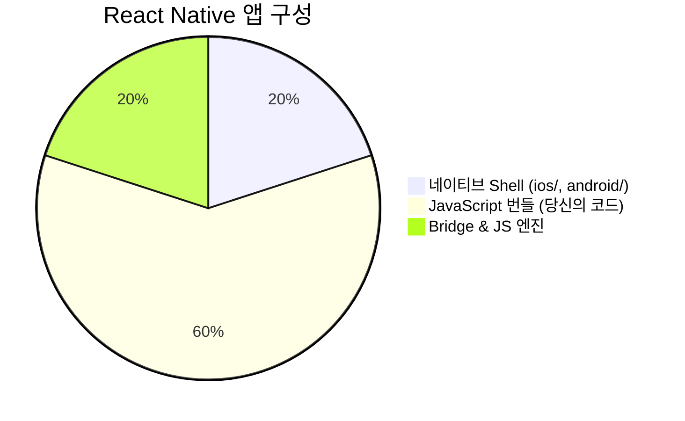
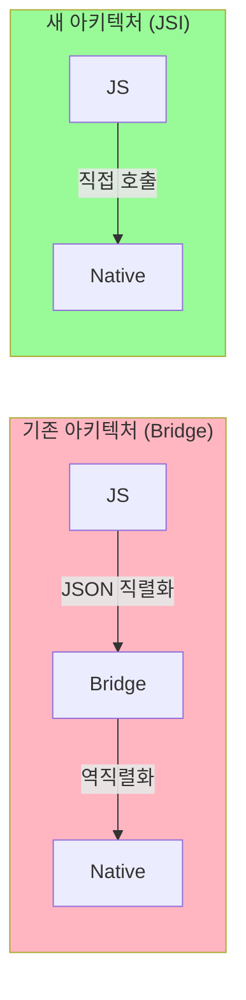

## React Native 앱 구조와 작동 원리

React Native 앱이 어떻게 구성되어 있고, JavaScript와 네이티브 코드가 어떻게 공존하는지 정리합니다.

<Toc>
1. [React Native 앱의 구조 이해하기](#react-native-앱의-구조-이해하기)
2. [두 개의 레이어](#두-개의-레이어)
3. [JS 코드와 네이티브 코드가 공존하는 원리](#js-코드와-네이티브-코드가-공존하는-원리)
4. [Bridge 아키텍처](#bridge-아키텍처)
5. [실제 동작 과정](#실제-동작-과정)
6. [네이티브 폴더의 역할](#네이티브-폴더의-역할)
7. [New Architecture (JSI)](#new-architecture-jsi)
</Toc>

---

## React Native 앱의 구조 이해하기

### 🚨 중요한 오해 바로잡기

> **Q: React Native로 작성한 JS 코드가 Swift/Kotlin으로 변환되나요?**
>
> **A: 아니요!** JS 코드는 **그대로 JavaScript로 실행**됩니다. 변환되지 않습니다!



---

## 두 개의 레이어

React Native 앱은 크게 **두 개의 레이어**로 구성됩니다:



### 비유로 이해하기 🎮

> React Native 앱은 **게임기(네이티브)와 게임 카트리지(JavaScript)**와 같습니다.
>
> - **네이티브 레이어** = 게임기 본체 (Nintendo Switch)
>
>   - 하드웨어 기능 제공 (화면, 버튼, 스피커)
>   - 한번 만들면 쉽게 바꿀 수 없음
>   - 컴파일이 필요함
>
> - **JavaScript 레이어** = 게임 카트리지
>   - 실제 게임 내용 (로직, UI)
>   - 쉽게 교체 가능
>   - 컴파일 없이 바로 실행

| 레이어         | 역할                  | 변경 시        | 예시                         |
| -------------- | --------------------- | -------------- | ---------------------------- |
| **네이티브**   | 하드웨어/OS 기능 접근 | 재빌드 필요    | 카메라, GPS, 푸시 알림       |
| **JavaScript** | UI, 비즈니스 로직     | 즉시 반영 가능 | 버튼 색상, 텍스트, 화면 구성 |

---

## JS 코드와 네이티브 코드가 공존하는 원리

### Bridge 아키텍처

React Native의 핵심은 **JavaScript 엔진**과 **네이티브 플랫폼** 사이의 **Bridge(다리)**입니다.


### 비유로 이해하기 🌐

> React Native는 **통역사가 있는 국제 회의**와 같습니다.
>
> - **JavaScript** = 영어로 말하는 발표자
> - **Bridge** = 통역사 (영어 ↔ 한국어/일본어 번역)
> - **Native** = 한국어(iOS)/일본어(Android)를 사용하는 청중
>
> 발표자(JS)가 "버튼을 빨간색으로 바꿔주세요"라고 말하면,
> 통역사(Bridge)가 이를 네이티브 언어로 번역해서 전달합니다.

---

## 실제 동작 과정



### 코드로 이해하기

당신이 작성하는 React Native 코드:

```tsx
// App.tsx - 당신이 작성하는 코드
import { View, Text, TouchableOpacity } from "react-native";

export default function App() {
  const handlePress = () => {
    console.log("버튼 클릭!");
  };

  return (
    <View style={{ backgroundColor: "red", padding: 20 }}>
      <Text>안녕하세요!</Text>
      <TouchableOpacity onPress={handlePress}>
        <Text>클릭하세요</Text>
      </TouchableOpacity>
    </View>
  );
}
```

이 코드가 실행될 때 내부적으로 일어나는 일:



---

## 네이티브 폴더의 역할



**네이티브 폴더(`ios/`, `android/`)에 있는 것:**

- ✅ 앱 시작점 (AppDelegate, MainActivity)
- ✅ JavaScript 엔진 초기화 코드
- ✅ Bridge 설정
- ✅ 네이티브 모듈 (카메라, GPS 등)
- ✅ 앱 설정 (권한, 아이콘 등)

**네이티브 폴더에 없는 것:**

- ❌ 당신의 React 컴포넌트 (JS로 실행됨)
- ❌ 비즈니스 로직 (JS로 실행됨)
- ❌ 화면 구성 코드 (JS로 실행됨)

### 정리: 앱의 구성 요소



| 구성 요소          | 언어          | 역할                     | 위치                    |
| ------------------ | ------------- | ------------------------ | ----------------------- |
| **네이티브 Shell** | Swift/Kotlin  | 앱 껍데기, 하드웨어 접근 | `ios/`, `android/`      |
| **JS 엔진**        | C++           | JavaScript 실행          | 앱에 내장               |
| **Bridge**         | C++/Java/ObjC | JS ↔ Native 통신         | 앱에 내장               |
| **JS 번들**        | JavaScript    | UI, 로직 (당신의 코드)   | Metro 서버 또는 앱 내장 |

---

## New Architecture (JSI)

> 💡 **참고**: React Native 0.68+부터 **New Architecture**가 도입되었습니다.
> 기존 Bridge 대신 **JSI (JavaScript Interface)**를 사용하여 더 빠른 통신이 가능합니다.



| 아키텍처         | 통신 방식            | 속도 | 특징            |
| ---------------- | -------------------- | ---- | --------------- |
| **Old (Bridge)** | JSON 직렬화/역직렬화 | 느림 | 비동기, 안정적  |
| **New (JSI)**    | 직접 메모리 접근     | 빠름 | 동기 가능, 최신 |

---

## 마무리

React Native 앱은 네이티브 Shell과 JavaScript 번들이 Bridge(또는 JSI)를 통해 통신하는 구조입니다. JS 코드는 Swift/Kotlin으로 변환되지 않고 그대로 실행되며, 이 구조 덕분에 Hot Reload가 가능하고 네이티브 변경 시에만 재빌드가 필요합니다.
