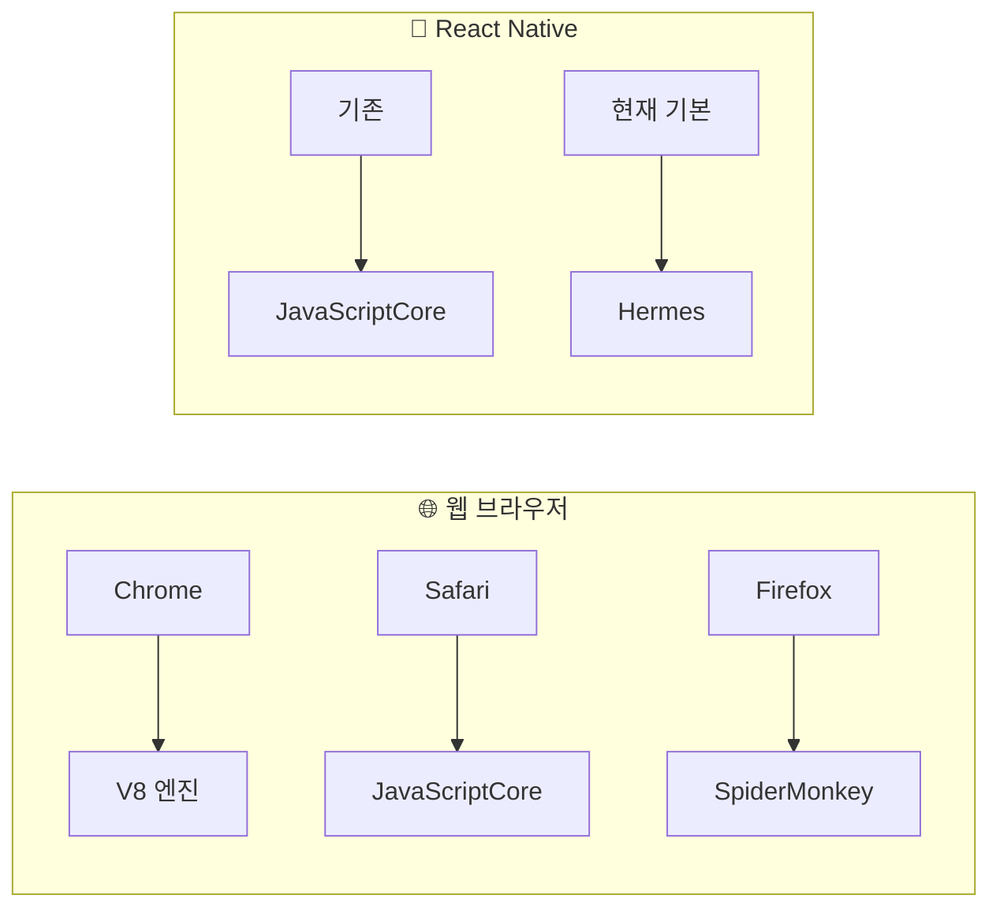
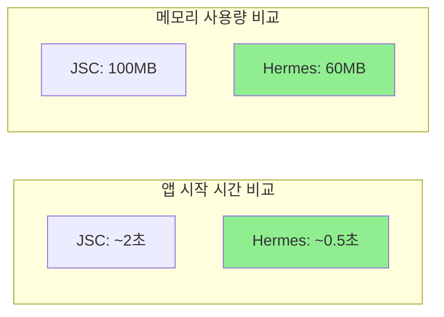

## Hermes 엔진이란?

Meta가 React Native를 위해 만든 JavaScript 엔진 Hermes의 특징과 장점을 정리합니다.

<Toc>
1. [JavaScript 엔진의 역할](#javascript-엔진의-역할)
2. [Hermes란?](#hermes란)
3. [왜 Hermes를 만들었나?](#왜-hermes를-만들었나)
4. [Hermes의 핵심: AOT 컴파일](#hermes의-핵심-aot-컴파일)
5. [Hermes 활성화 확인](#hermes-활성화-확인)
6. [Hermes vs JSC 비교](#hermes-vs-jsc-비교)
</Toc>

---

## JavaScript 엔진의 역할

JavaScript 엔진은 **JS 코드를 실행하는 프로그램**입니다. 웹 브라우저마다 다른 JS 엔진을 사용하듯이, React Native도 JS 엔진이 필요합니다.



---

## Hermes란?

**Hermes**는 Meta(Facebook)가 React Native를 위해 **특별히 만든 JavaScript 엔진**입니다.


### Hermes의 주요 특징

- **빠른 앱 시작 시간**: 미리 컴파일된 바이트코드로 즉시 실행
- **적은 메모리 사용**: 모바일 환경에 최적화된 메모리 관리
- **작은 앱 크기**: 경량화된 엔진
- **AOT 컴파일**: 빌드 시점에 미리 컴파일

---

## 왜 Hermes를 만들었나?

기존 JavaScriptCore(JSC)의 문제점:

| 문제             | JSC                 | Hermes             |
| ---------------- | ------------------- | ------------------ |
| **앱 시작 시간** | 느림 (JS 파싱 필요) | 빠름 (미리 컴파일) |
| **메모리 사용**  | 많음                | 적음 (최적화)      |
| **앱 크기**      | 큼                  | 작음               |

### 문제 상황

React Native 앱은 시작할 때:

1. JavaScript 코드를 파싱해야 하고
2. 파싱된 코드를 실행해야 함

이 과정이 모바일 기기에서는 상당한 시간이 걸렸습니다. 특히 저사양 기기에서는 앱 시작이 느려지는 문제가 있었습니다.

---

## Hermes의 핵심: AOT 컴파일

**AOT (Ahead-Of-Time)** 컴파일은 Hermes의 핵심 기술입니다.


### 비유로 이해하기 📚

> **JSC** = 원서를 읽을 때마다 번역하는 것
>
> - 책을 펼칠 때마다 번역 시작 (느림)
>
> **Hermes** = 미리 번역해둔 책을 읽는 것
>
> - 이미 번역되어 있어서 바로 읽기 가능 (빠름)

### AOT 컴파일의 장점

1. **빌드 시점에 컴파일**: 앱 실행 시 파싱/컴파일 불필요
2. **바이트코드(.hbc) 파일**: 최적화된 형태로 앱에 포함
3. **즉시 실행**: 앱 시작 시 바로 실행 가능

---

## Hermes 활성화 확인

Expo SDK 48+ 에서는 **Hermes가 기본으로 활성화**되어 있습니다.

```json
// app.json
{
  "expo": {
    "jsEngine": "hermes" // 기본값 (생략 가능)
  }
}
```

JSC로 변경하려면 (권장하지 않음):

```json
{
  "expo": {
    "jsEngine": "jsc"
  }
}
```

### 코드에서 확인하기

```tsx
// Hermes 사용 여부 확인
const isHermes = () => !!global.HermesInternal;

console.log("Hermes 사용 중:", isHermes());
```

---

## Hermes vs JSC 비교

| 특성             | Hermes             | JavaScriptCore     |
| ---------------- | ------------------ | ------------------ |
| **앱 시작 시간** | ⚡ 빠름            | 🐢 느림            |
| **메모리 사용**  | 📉 적음            | 📈 많음            |
| **앱 크기**      | 📦 작음            | 📦 큼              |
| **디버깅**       | ✅ Chrome DevTools | ✅ Safari DevTools |
| **Expo 기본값**  | ✅ (SDK 48+)       | ❌                 |

### 성능 비교 (예시)



---

## 마무리

Hermes는 AOT 컴파일을 통해 앱 시작 시간을 단축하고 메모리 사용량을 줄입니다. Expo SDK 48+에서는 기본으로 활성화되어 있으며, 특별한 이유가 없다면 그대로 사용하면 됩니다.
