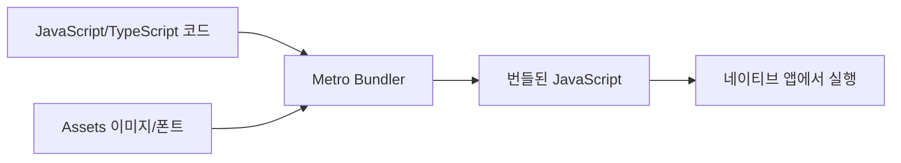
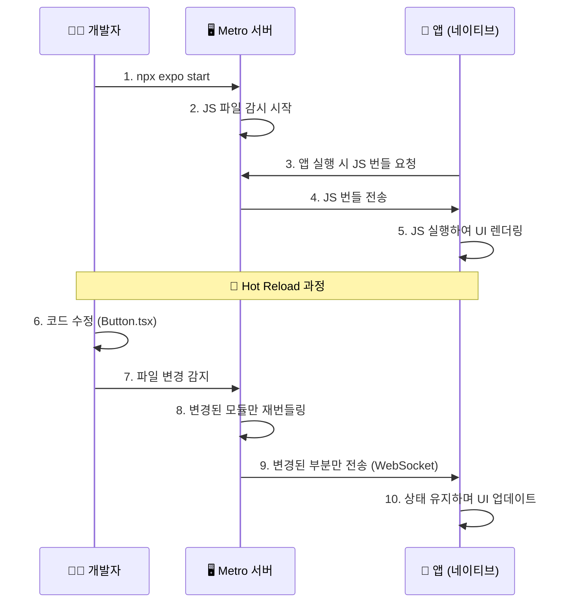
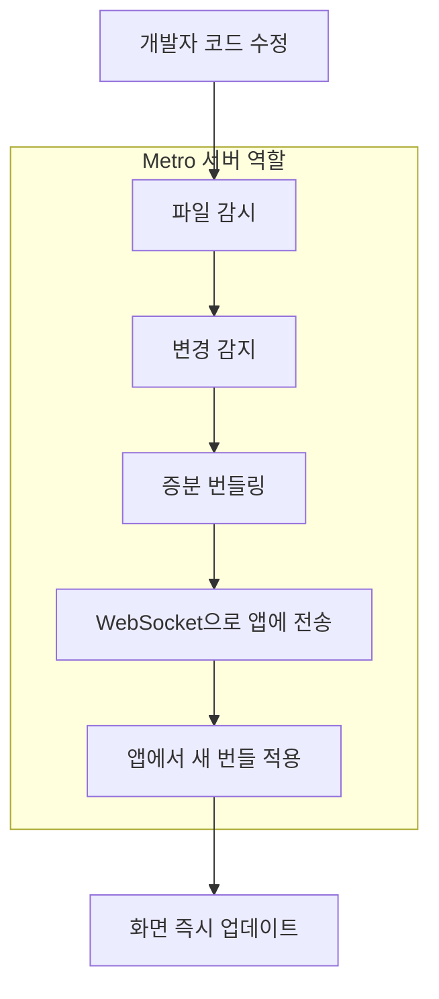
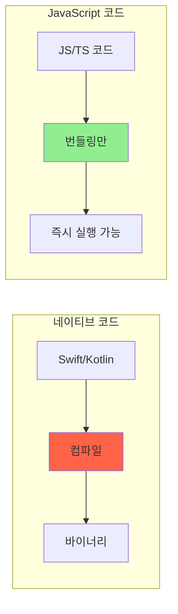
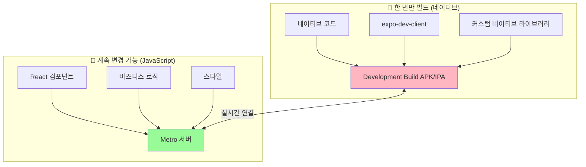
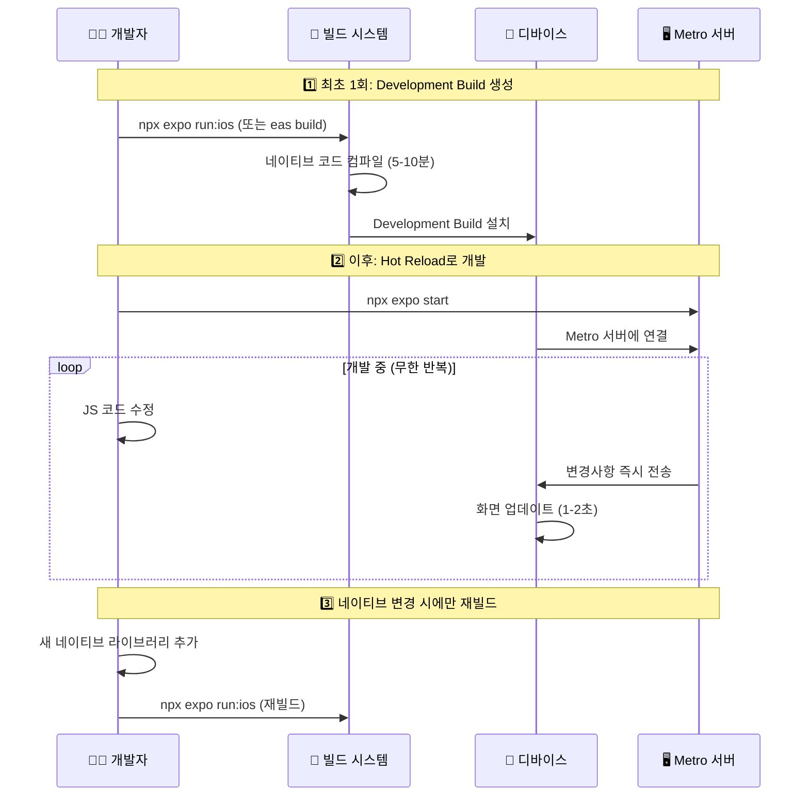
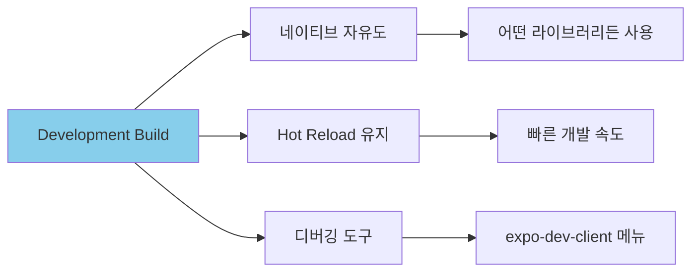
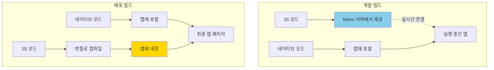

## Metro 서버와 Hot Reload 원리

Metro 서버의 역할과 Hot Reload가 어떻게 작동하는지 정리합니다.

<Toc>
1. [Metro 서버란?](#metro-서버란)
2. [Metro의 주요 역할](#metro의-주요-역할)
3. [Metro 서버가 필요한 이유](#metro-서버가-필요한-이유)
4. [Hot Reload가 가능한 이유](#hot-reload가-가능한-이유)
5. [Development Build에서 Hot Reload가 되는 원리](#development-build에서-hot-reload가-되는-원리)
6. [왜 Preview/Production에서는 Metro가 필요 없을까?](#왜-previewproduction에서는-metro가-필요-없을까)
</Toc>

---

## Metro 서버란?

Metro는 React Native와 Expo의 **공식 JavaScript 번들러**입니다. 웹 개발에서 Webpack이나 Vite가 하는 역할과 비슷합니다.



---

## Metro의 주요 역할

| 기능                | 설명                                      |
| ------------------- | ----------------------------------------- |
| **코드 번들링**     | 여러 JS/TS 파일을 하나의 번들로 합침      |
| **Hot Reload**      | 코드 변경 시 앱을 새로고침 없이 즉시 반영 |
| **Fast Refresh**    | 컴포넌트 상태를 유지하면서 변경사항 반영  |
| **Asset 처리**      | 이미지, 폰트 등의 리소스 처리             |
| **TypeScript 지원** | TS 코드를 JS로 변환                       |

### Metro 서버 시작 방법

```bash
npx expo start
```

이 명령어를 실행하면 기본적으로 `http://localhost:8081`에서 Metro 서버가 시작됩니다.

---

## Metro 서버가 필요한 이유

### 개발 모드 (Expo Go / Development Build)

개발 중에는 JavaScript 코드를 **실시간으로 수정하고 테스트**해야 합니다. 이때 Metro 서버가 핵심 역할을 합니다.



### Metro 서버의 역할 정리



**Metro 서버가 하는 일:**

1. **파일 감시 (Watch)**: 프로젝트의 모든 JS/TS 파일 변경 감시
2. **번들링 (Bundle)**: 변경된 파일만 빠르게 재번들링
3. **전송 (Serve)**: WebSocket을 통해 앱에 새 코드 전송
4. **HMR (Hot Module Replacement)**: 상태를 유지하면서 변경된 모듈만 교체

---

## Hot Reload가 가능한 이유

**핵심 포인트**: JavaScript 코드는 **인터프리터 언어**이기 때문에 컴파일 없이 즉시 실행할 수 있습니다!



| 언어                    | 실행 방식                | 변경 시                  |
| ----------------------- | ------------------------ | ------------------------ |
| Swift/Kotlin (네이티브) | 컴파일 → 바이너리        | 전체 재빌드 필요 (수 분) |
| JavaScript              | 번들링 → 인터프리터 실행 | 번들만 교체 (수 초)      |

---

## Development Build에서 Hot Reload가 되는 원리

이 부분이 가장 헷갈리는 부분이죠! **"빌드가 필요한데 어떻게 Hot Reload가 가능하지?"**

### 핵심 이해: 빌드는 네이티브만!



### 비유로 이해하기 🎮

> Development Build는 **게임기 본체를 한 번 조립**하는 것과 같습니다.
>
> 1. **게임기 조립 (빌드)**: 한 번만 하면 됨
>
>    - 원하는 컨트롤러 추가 (네이티브 라이브러리)
>    - 특수 기능 추가 (카메라, GPS 등)
>
> 2. **게임 카트리지 교체 (Hot Reload)**: 무한히 가능
>    - 게임기를 다시 조립할 필요 없음
>    - 카트리지(JS)만 바꾸면 됨

### 실제 워크플로우



### 언제 재빌드가 필요한가?

| 변경 내용                      | 재빌드 필요? | 이유                 |
| ------------------------------ | ------------ | -------------------- |
| 버튼 색상 변경                 | ❌           | JS 코드 (Hot Reload) |
| 새 화면 추가                   | ❌           | JS 코드 (Hot Reload) |
| API 호출 로직 변경             | ❌           | JS 코드 (Hot Reload) |
| 새 npm 패키지 (JS만)           | ❌           | JS 코드 (Hot Reload) |
| **react-native-firebase 추가** | ✅           | 네이티브 코드 포함   |
| **카메라 권한 설정 변경**      | ✅           | 네이티브 설정        |
| **앱 아이콘 변경**             | ✅           | 네이티브 리소스      |
| **Expo SDK 업그레이드**        | ✅           | 네이티브 코드 변경   |

### 정리: Development Build의 장점



**Development Build = 네이티브 자유도 + Hot Reload의 편리함**

- Expo Go처럼 빠른 개발 (Hot Reload)
- 하지만 네이티브 제한 없음 (커스텀 라이브러리 사용 가능)
- 네이티브 변경 시에만 재빌드 (보통 드묾)

---

## 왜 Preview/Production에서는 Metro가 필요 없을까?

### 배포 빌드의 구조

Preview와 Production 빌드에서는 **JavaScript 번들이 앱 안에 내장**됩니다!


### 비유로 이해하기 📺

> **개발 모드** = 넷플릭스 스트리밍
>
> - 영상(JS)을 서버(Metro)에서 실시간으로 받아옴
> - 인터넷 연결 필수
> - 영상 변경 시 바로 반영
>
> **배포 모드** = DVD에 구운 영화
>
> - 영상(JS)이 디스크(앱) 안에 들어있음
> - 인터넷 연결 불필요
> - 영상 변경하려면 새 DVD 필요 (새 빌드)

### 빌드 과정 비교



| 구분             | 개발 빌드         | 배포 빌드      |
| ---------------- | ----------------- | -------------- |
| **JS 번들 위치** | Metro 서버 (외부) | 앱 내부 (내장) |
| **Metro 필요**   | ✅ 필수           | ❌ 불필요      |
| **Hot Reload**   | ✅ 가능           | ❌ 불가능      |
| **인터넷 필요**  | ✅ 개발 서버 연결 | ❌ 독립 실행   |
| **JS 변경 시**   | 즉시 반영         | 새 빌드 필요   |

---

## 마무리

Metro 서버는 JavaScript 번들러이자 실시간 코드 전송 역할을 합니다. 개발 중에는 Metro가 변경된 JS를 앱에 전송하고, 배포 빌드에서는 JS 번들이 앱에 내장되어 Metro 없이 독립 실행됩니다.
