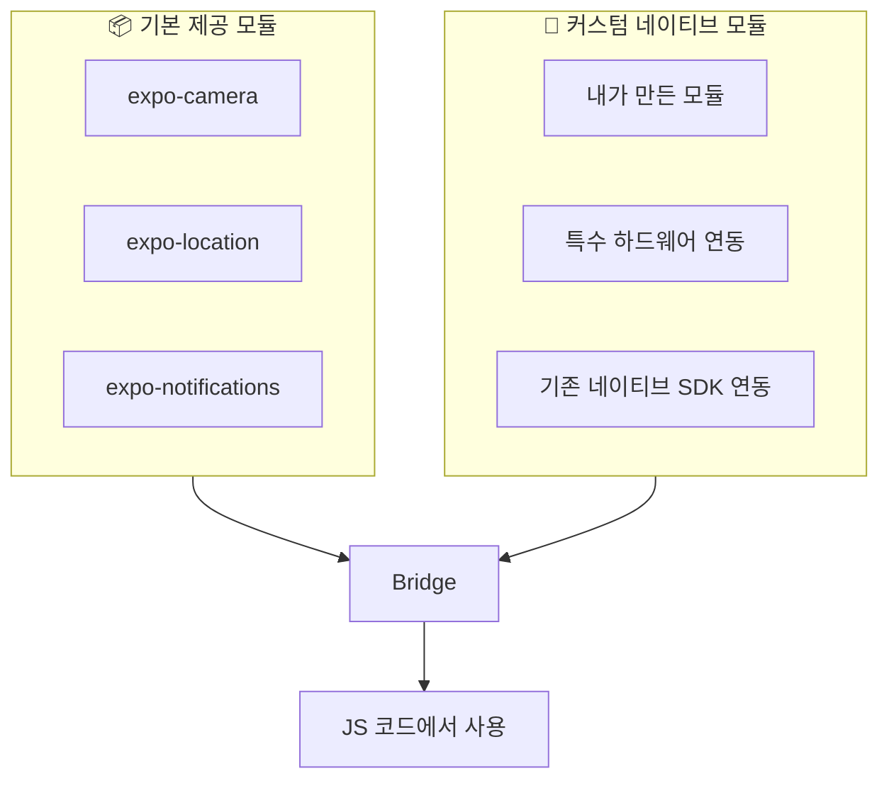
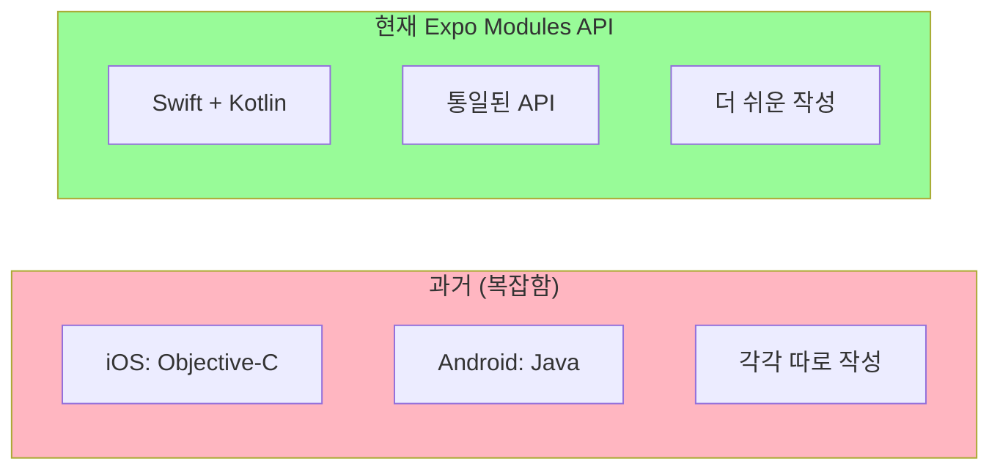
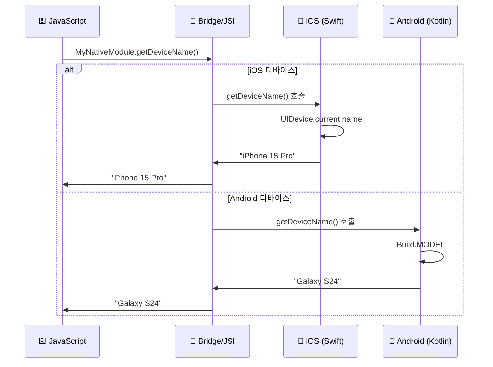
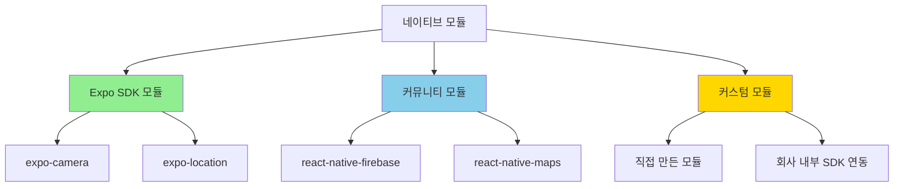

## 커스텀 네이티브 모듈 만들기

Expo Modules API를 활용해 직접 네이티브 모듈을 만들고 JS 코드와 통신하는 방법을 정리합니다.

<Toc>
1. [사용자도 Bridge를 통해 JS ↔ Native 통신 가능!](#사용자도-bridge를-통해-js--native-통신-가능)
2. [언제 커스텀 네이티브 모듈이 필요한가?](#언제-커스텀-네이티브-모듈이-필요한가)
3. [Expo Modules API로 쉽게 만들기](#expo-modules-api로-쉽게-만들기)
4. [커스텀 네이티브 모듈 예시](#커스텀-네이티브-모듈-예시)
5. [통신 흐름](#통신-흐름)
6. [네이티브 모듈의 종류](#네이티브-모듈의-종류)
</Toc>

---

## 사용자도 Bridge를 통해 JS ↔ Native 통신 가능!

React Native에서 제공하는 기본 모듈 외에도, **직접 네이티브 모듈을 만들어서** JS 코드와 통신할 수 있습니다.



---

## 언제 커스텀 네이티브 모듈이 필요한가?

| 상황                       | 예시                     |
| -------------------------- | ------------------------ |
| **특수 하드웨어 연동**     | 블루투스 장비, IoT 기기  |
| **기존 네이티브 SDK 사용** | 결제 SDK, 광고 SDK       |
| **성능 최적화**            | 이미지 처리, 암호화      |
| **플랫폼 특화 기능**       | iOS 위젯, Android 서비스 |

### 구체적인 사례

- 회사 내부에서 사용하는 독자적인 네이티브 SDK 연동
- 특수 블루투스 장비와의 통신
- 고성능 이미지/비디오 처리
- 네이티브 UI 컴포넌트 커스터마이징

---

## Expo Modules API로 쉽게 만들기

Expo는 **Expo Modules API**를 제공하여 네이티브 모듈을 쉽게 만들 수 있습니다.



### Expo Modules API의 장점

- **Swift와 Kotlin 사용**: 현대적인 언어로 작성
- **통일된 API**: iOS/Android 모두 비슷한 패턴
- **타입 안전성**: TypeScript와 잘 통합
- **쉬운 설정**: 보일러플레이트 자동 생성

---

## 커스텀 네이티브 모듈 예시

### 1. 모듈 생성

```bash
npx create-expo-module my-native-module
```

### 2. iOS 네이티브 코드 (Swift)

```swift
// ios/MyNativeModule.swift
import ExpoModulesCore

public class MyNativeModule: Module {
  public func definition() -> ModuleDefinition {
    Name("MyNativeModule")

    // JS에서 호출할 수 있는 함수 정의
    Function("getDeviceName") { () -> String in
      return UIDevice.current.name
    }

    // 비동기 함수
    AsyncFunction("doHeavyWork") { (input: String) -> String in
      // 네이티브에서 무거운 작업 수행
      return "처리 완료: \(input)"
    }
  }
}
```

### 3. Android 네이티브 코드 (Kotlin)

```kotlin
// android/src/main/java/expo/modules/mynativemodule/MyNativeModule.kt
package expo.modules.mynativemodule

import expo.modules.kotlin.modules.Module
import expo.modules.kotlin.modules.ModuleDefinition
import android.os.Build

class MyNativeModule : Module() {
  override fun definition() = ModuleDefinition {
    Name("MyNativeModule")

    // JS에서 호출할 수 있는 함수 정의
    Function("getDeviceName") {
      Build.MODEL
    }

    // 비동기 함수
    AsyncFunction("doHeavyWork") { input: String ->
      // 네이티브에서 무거운 작업 수행
      "처리 완료: $input"
    }
  }
}
```

### 4. JavaScript에서 사용

```tsx
// App.tsx
import { MyNativeModule } from "my-native-module";

export default function App() {
  const [deviceName, setDeviceName] = useState("");

  useEffect(() => {
    // 네이티브 함수 호출!
    const name = MyNativeModule.getDeviceName();
    setDeviceName(name);
  }, []);

  const handleHeavyWork = async () => {
    // 비동기 네이티브 함수 호출
    const result = await MyNativeModule.doHeavyWork("테스트 데이터");
    console.log(result); // "처리 완료: 테스트 데이터"
  };

  return (
    <View>
      <Text>디바이스: {deviceName}</Text>
      <Button title="무거운 작업" onPress={handleHeavyWork} />
    </View>
  );
}
```

---

## 통신 흐름



### 동기 vs 비동기 함수

| 함수 타입         | 사용 시점           | 예시              |
| ----------------- | ------------------- | ----------------- |
| **Function**      | 빠른 동기 작업      | 디바이스 이름     |
| **AsyncFunction** | 시간이 걸리는 작업  | 파일 읽기, 네트워크 |

```swift
// Swift 예시
Function("syncWork") { () -> String in
  // 즉시 반환
  return "결과"
}

AsyncFunction("asyncWork") { (promise: Promise) in
  // 비동기 작업 후 resolve
  DispatchQueue.global().async {
    let result = heavyComputation()
    promise.resolve(result)
  }
}
```

---

## 네이티브 모듈의 종류



| 종류              | 설명                          | 예시                       |
| ----------------- | ----------------------------- | -------------------------- |
| **Expo SDK 모듈** | Expo 팀이 만든 공식 모듈      | expo-camera, expo-location |
| **커뮤니티 모듈** | 오픈소스 커뮤니티가 만든 모듈 | react-native-firebase      |
| **커스텀 모듈**   | 직접 만드는 모듈              | 특수 하드웨어 연동         |

---

## 추가 기능들

### 이벤트 발송 (Native → JS)

```swift
// Swift
Events("onDataReceived")

func sendEvent() {
  sendEvent("onDataReceived", [
    "data": "네이티브에서 보낸 데이터"
  ])
}
```

```tsx
// JavaScript
import { useEvent } from 'my-native-module';

function App() {
  useEvent('onDataReceived', (event) => {
    console.log(event.data); // "네이티브에서 보낸 데이터"
  });
}
```

### 상수 정의

```swift
// Swift
Constants([
  "VERSION": "1.0.0",
  "PLATFORM": "iOS"
])
```

```tsx
// JavaScript
import { VERSION, PLATFORM } from 'my-native-module';
console.log(VERSION, PLATFORM); // "1.0.0", "iOS"
```

---

## 마무리

Expo Modules API를 사용하면 Swift/Kotlin으로 네이티브 모듈을 만들 수 있습니다. 특수 하드웨어 연동, 기존 SDK 활용, 고성능 작업 처리가 필요할 때 유용합니다.
