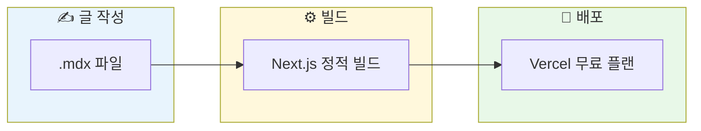
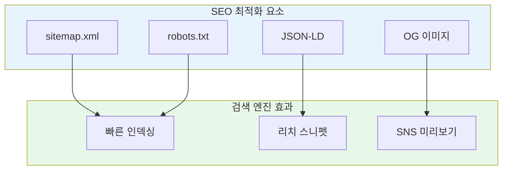
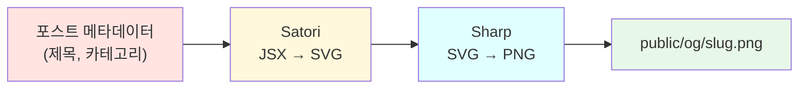

## 정보
URL: https://log.itjustbong.com/

---

## 왜 만들었나

개발 블로그를 운영하고 싶었지만, 기존 플랫폼들은 몇 가지 아쉬운 점이 있었습니다.

- 티스토리, 벨로그 같은 플랫폼은 커스터마이징에 한계가 있음
- Ghost, WordPress는 서버 비용이 발생함
- Notion 기반 블로그는 로딩 속도가 느림

DB 없이 독립적으로 운영 가능한 무료 테크 블로그를 만들고 싶었습니다. 마크다운 파일만으로 콘텐츠를 관리하고, 정적 빌드를 통해 빠른 속도와 SEO를 모두 잡는 것이 목표였습니다.

## 가설

마크다운 파일과 Mermaid 조합으로 문서를 작성하고, Next.js의 정적 빌드를 활용한다면 비용이 들지 않고 오프라인 환경에서도 편하게 글을 작성할 수 있을 것이라 생각했습니다.



## 기술 스택

| 영역 | 기술 | 선택 이유 |
|------|------|----------|
| 프레임워크 | Next.js 15 (App Router) | 정적 빌드 + SEO 최적화 |
| 콘텐츠 | MDX | 마크다운 + React 컴포넌트 |
| 다이어그램 | Mermaid | 코드로 다이어그램 작성 |
| 스타일링 | Tailwind CSS | 빠른 UI 개발 |
| 배포 | Vercel | 무료 + 자동 배포 |

## 핵심 구현

### 1. 파일 기반 콘텐츠 관리

`content/posts/` 폴더에 카테고리별로 MDX 파일을 저장합니다. 빌드 시점에 파일 시스템을 읽어 포스트 목록을 생성합니다.

```
content/posts/
├── frontend/
│   ├── react-native-architecture.mdx
│   └── tech-blog-without-database.mdx
├── backend/
│   └── dto-dao-entity-pattern.mdx
└── devops/
    └── docker-compose-guide.mdx
```

frontmatter에서 메타데이터를 추출하고, gray-matter 라이브러리로 파싱합니다.

```typescript
const { data, content } = matter(fileContent);

return {
  slug,
  title: data.title,
  description: data.description,
  content,
  category,
  tags: data.tags || [],
  createdAt: data.createdAt,
};
```

### 2. SEO 최적화

검색 엔진 최적화를 위해 여러 요소를 구현했습니다.

**sitemap.xml 자동 생성**

모든 포스트와 카테고리 페이지를 sitemap에 포함시킵니다.

```typescript
export default async function sitemap(): Promise<MetadataRoute.Sitemap> {
  const posts = await getAllPosts();
  const categories = await getCategorySlugs();

  const postUrls = posts.map((post) => ({
    url: `${baseUrl}/posts/${post.slug}`,
    lastModified: new Date(post.updatedAt || post.createdAt),
    changeFrequency: "weekly",
    priority: 0.8,
  }));

  return [...mainPages, ...categoryUrls, ...postUrls];
}
```

**robots.txt 설정**

관리자 페이지와 API는 크롤링에서 제외합니다.

```typescript
export default function robots(): MetadataRoute.Robots {
  return {
    rules: [{ userAgent: "*", allow: "/", disallow: ["/admin/", "/api/"] }],
    sitemap: `${siteUrl}/sitemap.xml`,
  };
}
```

**구조화된 데이터 (JSON-LD)**

검색 결과에서 리치 스니펫을 표시하기 위해 Article 스키마를 추가했습니다.



### 3. 동적 OG 이미지 생성

포스트마다 썸네일 이미지를 직접 만들기는 번거롭습니다. 빌드 시점에 Satori와 Sharp를 사용해 자동으로 OG 이미지를 생성합니다.



카테고리별로 다른 색상 테마를 적용해 시각적 구분을 줍니다.

```javascript
const categoryThemes = {
  frontend: { bg1: "#667eea", bg2: "#764ba2", letter: "F" },
  backend: { bg1: "#0d9488", bg2: "#14b8a6", letter: "B" },
  devops: { bg1: "#0284c7", bg2: "#0ea5e9", letter: "D" },
};
```

### 4. Mermaid 다이어그램 지원

기술 문서에서 다이어그램은 필수입니다. 이미지 파일을 만들어 첨부하는 대신, 코드로 다이어그램을 작성할 수 있도록 Mermaid를 지원합니다.

MDX 파일에서 mermaid 코드 블록을 감지하면 자동으로 Mermaid 컴포넌트로 렌더링합니다.

```typescript
function Pre({ children, ...props }) {
  const className = childElement?.props?.className || "";
  const code = childElement?.props?.children;

  if (className.includes("language-mermaid")) {
    return <Mermaid chart={code} />;
  }

  return <pre {...props}>{children}</pre>;
}
```

다크 모드와 라이트 모드에 맞춰 Mermaid 테마도 자동으로 전환됩니다.

## 효과

가설대로 Vercel의 무료 플랜 내에서 충분히 서빙할 수 있습니다. 정적 빌드 덕분에 페이지 로딩 속도도 빠릅니다.

| 항목 | 결과 |
|------|------|
| 월 비용 | 0원 (Vercel 무료 플랜) |
| 빌드 시간 | 약 30초 |
| Lighthouse 성능 점수 | 95+ |
| 콘텐츠 작성 환경 | 로컬 에디터 (오프라인 가능) |

Mermaid를 지원하면서 사진 없이도 높은 가독성을 보장할 수 있게 되었습니다. 플로우차트, 시퀀스 다이어그램, ER 다이어그램 등을 코드로 작성하면 되니 이미지 관리 부담이 줄었습니다.

마크다운 파일 기반이라 Git으로 버전 관리가 가능하고, 오프라인 환경에서도 글을 작성할 수 있습니다. VSCode나 Obsidian 같은 에디터에서 바로 작성하고 커밋하면 자동 배포됩니다.

## 마치며

DB 없이 파일 시스템만으로 블로그를 운영하는 것은 충분히 가능합니다. Next.js의 정적 빌드와 Vercel의 무료 플랜을 활용하면 비용 걱정 없이 빠르고 SEO 친화적인 블로그를 만들 수 있습니다. Mermaid 지원으로 다이어그램 작성도 편해졌고, 마크다운 기반이라 어디서든 글을 쓸 수 있습니다.

