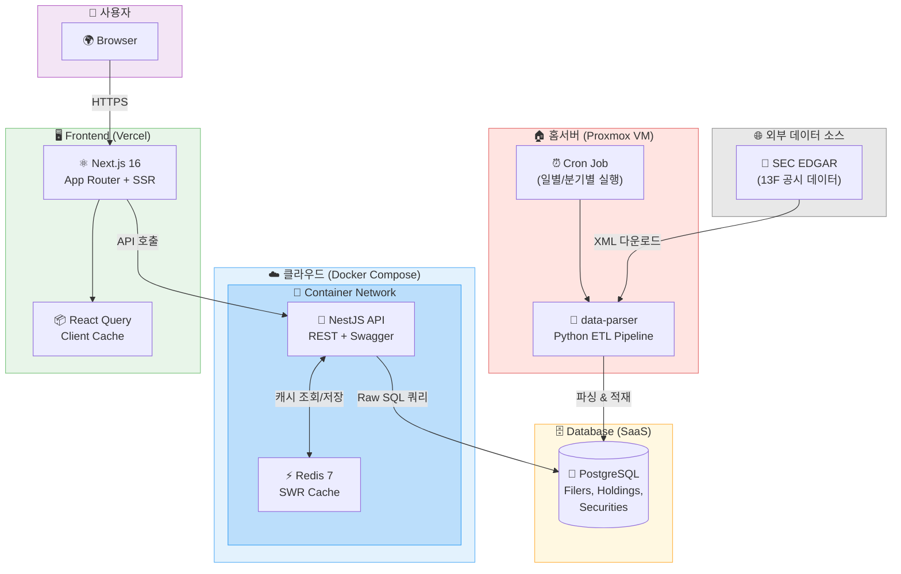
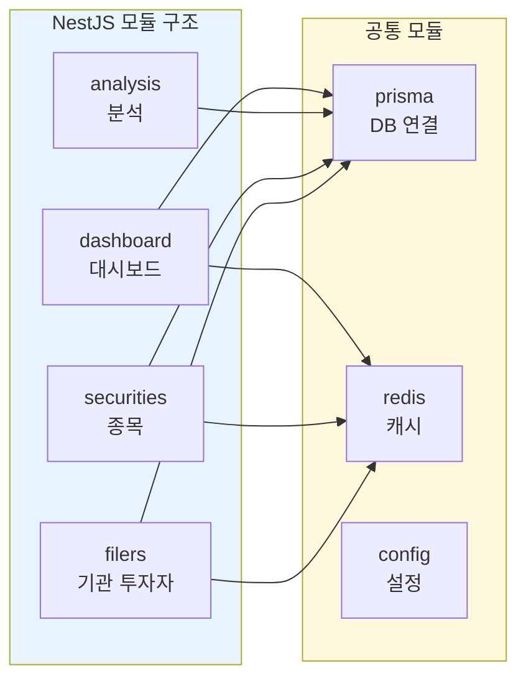
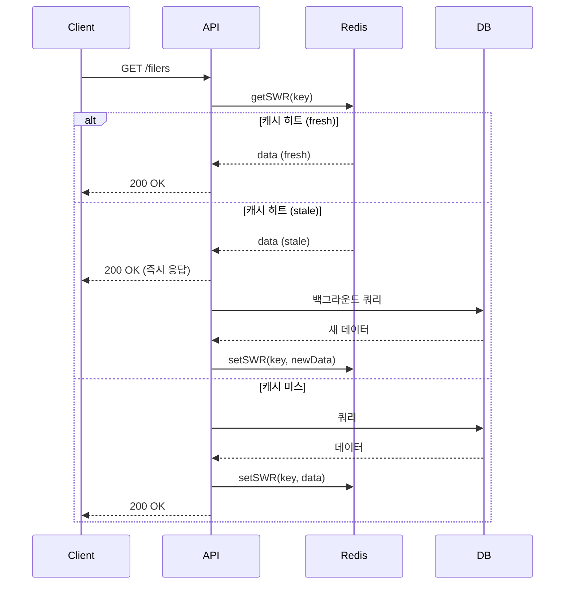

## 정보

URL: https://www.whales-wallet.com/

---

## 왜 만들었나

주식 시장을 움직이는 건 결국 고래들입니다. 버크셔 해서웨이, 브릿지워터, 르네상스 테크놀로지 같은 기관 투자자들의 포트폴리오 변화는 시장에 큰 영향을 미칩니다. 미국 SEC는 1억 달러 이상 운용하는 기관 투자자에게 분기별로 13F 보고서를 제출하도록 의무화하고 있습니다.

문제는 이 데이터가 공개되어 있지만 접근성이 떨어진다는 점입니다. SEC EDGAR 사이트에서 XML 파일을 직접 다운로드해 파싱해야 하고, 여러 기관의 포트폴리오를 비교하거나 시계열 분석을 하려면 상당한 노력이 필요합니다.

고래들의 포트폴리오를 쉽게 조회하고 분석할 수 있는 서비스를 만들고 싶었습니다.

## 가설

기관 투자자들이 포트폴리오에 추가하는 종목들은 적어도 역성장하지는 않을 것이라는 가설을 세웠습니다. 물론 13F 데이터는 45일 지연 공개되기 때문에 실시간 매매 신호로 사용하기는 어렵습니다. 하지만 장기 투자 관점에서 고래들의 움직임을 참고하는 것은 의미가 있다고 판단했습니다.

## 전체 아키텍처



인프라는 네 부분으로 나뉩니다. 데이터 수집을 담당하는 Python ETL 파이프라인은 Proxmox 기반 홈서버의 VM에서 실행됩니다. NestJS 백엔드와 Redis 캐시는 클라우드에서 Docker Compose로 묶어 운영하고, PostgreSQL 데이터베이스는 SaaS 서비스를 사용합니다. 프론트엔드는 Vercel에 배포했습니다.

## 기술 스택

| 영역 | 기술 | 선택 이유 |
|------|------|----------|
| 모노레포 | Turborepo + pnpm | 빌드 캐싱, 의존성 관리 |
| 백엔드 | NestJS | 모듈 구조, DI, Swagger 자동 생성 |
| 프론트엔드 | Next.js 16 (App Router) | SSR, 캐싱 전략 |
| 캐시 | Redis (SWR 패턴) | 응답 속도 개선 |
| ORM | Prisma + Raw SQL | 타입 안전성 + 복잡 쿼리 성능 |
| API 클라이언트 | @hey-api/openapi-ts | OpenAPI 스펙 기반 타입 생성 |
| 데이터 수집 | Python | SEC EDGAR XML 파싱 |

## 모노레포 구조

Turborepo와 pnpm workspace를 사용해 프론트엔드와 백엔드를 하나의 저장소에서 관리합니다.

```
web-app-be-monorepo/
├── apps/
│   ├── be/          # NestJS 백엔드
│   └── web/         # Next.js 프론트엔드
├── packages/
│   ├── api-client/  # OpenAPI 기반 API 클라이언트
│   ├── type/        # 공유 타입 정의
│   ├── ui/          # 공유 UI 컴포넌트
│   └── typescript-config/
├── turbo.json
└── pnpm-workspace.yaml
```

`@repo/api-client` 패키지는 백엔드의 OpenAPI 스펙에서 자동 생성됩니다. 백엔드 API가 변경되면 `pnpm generate:api` 명령으로 클라이언트 코드를 재생성하고, 프론트엔드에서 타입 안전하게 API를 호출할 수 있습니다.

## 백엔드 모듈 구조

NestJS의 모듈 시스템을 활용해 도메인별로 코드를 분리했습니다.



각 도메인 모듈은 Controller → Service → Repository 계층으로 구성됩니다. Repository 계층에서 Raw SQL 쿼리를 담당하고, Service에서 비즈니스 로직을 처리합니다.

### Repository 패턴과 Raw SQL

Prisma ORM을 사용하지만, 복잡한 집계 쿼리는 Raw SQL로 작성합니다. 기관별 AUM 합산, 분기 비교, 포트폴리오 변화율 계산 등은 SQL 레벨에서 처리하는 것이 성능상 유리합니다.

```typescript
// filers.repository.ts
async getFilerListWithLatestQuarter(options: {
  search?: string;
  minAum?: number;
  sortColumn: string;
  sortDir: string;
  limit: number;
  offset: number;
}) {
  return this.prisma.$queryRawUnsafe<FilerListResult[]>(`
    WITH latest_quarters AS (
      SELECT 
        filer_id,
        report_year,
        report_quarter,
        total_aum,
        ROW_NUMBER() OVER (
          PARTITION BY filer_id 
          ORDER BY report_year DESC, report_quarter DESC
        ) as rn
      FROM filer_quarterly_aum
      WHERE total_aum > 0
    )
    SELECT f.filer_id, f.cik, f.filer_name, ...
    FROM filers f
    LEFT JOIN latest_quarters lq ON f.filer_id = lq.filer_id AND lq.rn = 1
    WHERE ...
    ORDER BY ${sortColumn} ${sortDir}
    LIMIT ${limit} OFFSET ${offset}
  `);
}
```

CTE(Common Table Expression)를 활용해 복잡한 쿼리를 단계별로 구성합니다. 분기별 스냅샷 테이블을 미리 생성해두고, 실시간 계산이 필요한 경우에만 filings 테이블을 직접 조회하는 방식으로 성능을 최적화했습니다.

## Redis 캐싱 전략 (SWR 패턴)

백엔드에서 SWR(Stale-While-Revalidate) 패턴을 구현했습니다. 캐시된 데이터가 stale 상태가 되어도 즉시 반환하고, 백그라운드에서 데이터를 갱신합니다.



```typescript
// redis.service.ts
async getSWR<T>(key: string): Promise<SWRResult<T>> {
  const cached = JSON.parse(await this.client.get(key));
  const now = Date.now();

  if (now >= cached.expireAt) {
    await this.del(key);
    return { data: null, isStale: false, needsRevalidation: false };
  }

  const isStale = now >= cached.staleAt;
  const needsRevalidation = isStale && !this.revalidatingKeys.has(key);

  return { data: cached.data, isStale, needsRevalidation };
}
```

데코레이터를 통해 컨트롤러 메서드에 캐싱을 적용합니다.

```typescript
@Get()
@CacheTTL(3600)           // 1시간 후 완전 만료
@CacheStaleTime(86400)    // 1일 후 stale 상태
async getFilers(@Query() query: FilerQueryDto) {
  return this.filersService.getFilers(query);
}
```

## 프론트엔드 구조 (FSD 아키텍처)

프론트엔드는 Feature-Sliced Design 패턴을 적용했습니다.

```
src/
├── app/              # Next.js App Router 페이지
│   └── [locale]/     # i18n 라우팅
├── widgets/          # 페이지 단위 UI 조합
│   ├── filer-table/
│   ├── holdings-treemap/
│   └── sector-distribution/
├── features/         # 사용자 인터랙션 기능
│   ├── search-filers/
│   ├── quarter-selector/
│   └── filter-by-sector/
├── entities/         # 비즈니스 엔티티
├── shared/           # 공통 유틸리티
│   ├── hooks/
│   ├── lib/
│   └── ui/
└── messages/         # i18n 메시지 (ko.json, en.json)
```

### React Query 캐싱

프론트엔드에서도 React Query를 통해 클라이언트 사이드 캐싱을 적용합니다.

```typescript
// query-client.ts
function makeQueryClient() {
  return new QueryClient({
    defaultOptions: {
      queries: {
        staleTime: 60 * 1000,      // 1분간 fresh
        gcTime: 5 * 60 * 1000,     // 5분간 캐시 유지
        retry: 1,
        refetchOnWindowFocus: false,
      },
    },
  });
}
```

백엔드의 SWR 캐싱과 프론트엔드의 React Query 캐싱이 이중으로 적용되어, 사용자 경험과 서버 부하 모두 개선됩니다.

## 데이터 파이프라인

data-parser는 SEC EDGAR에서 13F 데이터를 수집하고 파싱하는 Python ETL 파이프라인입니다. Proxmox 홈서버의 VM에서 cron으로 주기적으로 실행됩니다. 상세 구현은 별도 글에서 다룰 예정입니다.

## 효과

아직 가설 검증에는 더 많은 시간이 필요합니다. 서비스를 운영하면서 데이터를 축적하고, 기관 투자자들의 포트폴리오 변화와 실제 주가 움직임 간의 상관관계를 분석할 계획입니다.

기술적으로는 모노레포 구조 덕분에 백엔드 API 변경 시 프론트엔드 타입이 자동으로 동기화되어 개발 생산성이 높아졌습니다. SWR 캐싱 패턴으로 응답 속도도 크게 개선되었습니다.

## 앞으로 추가할 기능

현재는 SEC 13F 데이터만 다루고 있지만, 확장 계획이 있습니다.

**크립토 고래 지갑 추적**

트럼프 아들, 워뇨띠 같은 유명 트레이더나 기관의 온체인 지갑을 추적해 포트폴리오를 보여주는 기능입니다. 블록체인 데이터는 실시간으로 공개되기 때문에 13F보다 훨씬 빠른 인사이트를 제공할 수 있습니다.

**이상 거래 탐지**

특정 시점에 비정상적으로 대량 매수/매도가 발생한 코인 정보를 감지하고 알림을 보내는 기능입니다.

**AI 리포트 요약**

증권사, 금융사에서 출간하는 리서치 리포트를 AI로 요약해 핵심 내용만 빠르게 파악할 수 있는 기능입니다.

## 마치며

고래들의 움직임을 추적하는 것은 투자 의사결정에 참고할 만한 정보입니다. 13F 데이터의 45일 지연이라는 한계가 있지만, 장기 투자 관점에서는 충분히 유용합니다. 모노레포 구조와 SWR 캐싱 패턴은 이런 데이터 집약적 서비스를 만들 때 좋은 선택이었습니다.
